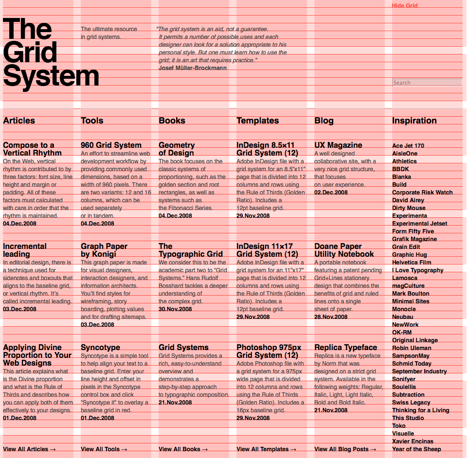
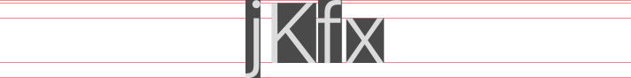
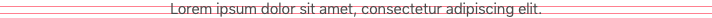
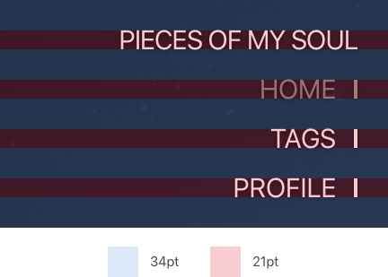
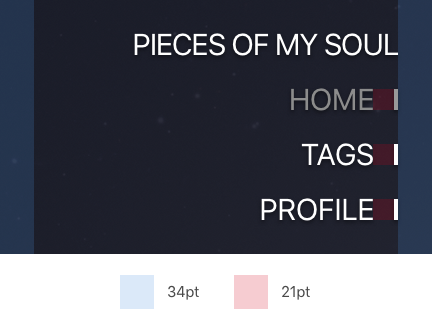
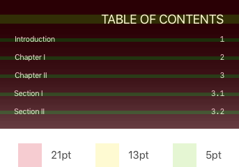
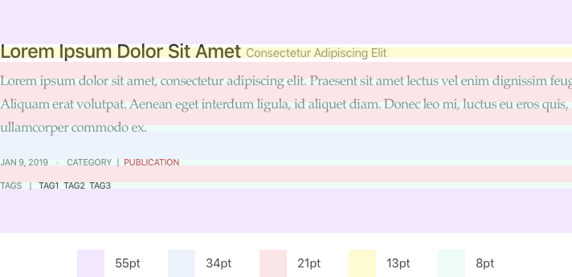
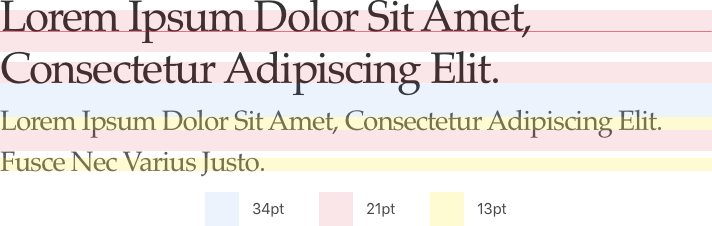

> This post has been revisited with LLM technology to improve its English
> fluency.

I had limited time to create a modern design for the first version of Gatsblog.
The design is somewhat "old school," but I carefully tuned the grid system to
achieve a high-quality layout.

## Grid System

Grid systems are common in modern design across various fields. They help
designers create layouts with consistent rhythm.



However, I did not use traditional grid systems like the one shown above.

## Typography

Text is the most important element of a blog. Latin characters have a unique
rhythm distinct from regular geometric shapes.


Since Latin characters have more dimensions than simple height and width,
laying them out is more complex than arranging regular geometric shapes. To
handle these complex shapes, I simplify them into basic rectangles.



Note that the simplified geometry of the letter "x" is much smaller than that
of the capital letter "K." In fact, the size differences between simplified
letter geometries vary with font size. How should we understand these size
gaps?

The letter-frequency table below comes from Pavel Mička's website[^1], which
cites Robert Lewand's *Cryptological Mathematics*.

| Letter | Relative Frequency in English Language (%) |
|:------:|:------------------------------------------:|
| e	     | 12.02                                      |
| t	     | 9.10                                       |
| a	     | 8.12                                       |
| o	     | 7.68                                       |
| i	     | 7.31                                       |
| n	     | 6.95                                       |
| s	     | 6.28                                       |
| r	     | 6.02                                       |
| h	     | 5.92                                       |
| d	     | 4.32                                       |
| l	     | 3.98                                       |
| u	     | 2.88                                       |
| c	     | 2.71                                       |
| m	     | 2.61                                       |
| f	     | 2.30                                       |
| y	     | 2.11                                       |
| w	     | 2.09                                       |
| g	     | 2.03                                       |
| p	     | 1.82                                       |
| b	     | 1.49                                       |
| v	     | 1.11                                       |
| k	     | 0.69                                       |
| x	     | 0.17                                       |
| q	     | 0.11                                       |
| j	     | 0.10                                       |
| z	     | 0.07                                       |

The table does not distinguish between capital and lowercase letters. Since
we use capital letters only at the beginning of sentences, for terminology,
and in titles, this distinction would not significantly affect the table's
trends.

From this table, we can see that 60.82% of English text uses lowercase
letters with x-height (like "x"), and 6.17% use lowercase letters with
descenders (like "j"). This means that for a given font at a small enough
size, the descenders, `(ascents - x-height)`, and `(cap-height - x-height)`
become negligible. The simplified geometries of characters in paragraph lines
converge to rectangles with heights equal to the x-height.



Therefore, we can treat English text with regular fonts at small sizes as
rectangles with heights equal to the font's x-height in practical design.

## Series

A series is a set of quantities determined by a common relation—the
mathematical concept of "series."

When discussing grid systems, we refer to the rhythm of element sizes and
spacing. This rhythm should possess inherent beauty. The golden ratio is the
ideal choice, but deriving sizes and spaces from a base value using the
golden ratio is tedious. I chose the Fibonacci series instead.

```
1, 1, 2, 3, 5, 8, 13, 21, 34, 55, 89, 144...
```

By removing the first four numbers, we get a series suitable for practical
design:

```
5, 8, 13, 21, 34, 55, 89, 144...
```

To simplify further, we can use just the first five numbers:

```
5, 8, 13, 21, 34
```

I used these five numbers throughout my design. All sizes and spaces on my
blog are multiples of these five numbers.







For Latin characters at large font sizes, the descent and differences
between ascent and x-height or cap-height and x-height become significant.
For these cases, I still size the font's x-height to match a particular
series number, but we must account for the ascent and cap-height.





[^1]: Mička, Pavel. ["Letter frequency (English)"](http://en.algoritmy.net/article/40379/Letter-frequency-English)
