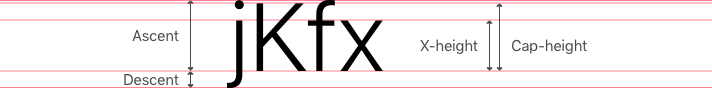

> This post has been revisited with LLM technology to improve its English
> fluency.

In this post, I'll discuss the implementation of Gatsblog, a blog system
built with Gatsby.js. If you missed my previous posts about the overview and
design of Gatsblog, please check them for context about the technology stack.
As this is my first JavaScript/Node.js/front-end project, the following
approaches may not represent best practices.

## Identifying Resources

How do we identify one post from another?

Since posts may share the same name, we need a unique identifier for each.
Like Jekyll, I initially chose a URL scheme of `/post/YYYY/MM/post-name` and
a filename format of `YYYY-MM-DDThh-mm-ssZ-post-name.md` (with optional time
and timezone). However, I soon discovered this approach couldn't distinguish
posts with identical names published on the same day.

To solve this problem, I decided to **hash** the `YYYY-MM-DDThh-mm-ssZ`
portion and append the hash value to the URL. The resulting URL scheme
became:

```
/post/YYYY/MM/post-name-1a0c
```

This allows unique identification of each post.

## Protecting Sensitive Information from Bots

Websites often contain sensitive information meant only for human users.
Plain HTML content like `mailto:whatever@email.ltd` exposes information to
bots. To protect against this, I designed a simple process and implemented
a React component that:

1. Encrypts sensitive information during source compilation
2. Decrypts the information only when a real user clicks the component

The implementation is straightforward, with one caveat: Safari prevents
programmatic behaviors like page redirection on click unless you call
`event.preventDefault()` immediately after a click event.

## Adapting to CSS Layout Box

While implementing my design, I discovered that CSS layout boxes aren't
ideal for professional designers.

Some might say, "But CSS offers flex-box and grid layout models."

I don't mean just the box model; none of CSS's layout models align with
how designers think. CSS layout boxes calculate text content size using
`line-height`, a concept unfamiliar to designers. Designers work with
typographic properties like ascent, descent, x-height, and line spacing,
not `line-height`.



In CSS, `line-height` sets the space used for lines in text. This property
has no direct connection to font attributes. The only way to connect
`line-height` to font is by setting it with a unitless number—creating a
ratio between `line-height` and `font-size`.


As shown in my previous post, designers often lay out elements using font
attributes. This creates a disconnect between the default size of CSS layout
boxes and designer expectations.

To bridge CSS layout boxes and the designer's world, we must think in terms
of `line-height` when setting margins rather than font attributes. I developed
a solution called Normalized Layout Box to adjust layout box size to match
designer intentions.


### Normalized Layout Box

To reduce layout box size, we can use negative margins:

```css
.normalized-layout-box {
  font-size: 1.3em;
  line-height: 1.3;
  margin-top: -0.3rem;
  margin-bottom: -0.3rem;
}
```

However, since block elements collapse margins (when elements are adjacent
or nested), we end up with `0` top margin if the layout box is the first
child and `0` bottom margin if it's the last child. To make negative margins
work in these cases, we must wrap the block elements in a flex box.

```css
.normalized-layout-box-flex-wrapper {
  align-items: stretch;
  display: flex;
  flex-direction: column;
}
```

```html
<div class="normalized-layout-box-flex-wrapper">
  <div class="normalized-layout-box">
    Contents
  </div>
</div>
```

## Testing

This project lacks comprehensive testing. Testing JavaScript is tedious because,
as a dynamic language, it relies heavily on tests for correctness. Without
explicit data type schemes, ensuring program correctness requires extensive
testing efforts.

You might suggest "snapshot" testing—a great feature in Jest. But many issues
stem from type mismatches or mistakes that type checking would catch. Also,
how can we verify that manually created snapshots are correct?

I need a type system for JavaScript. If I continue developing this blog project,
I would migrate from JavaScript to TypeScript to address these concerns.
