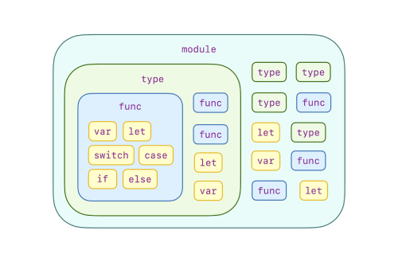
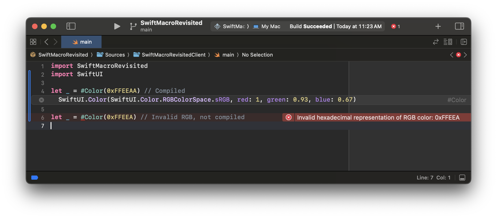
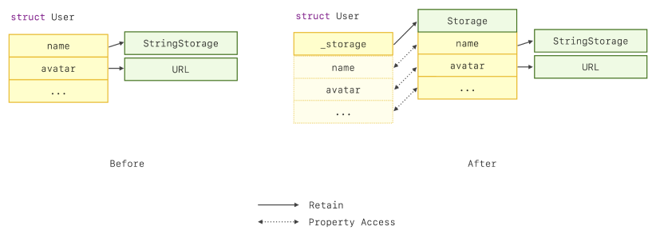
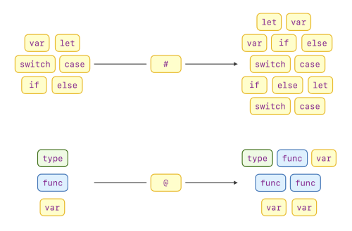

通过 2023 WWDC 的会议，我们了解到 Swift 宏的目标是：

- 消除重复代码
- 让繁琐的事情变得简单
- 以软件包的形式与其他开发者分享

然而，这些目标并不是 Swift 宏所独有的。对于 Swift 中的许多代码重用手段而言，这些都是共同的目标，如函数、类型和模块。可以说，所有高级编程语言都希望实现这些目标。Swift 宏必须在其他方面有所胜出；否则的话没必要存在。

那么， Swift 宏到底擅长什么？

这个问题的答案至关重要。 Swift 宏独一无二的优势会决定它的本质：这可以指导我们创作有效的 Swift 宏、告诉我们在创作宏时的行为边界，并最终帮助我们产出良好设计的 Swift 宏。

要理解这一点，我们首先需要理解 Swift 现有的代码重用手段解决了哪些问题以及它们的局限性。了解 Swift 宏的独特之处就在于这一探索过程。

## 现有代码重用手段解决了什么问题？

在 Swift 中，代码重用的方法将代码封装到不同层次的粒度中，从最细粒度的函数到最粗粒度的模块。这种设计为我们提供了一个层次化的工具集，帮助我们在每个层级上消除冗余代码。

然而，一个良好设计的代码重用手段不仅仅意味着消除不必要的复制粘贴，还要为混乱带来秩序。从高级编程语言开发者的角度来看，这种混乱通常来自于意外的变量名、函数名或类型名绑定结果以及意外的程序执行顺序。

此外，现实世界中的代码重用中通常涉及各方提供的代码。这意味着对于编译语言而言，要复用的代码可能以不同的分发形式存在：源代码或预构建的库。

让我们看看现有的 Swift 代码重用手段如何处理所有这些问题。

### 函数

在 Swift 中，函数是最细粒度的代码重用手段。程序员通过使用诸如 `if ... else ...` 语句、`while` 循环、`for` 循环和 `return` 语句等控制结构来组织执行流序列，以封装基础算法。在控制结构的代码块中声明的变量具有比外部声明的变量更高的绑定优先级。对此这有一段代码作为示例。每一条线表示一个名称颁订结果。

```swift
// 源文件根部声明的全局变量
var bar: Int = 0
//   ^
//   |
//   +---------------------------------------------------+
func foo() {                                          // |
  func getHexDescription(for index: Int) -> String {  // |
    return "0x" + String(index, radix: 16)            // |
  }                                                   // |
  for i in 0..<100 {                                  // |
    // for 循环体内部声明的局部变量                            |
    let bar = getHexDescription(for: i)               // |
//       ^                                               |
//       |                                               |
//       +--------- +                                    |
//                  |                                    |
    print("bar = \(bar)")                             // |
  }                                                   // |
// +-----------------------------------------------------+
// |
  bar += 1
}
```

上述代码在我们的日常编程中已经变得再平常不过。然而，达成这一点并非易事。这个设计背后的理念被称为「结构化编程」，由以下几个关键原则定义：

- 变量只能在控制结构的代码块内访问。
- 控制结构可以用更具表达力的方式，例如使用 `if ... else ...` 而不仅仅是简单的 `if` 语句。
- 可以通过更高级的控制结构消除 goto 语句。
- 函数体内可以定义另一个函数。

最早的高级编程语言 FORTRAN 并没有像我们今天所理解的那样采纳这些原则。之后整个计算机工业花费了几年时间来完善和整合这些概念。随后，「结构化编程」的设计理念对高级编程语言的设计和发展产生了重大影响。Swift 也采纳了「结构化编程」的设计理念，来让程序员能够构建健壮的函数。

### 类型

Swift 类型允许程序员将共享内部关系的数据和函数聚合在一起。与独立函数相比，这可以在更大的粒度上实现代码复用。

然而，仅仅将许多东西打包在一起中并不能消除复杂性。当访问在类型中声明的成员时，应存在与「结构化编程」中变量的访问规则类似的原则。这样我们才可以确保变量名/函数/类型名绑定的结果符合预期。否则，将会在不同类型之间引起无尽的命名冲突。

另外，内部数据和实现也不应该在某个特定的范围外可以被访问到。这个范围可以是类型或源文件等。这样通过只向程序员公开必要的信息、阻止意外访问内部实现而产生的未定义行为，以及限定类型可以协作的范围，我们就可以减轻使用该类型的程序员的心智负担。

Swift 类型通过以下方式解决了上述挑战：

- 在类型定义块内可以访问类型成员，如变量和函数所声明的。
- 引入点符号语法来访问类型块之外的成员。
- 引入访问控制以保护类型中的成员在特定范围内。

```swift
struct Foo {

  // `bar` 是私有的
  private var bar: Int

  func print() {
    // `bar` 仅可以在 `Foo` 的类型块中访问.
    print(bar)
  }

}

let foo = Foo()
// `print` 可以通过点语法访问
foo.print()
```

有了这些点，程序员可以通过泛化从 Swift 函数中学习到的「结构化编程」原则，在与类型打交道的过程中直观地预测变量名/函数/类型名绑定结果，并带入其他具有点语法和访问控制的语言中获得的经验。

### 模块

从前面的部分可以看出，当数据和函数共享内部关系时，Swift 是如何通过类型加强代码的可重用性的。当类型也共享这些关系时，我们如何进一步提高代码的可重用性呢？

一个直观的答案是进一步将类型、数据和函数封装成更大粒度的抽象。在 Swift 中，这就是模块所做的事情。

然而，在 Swift 中，模块不仅仅是另一个代码的聚合体。就像类型系统一样，一个朴素设计的模块系统也可能引入模块之间的命名冲突，并公开不必要的实现细节。通过进一步泛化我们从类型中学到的避免类似问题的方法，Swift 也避免了这些问题：

- 模块成员，如变量、函数和类型，可以在模块内部访问。
- 当不同模块中的名称冲突时，引入点号表示法来访问模块外部的成员。
- 引入访问控制来保护模块内部特定范围的成员。

```swift
// 在 Foo 模块中

private var name = "foo"

public var version: String {
  return "1.0"
}

public func foo() {
  print(name)
}

// 在 Bar 模块中

private var name = "bar"

public var version: String {
  return "2.0"
}

public func bar() {
  print(name)
}

// 在 app 中

import Foo
import Bar

print(Foo.version)
foo()
bar()
```

除此之外，模块也是分发代码的一种方式。由于人们可以将自己的代码分发为源代码或预构建的二进制文件，Swift 编译器在实现模块系统时会考虑这一点。


### 总结

通过回顾 Swift 中现有的代码重用手段，我们可以发现它们倾向于将较小的抽象聚合成更大的抽象，并采用特定的保护机制来确保合理的名字查找结果和预期的程序执行流程。



然而，正是这些优势也限制了它们的功能。由于这些保护机制，仍然有一些编程概念无法封装，因为有些概念要求我们放弃这种保护机制。

为了进一步提高语言的代码可重用性，我们不能再遵循这些现有的代码重用手段的设计倾向。

## Swift 宏在哪些方面表现出色？

相反，Swift 宏通过采用不同的设计理念来提高语言的代码可重用性。为了帮助你全面了解这些设计理念，我想通过一些典型的示例向你展示 Swift 宏的本质。

### 编译时转换和验证

设计软件如 Figma 和 Sketch 使用 6 个十六进制数字表示 RGB 颜色。开发者经常通过扩展颜色的类型，以便直接从设计软件中复制和粘贴 RGB 值，以供在 Swift 中使用：

```swift
import SwiftUI

// 颜色类型扩展
extension Color {

  public init(_ hex: UInt)

}

// 使用例子
Color(0xFFEEAA)
```

但是我们如何验证复制粘贴的值是否是有效的 RGB 颜色呢？复制粘贴的动作不能确保结果的正确性。下面的代码片段展示了一个可能的复制粘贴错误。

```swift
// 无效颜色. 只有 5 个十六进制码
Color(0xFFEEA)
```

然而，由于 Swift 宏通过对其参数进行语法变形来生成新代码，或者说“展开宏”，我们可以在此变形期间集成语法检查。这使得可以对 6 位十六进制 RGB 颜色"字面量"进行编译时验证。

```swift
#Color(0xFFEEAA) // 可以编译
// #Color 宏展开开始
SwiftUI.Color(red: 1, green: 0.93, blue: 0.67)
// #Color 宏展开结束
#Color(0xFFEEA) // 无效 RGB，无法编译
```



通过这个例子，你也许已经获得了启发，可以去看看这种编译计算如何应用于其他种类的"字面量"。

### 提供超越函数的行为

在实践中，我们通常避免使用感叹号来强制解包可选值：

```swift
func foo(_ bar: Int?) {
  print(bar!)
}
```

相反，我们更喜欢一种更安全的方法--使用 `guard let ... else`：

```swift
func foo(_ bar: Int?) {
  guard let bar else {
    return
  }
  print(bar)
}
```

然而，这可能会很繁琐，尤其是当有多个可选参数时。

鉴于程序员的天性，程序员们必然希望封装这个解包过程以便重用。不幸的是，由于「结构化编程」的缘故，函数保护了其内部执行流程免受内部函数的返回的影响，我们无法将这个 `guard let ... else` 封装在一个函数中--因为函数中的 `return` 语句无法使调用方函数退出。

```swift
func guard<T>(_ value: T?) -> T {
  guard let value else {
    // 这个 return 无法使得 `foo` 也 return.
    // 此外，这个函数也无法通过编译
    return
  }
  return value
}

func foo(_ bar: Int?) {
  let bar = guard(bar)
  print(bar)
}
```

不过， Swift 宏为这种类型的封装提供了一种可行的方法。我们可以有一个名为 `#unwrap` 的宏，使用方法如下所示：

```swift
func foo(_ bar: Int?) {
  #unwrap(bar) {
    print(bar)
  }
}
```

这可以被扩展为：

```swift
func foo(_ bar: Int?) {
  // #unwrap 宏展开开始
  guard let bar = bar else {
    return
  }
  print(bar)
  // #unwrap 宏展开结束
}
```

在上面的示例中，`#unwrap` 宏的参数--`bar` 和尾闭包，在编译器启动宏展开过程之前已经完成了类型检查。这意味着在宏展开之前，`print` 内的尾闭包接收到的 `bar` 将绑定到 `foo` 函数的参数 `_ bar: Int?`。

然而，一旦宏展开，由于展开过程本身可以被视为类似于复制粘贴的语法树替换，`print` 现在使用的 `bar` 将绑定到由 `guard let bar` 语句声明的 `bar`，与宏展开之前的类型检查结果无关。此外，此宏展开带来的 `return` 语句也可以影响应用点的控制流。

该示例展示了由 freestanding Swift macro 展开而可能涉及到的**控制流操控**和**词法作用域共享**。

### 提供超越类型的行为

Swift 宏的能力不限于这些范围。让我们考虑另一种 Swift 宏：attached macro，并通过实际例子展示其潜力。

在真实世界的编程中，我们通常从简单定义的类型开始。下面是一个例子：

```swift
struct User {

  var name: String

  var avatar: URL

}
```

然而，随着仓库的增长，`struct` 的大小可能会相应增加：

```swift
struct User {

  var name: String

  var avatar: URL

  var avatarsInDifferentScales: [Int : URL]

  var userID: String

  var socialMedias: [String]

  var brief: String

  // ...

}
```

由于示例中的每个属性在 `struct` 中都需要进行堆内存分配来存储数据，复制该结构体的成本也会增加。堆分配的次数与复制过程中的 retain 操作次数相对应。由于 retain 是原子操作，这可能导致用户交互时出现延迟，并浪费内存空间。

为了将结构体的复制成本降到最低，我们可以通过将属性聚合到一个用于存储的类实例中，并在修改属性时复制该用于存储的类实例，从而使原本的结构体采用写入时复制行为：

```swift
struct User {

  // 聚合了原本的结构体属性的堆存储容器类型
  private class Storage {

    var name: String

    // 其他属性 ...

  }

  // 堆存储容器实例
  private var _storage: Storage

  init(name: String, ...) {
    self._storage = Storage(name: name, ...)
  }

  // 提供写入时复制行为
  private func makeStorageUniqueIfNeeded() {
    if !isKnownUniquelyReferenced(&_storage) {
      _storage = Storage(name: name, ...)
    }
  }

  // 结构体中被重写的属性
  var name: String {
    get { return _storage.name }
    set {
      makeStorageUniqueIfNeeded()
      _storage.name = newValue
    }
  }

  // 其他被重写的属性 ...

}
```

为了进一步理解这个技术，下面的示例说明了在采用写入时复制行为之前和之后的工作细节的差异：



这是一种在复制大型结构体时提高性能的有效技术。在真实世界的测试中，我通过采用这种技术改进了字节跳动的一个应用程序的性能，将特定场景的 FPS 从 48 提高到了 56，并将调试时的内存使用量减少了 600MB。

然而，上面展示的方法可能很繁琐。它不仅涉及大量手写的代码，而且还增加了程序的维护成本。

更重要的是，这种技术无法封装在 Swift 中的任何现有类型中：无论是 `class`、`struct`、`enum` 还是 `protocol`。这是因为我对结构体所做的是通过将现有成员变形为另一种形式来扩展类型的行为。由于我们只能通过聚合、类继承和协议遵从来重用类型，这些都无法帮助我们封装这段逻辑。

但是，Swift 宏提供了我们想要的。我们可以使用 Swift 宏封装这个代码转换过程，并以更优雅的方式来处理之前的示例。

```swift
@COW
struct User {

  var name: String

  var avatar: URL

  var avatarsInDifferentScales: [Int : URL]

  var userID: String

  var socialMedias: [String]

  var brief: String

  // ...

}
```

是的。就像我展示的那样简单。通过向结构体添加一个名为 `@COW` 的 attached macro，我们为该结构体引入了写入时复制的行为。

这个宏所做的事情只不过是我们在之前的示例中手动编写的内容 —— 向结构体添加堆存储容器并将存储属性转换为计算属性，以便将访问转发到堆存储容器中：

```swift
@COW
struct User {

  // @COW 宏展开开始
  private class Storage {

    var name: String

    // 其他属性 ...

  }

  private var _$storage: Storage

  private func makeStorageUniqueIfNeeded() {
    if !isKnownUniquelyReferenced(&_$storage) {
      _$storage = Storage(name: name, ...)
    }
  }

  init(name: String, ...) {
    self._$storage = Storage(name: name, ...)
  }
  // @COW 宏展开结束

  // @COW 宏展开开始
  @COWIncluded(storage: _$storage)
  // @COW 宏展开结束
  var name: String {
    // @COWIncluded 宏展开开始
    get { return _$storage.name }
    set {
      makeStorageUniqueIfNeeded()
      _$storage.name = newValue
    }
    // @COWIncluded 宏展开结束
  }

}
```

然而，所有这些都是在一个自动的过程中发生的：Swift 编译器对 `User` 结构体进行类型检查，然后使用经过类型检查的 `User` 结构体作为参数来调用宏展开。最后，`@COW` 宏通过理解 `User` 结构体中的内容生成代码。通过这个自动的机制，维护成本已经被消除。

从上面展示的宏展开中可以观察到，attached Swift macro 可以扩展类型成员并通过添加 accessors 重写属性。扩展的内容不仅为类型带来了新的行为，还共享了扩展点的“命名空间”。值得注意的是，向存储属性添加 accessors 也将其语义从存储属性更改为计算属性。

## 结论

通过研究Swift中现有的代码重用手段以及了解新加入的 Swift 宏的特点，我们可以得出以下结论：

- Swift 宏是另一种封装形式，它不会带来任何新的运行时能力。
- Swift 宏通过在编译时转换程序员的代码来生成代码。这意味着我们也可以将编译时验证整合进去。
- 与 Swift 中现有的代码重用特性不同， Swift 宏默认情况下不会保护其宏展开内容免受应用点现有内容的影响。另外，它也可以改变应用点语义。宏作者在实现 Swift 宏时应该注意潜在的陷阱和问题。具体而言：
  - 对于 freestanding Swift macro，它们不仅可以影响应用点的控制流，还可以共享词法作用域。
  - 对于 attached Swift macro，它们不仅可以为类型扩展成员，还可以为属性提供 accessor。宏展开内容也共享扩展点的"命名空间"。此外，accessor macro 还可以通过添加 `get`、`set` 或其他文档中未记录的 accessor（如 `_read`、`_modify`、`unsafeAddressor` 和 `unsafeMutableAddressor`）将存储属性转换为计算属性。



这些性质不仅为程序员提供了另一种代码重用的选项，还能够封装涉及编译时检查、控制流操控以及为类型添加行为的编程概念，并且无需依赖继承或其他运行时技术。这些性质在 Swift 中以前从未实现过。毫无疑问，它们定义了 Swift 宏的独特优势。

然而，给予 Swift 宏优势的特性同样也引入了潜在的陷阱和问题。我们将在接下来的文章中深入探讨这个主题。

## 资源

- 一个实现了 `#Color` 和 `#unwrap` 宏的 playground 项目（需要`git checkout strengths-and-essence`）

[WeZZard/SwiftMacroRevisited](https://github.com/WeZZard/SwiftMacroRevisited)

- `@COW` 宏的生产级实现：

[WeZZard/COWMacro](https://github.com/wezzard/cowmacro)
