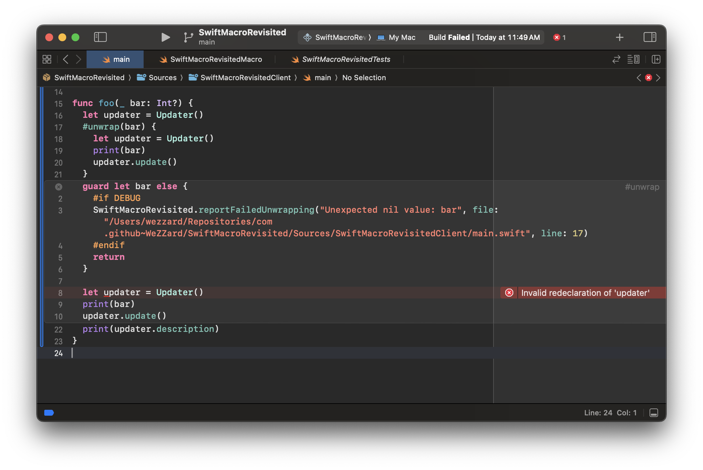
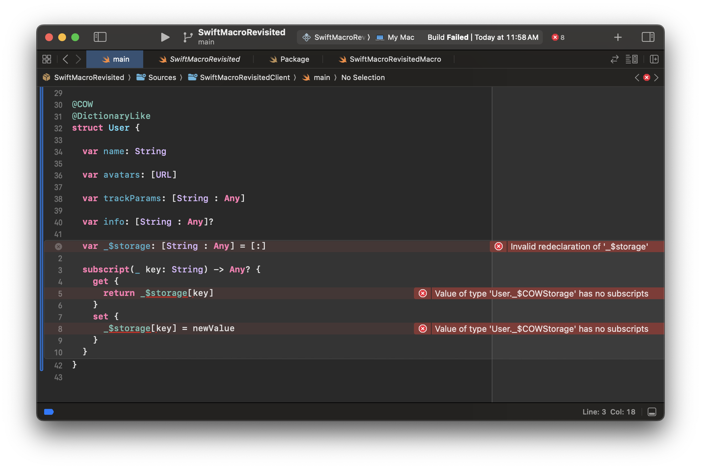
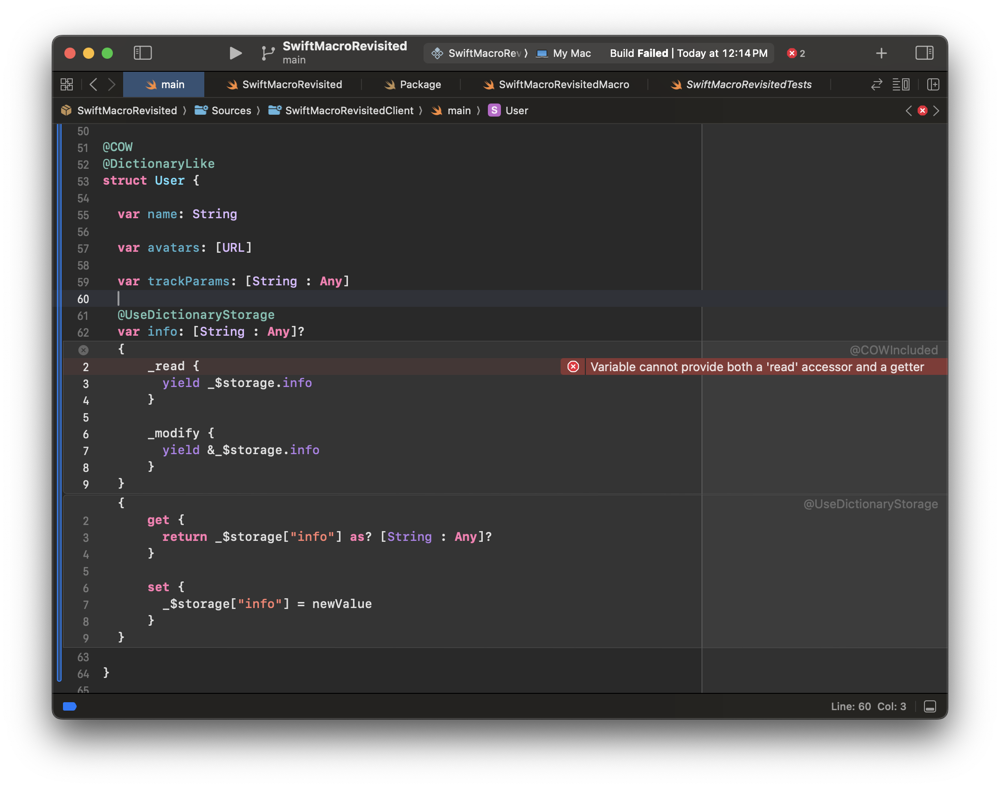
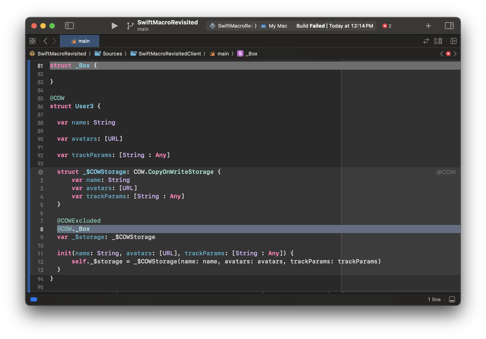
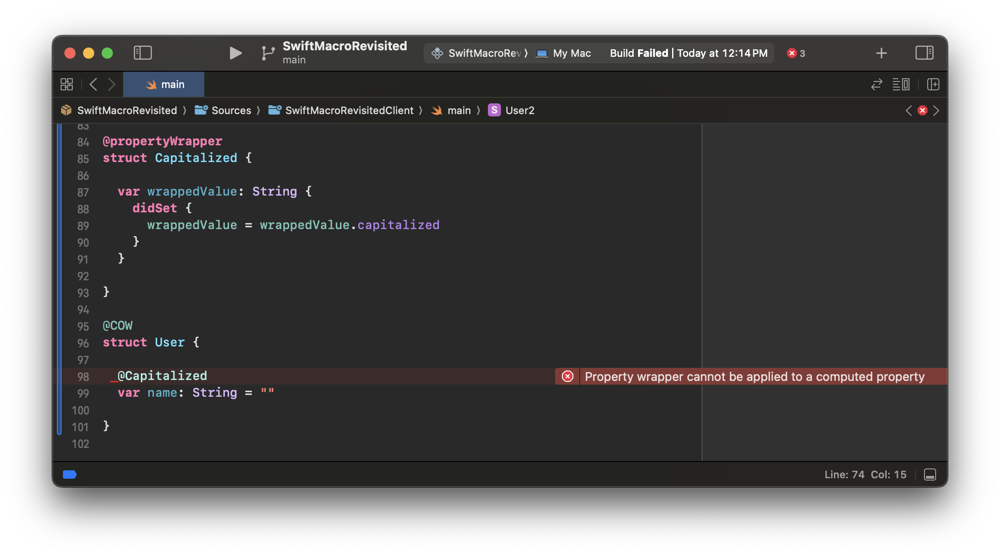
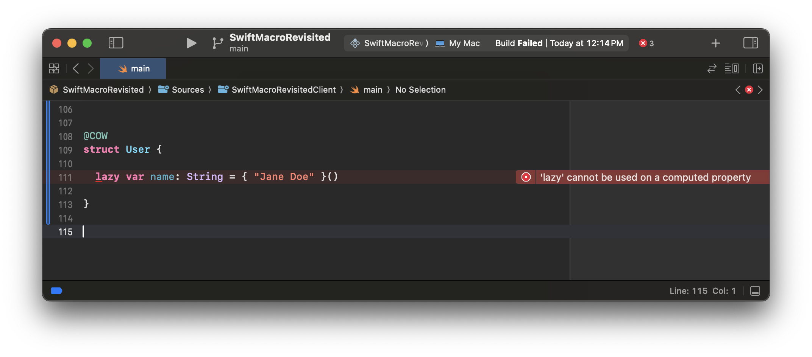
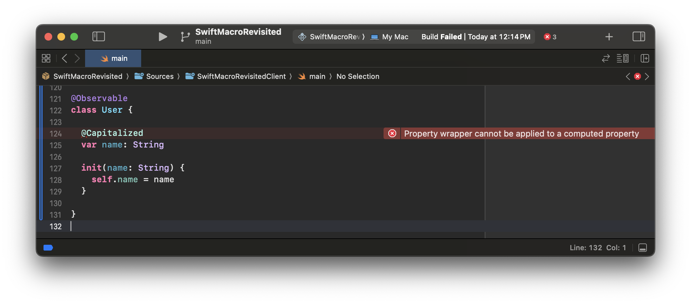
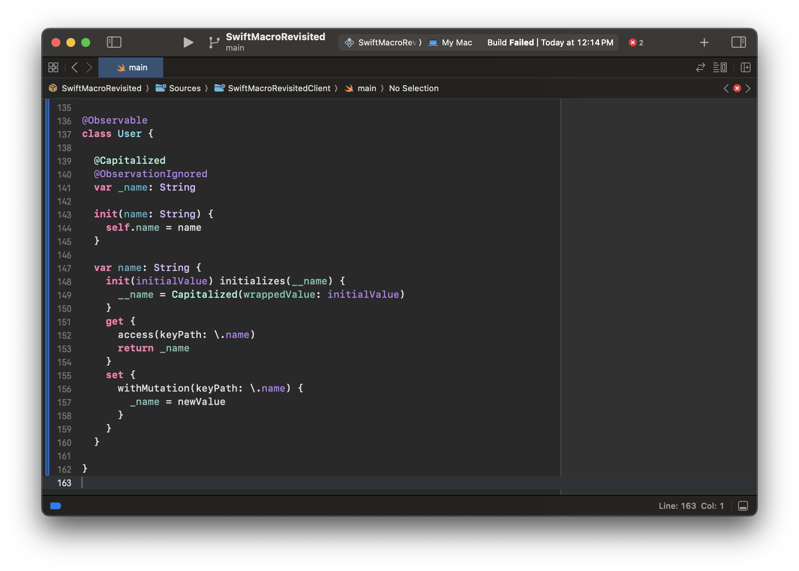
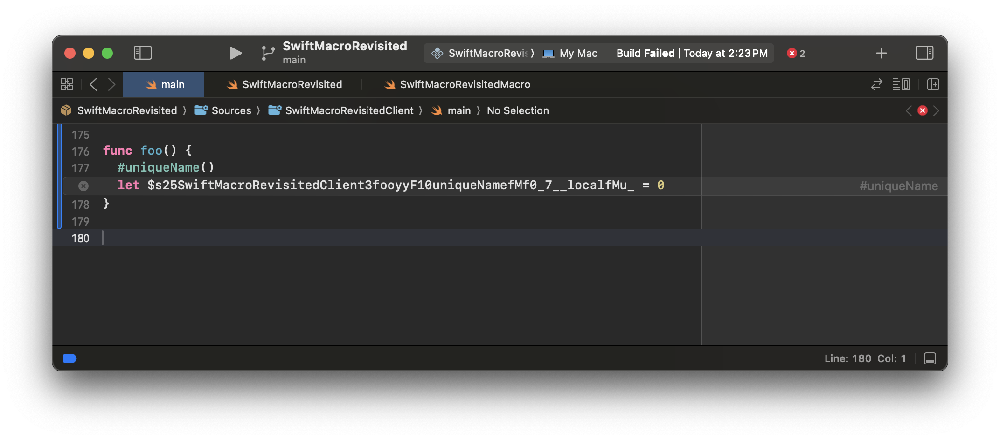
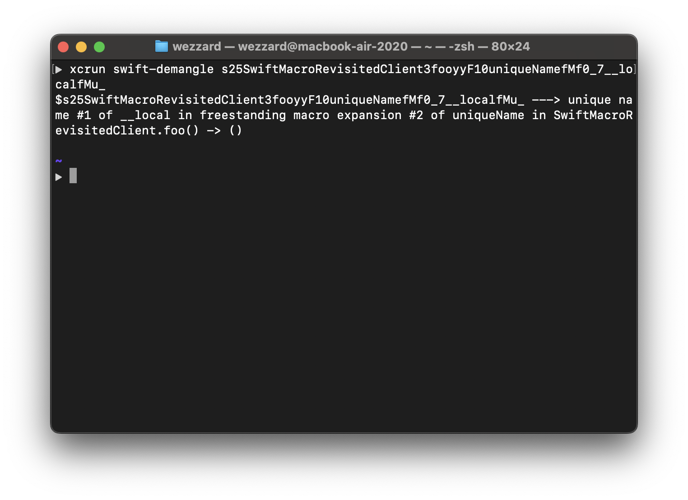

在之前的文章中，我们学习了突出定义 Swift 宏的优势和本质。文中的示例工作正常，但是我们现在可以自信而大胆地实现任何 Swift 宏了吗？

答案是否定的。

带来 Swift 宏优势的特性也会引入陷阱与缺陷，从而让程序员自己给自己造成麻烦。在本文中，我想向你展示我发现的一些问题以及如何避免它们。

## 陷阱与缺陷

### 控制流的潜在混乱

在之前的文章中的 `#unwrap` 示例中，Swift 宏展开可能涉及到**控制流操控**和**词法作用域共享**：

展开之前：

```swift
func foo(_ bar: Int?) {
  #unwrap(bar) {
    print(bar)
  }
}
```

展开之后：

```swift
func foo(_ bar: Int?) {
  // #unwrap 宏展开开始
  guard let bar = bar else {
    return
  }
  print(bar)
  // #unwrap 宏展开结束
}
```

由于示例宏展开中涉及控制流的 `return` 语句是有意行为，所以这并不让人感到意外。但是如果我们将这个宏放在循环中呢？请看下面这个例子：

展开之前：

```swift
func foo(_ bar: Int?) {
  for _ in 0..<10 {
    #unwrap(bar) {
      print(bar)
    }
  }
}
```

展开之后：

```swift
func foo(_ bar: Int?) {
  for _ in 0..<10 {
    // #unwrap 宏展开开始
    guard let bar = bar else {
      return
    }
    print(bar)
    // #unwrap 宏展开结束
  }
}
```

通过上面的宏展开，我们可以知道如果将非可选值传递给 `foo`，则 `bar` 只会被打印一次。这是因为宏展开引入的 `return` 语句会中断外部循环。

然而，`#unwrap` 宏的名称只传达了对可选值解包的目的。这可能会让使用这个宏的程序员认为从应用点返回是一个**意外行为**。

### Freestanding Macro 中的命名冲突

以上提到的意外并不是我给出的 `#unwrap` 宏扩展中唯一存在的潜在陷阱。这里还有一个陷阱：在宏扩展后，`bar` 变量被 `#unwarp` 宏重新绑定。让我们继续检查该宏的扩展:

```swift
func foo(_ bar: Int?) {
  // #unwrap 宏展开开始
  guard let bar = bar else {
    return
  }
  print(bar)
  // #unwrap 宏展开结束
}
```

这个宏扩展引入了 variable name shadowing，其中 `guard let bar: Int` shadow 了参数 `_ bar: Int?`。对于 `#unwrap` 来说，variable name shadowing 是无足轻重的，因为这是一种有意的行为。然而，在真实世界的编程中，`Optional` 之外的 variable name shadowing 都会被认为是一种不好的实践 - 实际上，在 Swift 中这会无法通过编译。如我之前所总结，freestanding Swift macro 的宏展开涉及应用点的词法作用域共享。这使得宏展开中可能发生 variable name shadowing。以下是一个人造的例子：由于宏展开，变量名 `updater` 被 shadow 了。

展开之前:

```swift
func foo(_ bar: Int?) {
  let updater = Updater()
  #unwrap(bar) {
    let updater = Updater()
    print(bar)
    updater.update()
  }
  print(updater.description)
}
```

展开之后:

```swift
func foo(_ bar: Int?) {
  // `updater` 第一次被声明
  let updater = Updater()
  // #unwrap 宏展开开始
  guard let bar else {
    return
  }
  // `updater` 第二次被声明
  let updater = Updater()
  print(bar)
  updater.update()
  // #unwrap 宏展开结束
  print(updater.description)
}
```

在 Xcode 中进行一次 clean build，你会发现这个例子无法编译:



### Attached Macro 中的命名冲突

潜在的命名冲突不仅可以在 freestanding macro 中产生，还可以在 attached macro 中产生。我们可以从之前那篇文章中的 `@COW` 宏示例中了解到这一点。让我们回顾一下这个示例的宏展开：

```swift
@COW
struct User {

  // @COW 宏展开开始
  private class Storage {

    var name: String

    // 其他属性 ...

  }

  private var _$storage: Storage

  private func makeStorageUniqueIfNeeded() {
    if !isKnownUniquelyReferenced(&_$storage) {
      _$storage = Storage(name: name, ...)
    }
  }

  init(name: String, ...) {
    self._storage = Storage(name: name, ...)
  }
  // @COW 宏展开结束

  // @COW 宏展开开始
  @COWIncluded(storage: _$storage)
  // @COW 宏展开结束
  var name: String {
    // @COWIncluded 宏展开开始
    get { return _$storage.name }
    set {
      makeStorageUniqueIfNeeded()
      _$storage.name = newValue
    }
    // @COWIncluded 宏展开结束
  }

}
```

你可能已经注意到，在宏展开中新增的一个成员带有 `_$` 前缀这个命名模式。

```swift
  private var _$storage: Storage
```

这是我从苹果的 Swift Observation 和 SwiftData 宏实现中学到的命名习惯，该习惯可以保护附加宏的实现细节不被程序员意外访问。然而，这并不能保护这些成员免受其他宏带来的意外重声明或访问 —— 因为程序员可能也应用了其他宏，而这些宏可能会添加重复名称的成员或者误用其他宏添加的成员。

例如，假设有一个叫做 `@DictionaryLike` 的宏，它通过添加一对 `subscript` getter 和 setter，使被应用的类型表现得像一个字典。然后我们在 `@COW` 宏示例中使用的 `User` 结构体上应用 `@DictionaryLike` 宏：

```swift
@DictionaryLike
struct User {

  // 其他内容 ...

}
```

`@DictionaryLike` 可以被展开为以下代码：

```swift
@DictionaryLike
struct User {

  // 其他内容 ...

  // @DictionaryLike 宏展开开始
  var _$storage: [String : Any] = [:]

  subscript(_ key: String) -> Any? {
    get { return _$storage[key] }
    set { _$storage[key] = newValue }
  }
  // @DictionaryLike 宏展开结束

}
```

一旦我们将 `@COW` 和 `@DictionaryLike` 叠加到同一类型上，就会出现这样的情况：即 `@COW` 和 `@DictionaryLike` 都向被应用的类型添加了一个名为 `_$storage` 的成员。

```swift
@COW
@DictionaryLike
struct User {

  // 其他内容 ...

  // 由 @COW 宏展开引入
  var _$storage: Storage

  // 由 @DictionaryLike 宏展开引入
  var _$storage: [String : Any] = [:]

}
```

显然，这在 Swift 中无法编译，因为 Swift 不允许属性重载。在这种情况下，我们会再次获得 "invalid redeclaration of a variable" 错误。



### 唯一语言结构的命名冲突

在 Swift 中，一些语言结构在其父一级结构下是唯一的。这意味着当多个宏尝试在相同的父一级结构中生成相同的子结构时，代码会变得无法编译。例如，属性声明中的 `get` 和 `set` accessor 中 —— 如果我们在属性声明中添加多个 `get` accessor，那么代码将无法编译。这个错误一般很少在手写代码中发生，但在使用宏时需要引起注意。

我们可以从之前的 `@DictionaryLike` 示例开始深入了解这个问题。假设有一个附加的 accessor macro 叫做 `@UseDictionaryStorage`，它为附加属性生成 `get` 和 `set` accessor。getter 和 setter 将访问转发到由 `@DictionaryLike` 宏展开带来的存储容器中。

宏展开之前：

```swift
@COW
@DictionaryLike
struct User {
  
  @UseDictionaryStorage
  var info: [String : Any]?

}
```

宏展开之后：

```swift
@COW
@DictionaryLike
struct User {
  
  @UseDictionaryStorage
  var info: [String : Any]? {
    // @UseDictionaryStorage 宏展开开始
    get {
      return _$storage["info"] as? [String : Any]?
    }
    set {
      _$storage["info"] = newValue
    }
    // @UseDictionaryStorage 宏展开结束
  }

}
```

然而，这过度简化了所发生的事情。`@COW` 宏的真实展开结果是：

```swift
@COW
@DictionaryLike
struct User {
  
  @UseDictionaryStorage
  @COWIncluded
  var info: [String : Any]? {
    // @COWIncluded 宏展开开始
    get {
      _$storage.info
    }
    set {
      makeStorageUniqueIfNeeded()
      _$storage.info = newValue
    }
    // @COWIncluded 宏展开结束
    // @UseDictionaryStorage 宏展开开始
    get {
      return _$storage["info"] as? [String : Any]?
    }
    set {
      _$storage["info"] = newValue
    }
    // @UseDictionaryStorage 宏展开结束
  }

}
```

我们可以观察到，在 `info` 属性下生成了两个 `get` 和 `set` accessor。由于 Swift 的语法只允许一个属性中有一个 `get`/`set` accessor，这个展开会导致 Swift 中的语法错误，最终使得代码无法编译。

然而，这还是没有看到全貌。通过 COW 宏的生产级实现，`get` 和 `set` accessor 被优化为了 `_read` 和 `_modify` 以生产环境中提供更好的性能，同时我们可以观察到 Swift 不仅禁止程序员定义名称相同的多个 accessor 而且还禁止定义多个语义相同的 accessor。



### 引用其他框架的声明时的命名冲突

上面我们已经学习了几种因为添加声明而导致的潜在命名冲突的案例，你可能会认为这个列表已经完结了。

但是不是这样的。命名冲突不仅可以由变量和属性的 accessor 等声明引起，还可以由对其他框架中声明的引用引起。我想向你展示一下如何通过重构 `@COW` 宏示例从而陷入这种窘境。

上面展示的 `@COW` 宏示例是一种朴素的实现--`makeStorageUniqueIfNeeded` 函数其实是多余的，我们可以通过将其提取到一个名为 `Box` 的类型中来消除。`Box` 可以包含在拥有 `@COW` 宏的库中。为了简化在宏展开中使用此类型的方式，我们还可以将其变成 property wrapper。下面是示例代码:

```swift
@propertyWrapper
public struct Box<Contents> {
  
  private class Heap {
    
    var contents: Contents
    
    init(contents: Contents) { self.contents = contents }
    
  }
  
  private var heap: Heap
  
  public init(wrappedValue: Contents) {
    heap = Heap(contents: wrappedValue)
  }
  
  public var wrappedValue: Contents {
    get { heap.contents }
    set {
      makeUniqueHeapIfNeeded()
      heap.contents = newValue
    }
  }
  
  private mutating func makeUniqueHeapIfNeeded() {
    guard !isKnownUniquelyReferenced(&heap) else { return }
    heap = Heap(contents: heap.contents)
  }
  
}
```

然后，我们可以通过将 `@Box` 附着到宏展开引入的 `_$storage` 属性，从而消除原地生成的 `makeStorageUniqueIfNeeded` 函数。这减少了冗余并增加了编译速度。现在这个宏的实现更加成熟了。

```swift
@COW
struct User {

  // @COW 宏展开开始
  private struct Storage {

    var name: String

    // 其他属性 ...

  }

  @Box
  private var _$storage: Storage

  init(name: String, ...) {
    self._$storage = Storage(name: name, ...)
  }
  // @COW 宏展开结束

  // @COW 宏展开开始
  @COWIncluded(storage: _$storage)
  // @COW 宏展开结束
  var name: String {
    // @COWIncluded 宏展开开始
    get { return _$storage.name }
    set { _$storage.name = newValue }
    // @COWIncluded 宏展开结束
  }

}
```

然而，类型名称 `Box` 可能存在歧义--可能还有其他框架也有一个名为 `Box` 的类型。这种歧义也可能导致代码无法编译。下面的截图展示了 `COW` 宏的生产级实现是如何解决这个问题的：



### 语义冲突

在与 `@COW` 宏产生 `get` 和 `set` accessor 竞争的 `@DictionaryLike` 宏示例中，我们已经了解到 accessor macro 可能会相互影响。然而，这不是 accessor macro 所带来的唯一潜在问题：一些语言特性也可能会受到 accessor macro 的干扰。看下面的例子：一个 property wrapper 附着到一个应用了 `@COW` 宏的结构体中的存储属性上，导致代码无法编译通过。

扩展之前的代码：

```swift
@propertyWrapper
struct Capitalized {
  
  var wrappedValue: String {
    didSet {
      wrappedValue = wrappedValue.capitalized
    }
  }
  
}

@COW
struct User {
  
  @Capitalized
  var name: String = ""
  
}
```

扩展之后的代码：

```swift
@COW
struct User {
  
  @COWIncluded
  @Capitalized
  var name: String = "" {
    get {
      return _$storage.name
    }
    set {
      makeStorageUniqueIfNeeded()
      _$storage.name = newValue
    }
  }

  // ...

}
```

我们得到这个展开结果是因为 property wrapper 的「展开」发生在宏展开之后。根据这个结果，`@Capitalized` property wrapper 仍然附着在 `name` 变量上，但由于宏展开，变量从存储属性变成了计算属性。最终，我们会得到编译器诊断出来的错误：

> Property wrapper cannot be applied to a computed property



这不仅限于 property wrappers，`lazy` 关键字也可能导致进入同样的死胡同。

```swift
@COW
class User {
  
  lazy var name: String = { "Jane Doe" }()
  
}
```

```swift
@COW
class User {
  
  @COWIncluded
  lazy var name: String = { "Jane Doe" }() {
    get {
      return _$storage.name
    }
    set {
      makeStorageUniqueIfNeeded()
      _$storage.name = newValue
    }
  }

  // ...

}
```



通过这些例子，我们可以了解到 Swift 宏的展开可能会改变源代码的语义。这可能会导致语义冲突，最终使得展开结果无法通过编译。

## 解决方案：渐进式控制宏展开

到目前为止，我们已经列出了一系列在实现 Swift 宏时可能会遇到的典型陷阱和缺陷。乍一看，这个列表可能让你感到不知所措。然而，我发明了一种简单的方法来摆脱这些问题：渐进式控制宏展开。这个方法的思想源自于「渐进式暴露 API 设计」和「渐进式类型化」，并借鉴了从苹果 Swift Observation 和 SwiftData 的实现中提取出的一些思路。

「渐进式控制宏展开」的思想非常简单：如果没有冲突，那么程序员就不需要费力绕过冲突解决机制；如果有，那么我们必须有工具使得程序员可以用最小的努力解决冲突。

### 最大化成为幸运儿的概率

如果一个程序员在使用 Swift 宏的过程中不需要解决任何冲突，那么我们可以说该程序员成为了幸运儿。为了最大化 Swift 宏用户获得预期结果的可能性，我们必须遵守以下几点：

> 条目 1：操作控制流的宏应该具有反映这一目的的名称。

这个项目的目的是为了避免对之前提到的 `#unwrap` 宏的误用：

```swift
func foo(_ bar: Int?) {
  for _ in 0..<10 {
    #unwrap(bar) {
      print(bar)
    }
  }
}
```

它被展开为：

```swift
func foo(_ bar: Int?) {
  for _ in 0..<10 {
    // #unwrap 宏展开开始
    guard let bar = bar else {
      return
    }
    print(bar)
    // #unwrap 宏展开结束
  }
}
```

通过将这个宏重命名为 `#returnIfAnyOptional`，程序员就可以更容易地避免进入这个陷阱了。

> 条目 2：如果符合你的设计，可以将宏展开放在一个「保护伞」下面。

这样可以摆脱大多数成员重复声明错误。例如：为了避免 `#unwrap` 宏中由 variable name shadowing 引起的命名冲突问题，我们可以使用一个**闭包**作为「保护伞」来保护宏展开：

问题展开：

```swift
func foo(_ bar: Int?) {
  // `updater` 第一次被声明
  let updater = Updater()
  // #unwrap 宏展开开始
  guard let bar else {
    return
  }
  // `updater` 第二次被声明
  let updater = Updater()
  print(bar)
  updater.update()
  // #unwrap 宏展开结束
  print(updater.description)
}
```

使用闭包修复后的宏展开：

```swift
func foo(_ bar: Int?) {
  // `updater` 第一次被声明
  let updater = Updater()
  // #unwrap 宏展开开始
  guard let bar else {
    return
  }
  { (bar) in
  // `updater` 第二次被声明
    let updater = Updater()
    print(bar)
    updater.update()
  }(bar)
  // #unwrap 宏展开结束
  print(updater.description)
}
```

然而，一旦闭包的内容涉及到控制流，闭包将不会在编译优化的性能内联过程中被内联。这会使闭包的内容无法进入宏应用点的局部分析和优化的范围。在某些情况下，这也意味着更大的包体积。为了摆脱这种情况，我们可以使用局部函数而不是闭包，并将局部函数标注为 `@inline(__always)` 来构建「保护伞」。

使用局部函数修复后的宏展开：

```swift
func foo(_ bar: Int?) {
  // `updater` 第一次被声明
  let updater = Updater()
  // #unwrap 宏展开开始
  guard let bar else {
    return true
  }
  @inline(__always)
  func unwrapped(bar: Int) -> Void {
  // `updater` 第二次被声明
    let updater = Updater()
    print(bar)
    updater.update()
  }
  unwrapped(bar)
  // #unwrap 宏展开结束
  print(updater.description)
}
```

这种类似「保护伞」的结构也可以用于 attached macro 的宏展开，例如 `@COW` 宏的展开会声明一个嵌套的 `Storage` 类型作为存储类型。这个嵌套类型将起到前面提到的「保护伞」的作用 -- 通过类型作用域保护其成员免受重复声明的影响。

```swift
@COW
struct User {

  // @COW 宏展开开始
  private struct Storage {

    var name: String

    // 其他属性 ...

  }

  // 无关宏展开 ...

  // @COW 宏展开结束
  
  // 无关内容 ...

}
```

> 条目 3：使用 fully-qualified name 引用标准库以外的框架中的类型、函数或变量。

在将 `@Box` property wrapper 引入 `@COW` 宏展开的示例中，我们会发现 `Box` 本身的名称可能会产生歧义，因为其他被 import 的框架可能有相同名称的声明。我们可以通过使用 fully-qualified name 来解决这个问题。假设库的名称是 `COW`，那么 `Box` 的 fully-qualified name 是 `COW.Box`。

修复前的宏展开：

```swift
@COW
struct User {

  // @COW 宏展开开始

  // 无关宏展开 ...
  
  @Box
  private var _$storage: Storage

  // 无关宏展开 ...

  // @COW 宏展开结束

  // 无关内容 ...

}
```

修复后的宏展开：

```swift
@COW
struct User {

  // @COW 宏展开开始

  // 无关宏展开 ...
  
  @COW.Box
  private var _$storage: Storage

  // 无关宏展开 ...

  // @COW 宏展开结束

  // 无关内容 ...

}
```

### 最小化解决冲突的工作量

然而，我们不能保证程序员总是会遇到幸运的情况。肯定会有一些情况需要程序员自己解决冲突。

通过应用上述条目，我们仍然可能会遇到潜在的名称和语义冲突。我们唯一能做的就是面对并解决它们：因为我们不能假设一个宏作者能够预测到其他所有宏作者可能选择的名称，同时，不变的语义绝对不应该是 Swift 宏展开的性质，因为这会降低 Swift 宏的灵活性。理想的情况是拥有一组解决冲突的工具，然后这些工具在使用成本方面呈现出平滑曲线。这些工具分别是：

> 条目 4：如果在宏展开的某个部分已由程序员声明，则使用程序员的声明。

通过这个条目，程序员仍然不需要费力解决冲突。这个条目中描述的机制被一些以 AST 转写的形式实现的语言特性采用，如 `Equatable` 和 `Hashable` —— 如果 `Equatable` 或 `Hashable` 已经由程序员实现，编译器就不会帮程序员实现这些协议。在 Swift Observation 中，当程序员实现了 `access` 函数或 `withMutation` 函数时，也可以观察到这个现象。由于这个机制是普遍存在的，学习曲线也应该是平缓的。

> 条目 5：在可以重命名声明时，为你的宏展开内容提供重命名的途径。

我们可以使用在单个类型上叠加 `@COW` 宏和 `@DictionaryLike` 宏的示例来测试此条目。这两个宏的扩展会生成两个 `_$storage` 变量。要添加重命名机制，我们可以自然而然地想到在宏中添加一个参数：

```swift
@attached(member, names: arbitrary)
@attached(memberAttribute)
public macro COW(storageName: String) =
  #externalMacro(module: "COWMacros", type: "COWMacro")
```

但是这会破坏「渐进式控制宏扩展」的理念：如果没有冲突，那么程序员就不需要关心解决冲突 —— 有了这个宏声明，程序员每次使用该宏都需要附加一个额外的参数。然而，你可能还不知道，我们可以通过宏重载来解决这个问题。这意味着我们可以有多个同名但具有不同「签名」的宏。

```swift
@attached(member, names: arbitrary)
@attached(memberAttribute)
public macro COW() =
  #externalMacro(module: "COWMacros", type: "COWMacro")

@attached(member, names: arbitrary)
@attached(memberAttribute)
public macro COW(storageName: String) =
  #externalMacro(module: "COWMacros", type: "COWMacro")
```

首先，让我们回顾一下在为每个宏添加重命名机制之前的宏展开。

```swift
@COW
@DictionaryLike
struct User {

  // 其他内容 ...

  // 由 @COW 宏展开引入
  var _$storage: Storage

  // 由 @DictionaryLike 宏展开引入
  var _$storage: [String : Any] = [:]

}
```

然后，一下是为每个宏添加重命名机制后的宏展开。

```swift
@COW(storageName: "_$cowStorage")
@DictionaryLike(storageName: "_$dictStorage")
struct User {

  // 其他内容 ...

  // 由 @COW 宏展开引入
  var _$cowStorage: Storage

  // 由 @DictionaryLike 宏展开引入
  var _$dictStorage: [String : Any] = [:]

}
```

然而，宏展开可能会引入无法重命名的声明，比如 `get` 和 `set` accessor。那么接下来我们会遇到最昂贵的条目：

> 条目 6：在生成代码涉及父一级结构中的唯一语言结构时，提供停止代码生成的方法。

Swift Observation 提供了一个很好的例子来说明这一点，下面是示例：一个附着了 `@Observable` 宏的类，同时其属性也附着了 `@Capitalized` property wrapper：

```swift
@propertyWrapper
struct Capitalized {
  
  var wrappedValue: String {
    didSet {
      wrappedValue = wrappedValue.capitalized
    }
  }
  
}

@Observable
class User {
  
  @Capitalized
  var name: String

  init(name: String) {
    self.name = name
  }
  
}
```

上面的代码无法编译，因为 property wrapper 要求 `name` 是一个存储属性，但 `@Observable` 将其转换为了计算属性。



这是宏展开的关键部分：

```swift
@Observable
class User {

  // 无关宏展开 ...
  
  @Capitalized
  // @Observable 宏展开开始
  @ObservationTracked
  // @Observable 宏展开结束
  var name: String {
    // @ObservationTracked 宏展开开始
    init(initialValue) initializes(_name) {
      _name = initialValue
    }
    get {
      access(keyPath: \.name)
      return _name
    }
    set {
      withMutation(keyPath: \.name) {
        _name = newValue
      }
    }
    // @ObservationTracked 宏展开结束
  }
  
  // 无关内容 ...
  
}
```

然而，由于 Swift Observation 还提供了一个叫 `@ObservationIgnored` 的 attached macro 来停止 `@Observable` 对应用类型的成员带来的代码生成，因此我们可以使用这个宏来手动解决冲突。

首先，我们需要将 `name` 属性加上 `_` 前缀，并在其上附着 `@ObservationIgnored`。

```swift
@Observable
class User {
  
  @Capitalized
  @ObservationIgnored
  var _name: String

  // ...

}
```

然后，我们可以添加一个 `name` 属性，手动实现观察机制：

```swift
@Observable
class User {

  // ...
  
  init(name: String) {
    self.name = name
  }

  var name: String {
    init(initialValue) initializes(__name) {
      __name = Capitalized(wrappedValue: initialValue)
    }
    get {
      access(keyPath: \.name)
      return _name
    }
    set {
      withMutation(keyPath: \.name) {
        _name = newValue
      }
    }
  }

  // ...
  
}
```

最终我们解决了这个冲突。



> 条目 7：宏的文档应包含一个示例宏展开。

然而，仅仅有第 6 条还不够。程序员仍然可能对如何单独手动「展开」宏感到困惑。为了解决这个问题，宏的作者应该在其文档中包含一个示例实现，展示如何手动展开宏。这样，程序员就能获得他们需要的指导，来手动解决宏展开冲突问题。

### 为什么我不推荐使用 makeUniqueName(_:)

在 WWDC 2203 中我们了解到有一种方法可以消除名称冲突：使用 `MacroExpansionContext.makeUniqueName(_:)`。然而，此API生成的名称对人类来说是无法理解的。下面是一个例子：



你知道这是什么意思吗？至少，我一眼看不出它的含义。我们只能通过使用 `swift-demangle` 解析它：



由于这个名称可能在调试时使用，所以可读性对于理解代码的意图至关重要。这就是为什么我不推荐使用 `MacroExpansionContext.makeUniqueName(_:)` 的原因。

## 结论

在本文中，我们列出了一些编写 Swift 宏时可能遇到的典型陷阱和缺陷。除此之外，我们还讨论了解决它们的方法论：「渐进式控制宏展开」，其中包括 2 个目标和 7 个条目。

这个方法论的目标是：

- 如果没有冲突，那么程序员就不需要费力绕过冲突解决机制。
- 如果有冲突，则必须有工具允许程序员以最小的努力解决冲突。

该方法论中的条目包括：

1. 操作控制流的宏应该具有反映这一目的的名称。
2. 如果符合你的设计，可以将宏展开放在一个「保护伞」下面。
3. 使用 fully-qualified name 引用标准库以外的框架中的类型、函数或变量。
4. 如果在宏展开的某个部分已由程序员声明，则使用程序员的声明。
5. 在可以重命名声明时，为你的宏展开内容提供重命名的途径。
6. 在生成代码涉及父一级结构中的唯一语言结构时，提供停止代码生成的方法。
7. 宏的文档应包含一个示例宏展开。

此外，我们还了解到 `MacroExpansionContext.makeUniqueName(_:)` 生成的名称无法被人类理解，这降低了调试时理解代码意图的效率。

## 资源

- 实现了本文中宏的 playground 项目（需要 `git checkout traps-and-pitfalls`）：

[WeZZard/SwiftMacroRevisited](https://github.com/WeZZard/SwiftMacroRevisited)

- `@COW` 宏的生产级实现：

[WeZZard/COWMacro](https://github.com/wezzard/cowmacro)
