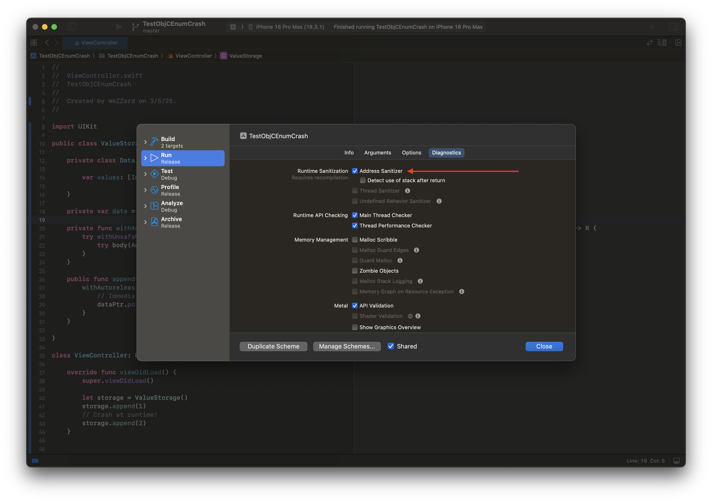
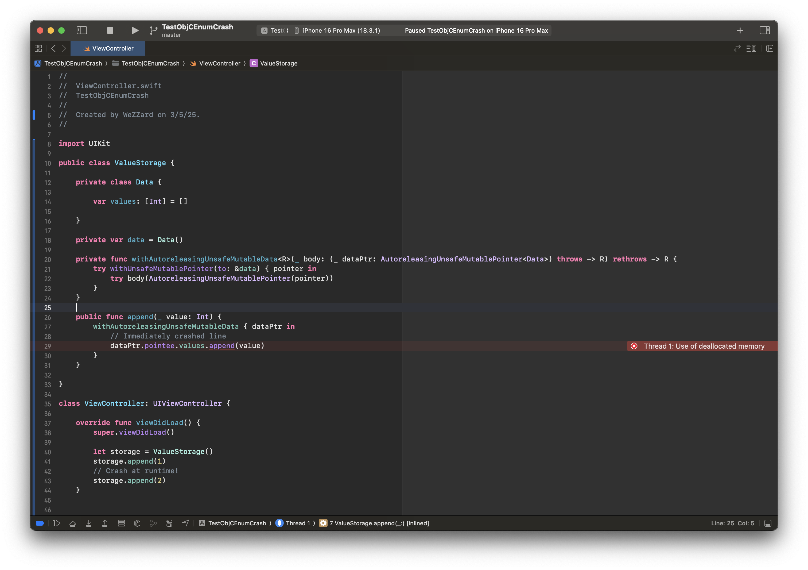
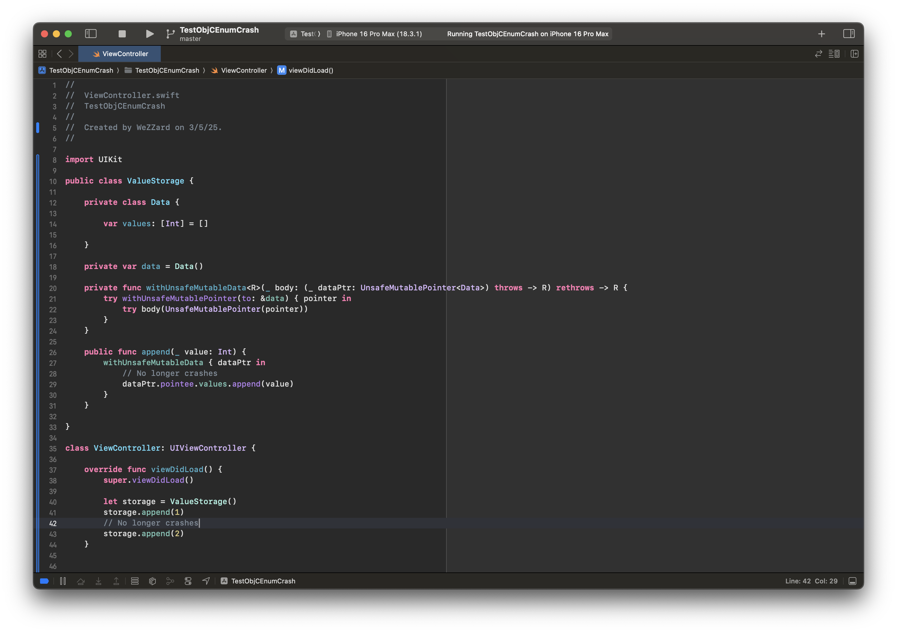
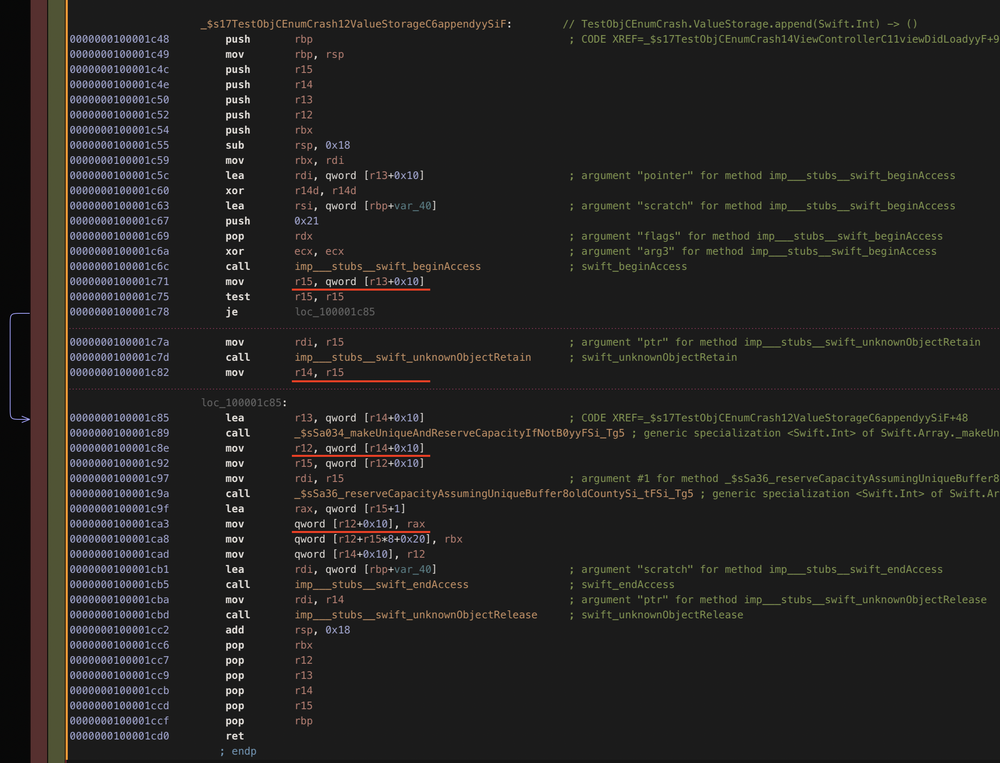
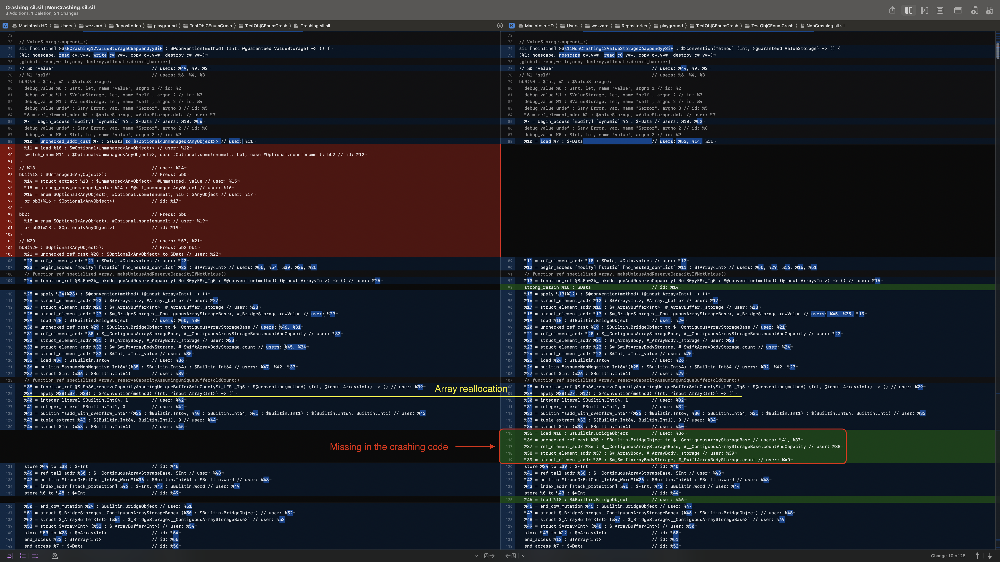
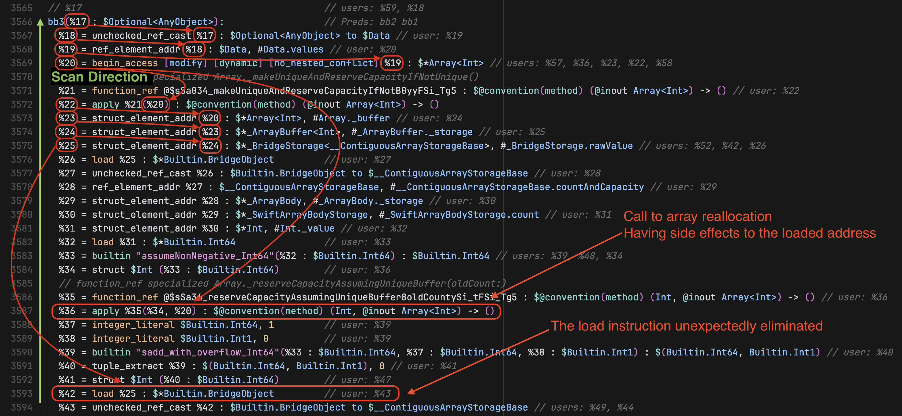
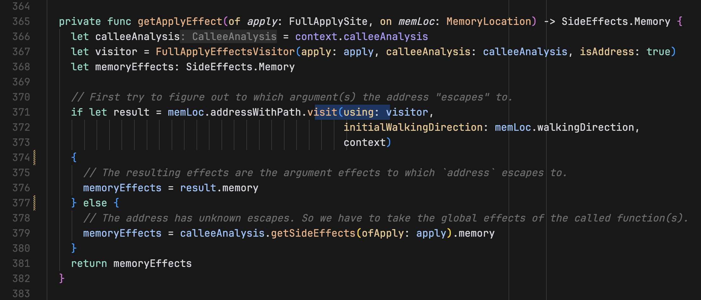
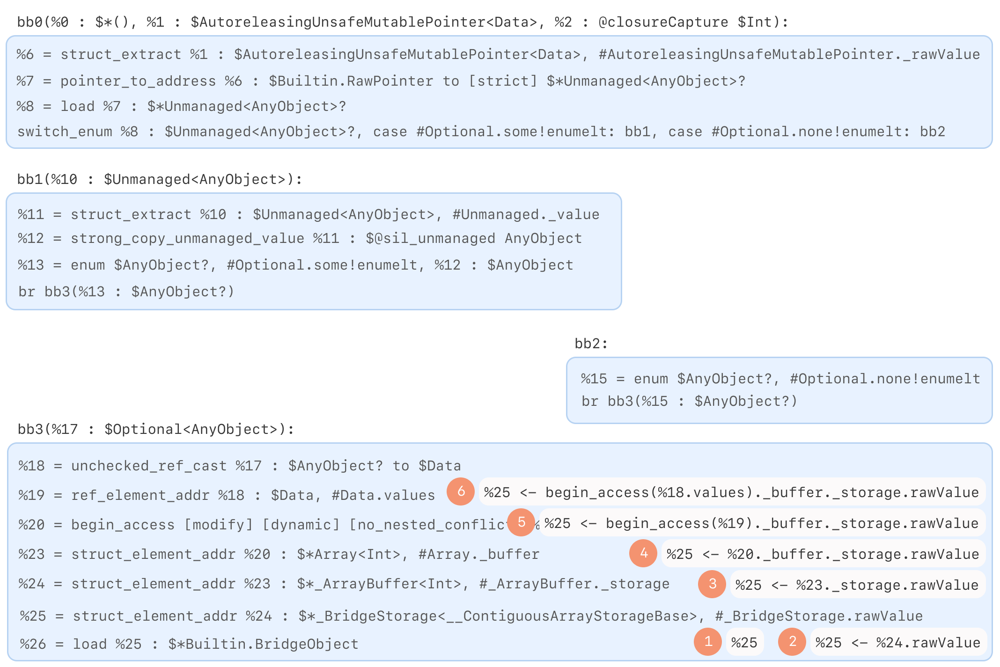
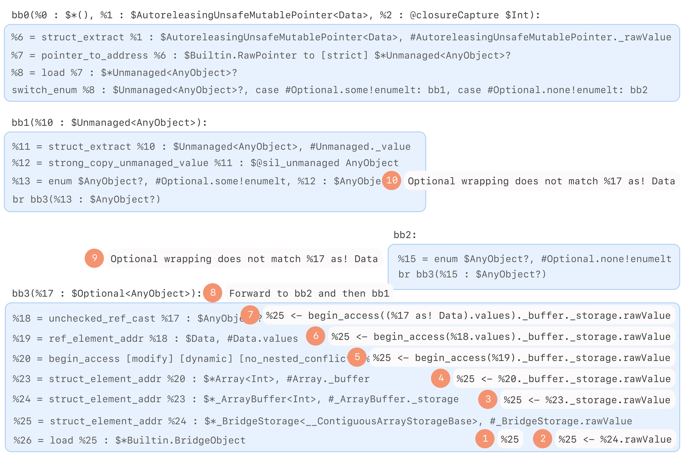
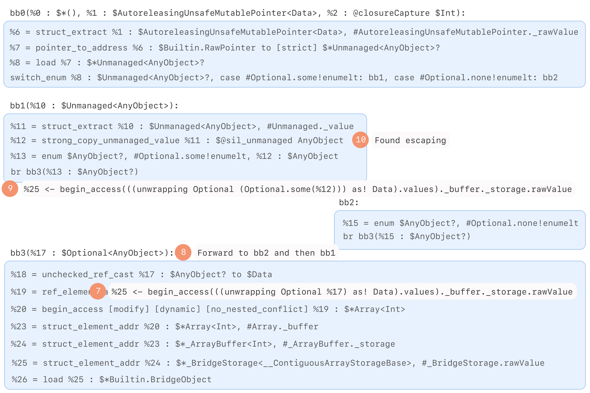

Right before the Chinese New Year vacation of the Year of the Snake, a
colleague showed me a mysterious crash caused by a use-after-free error.
Recently, I found time to investigate this issue and discovered that the
crash resulted from a miscompilation by the Swift compiler. The minimal
reproducible code appears below and must be compiled with the `-Osize`
optimization level. We can detect the use-after-free by enabling the
address sanitizer during compilation.

```swift
let storage = ValueStorage()
// Crash at runtime!
storage.append(1)

public class ValueStorage {
    
    private class Data {
    
        var values: [Int] = []
    
    }
    
    private var data = Data()
    
    private func withAutoreleasingUnsafeMutableData<R>(_ body: (_ dataPtr: AutoreleasingUnsafeMutablePointer<Data>) throws -> R) rethrows -> R {
        try withUnsafeMutablePointer(to: &data) { pointer in
            try body(AutoreleasingUnsafeMutablePointer(pointer))
        }
    }
    
    public func append(_ value: Int) {
        withAutoreleasingUnsafeMutableData { dataPtr in
            // Immediately crashed line
            dataPtr.pointee.values.append(value)
        }
    }
    
}
```





Interestingly, replacing `AutoreleasingUnsafeMutablePointer` with
`UnsafeMutablePointer` eliminates the issue.



## Investigating the Primary Scene of the Crash

After disassembling the problematic program, we can find that the `Array`
appending function was inlined in the `ValueStorage.append` function. The
key issue is that the program failed to re-acquire the `Array`'s buffer
object after reallocation. This causes the address computed with register
`r12` to point to the old buffer if reallocation occurred. The
disassembled code can be simplified as:

```asm
; load `self.values: [Int]` to r12
mov r15, qword [r13 + 0x10]
; r14 is now `self.values: [Int]`
mov r14, r15
; loads the Array's buffer object to r12
mov r12, qword [r14 + 0x10]
; reallocate, may free the old buffer object
call Swift.Array._reserveCapacityAssumingUniqueBuffer
; set the new count to the old buffer object
; use-after-free occurred
mov qword [r12 + 0x10] rax
```

Here is the complete disassembled code of `ValueStorage.append`:



Examining the Swift standard library reveals that the implementation
actually updates elements count and inserts new elements by accessing the
property `_buffer` on `self`, not an existing old buffer variable. The
Swift compiler incorrectly eliminated the re-acquisition of the `_buffer`
object in the target code.

```swift
// Implementation in the Standard Library
@inlinable
@_semantics("array.mutate_unknown")
@_effects(notEscaping self.**)
internal mutating func _appendElementAssumeUniqueAndCapacity(
  _ oldCount: Int,
  newElement: __owned Element
) {
  // Using `_buffer` of `self`
  _buffer.mutableCount = oldCount &+ 1
  // Using `_buffer` of `self`
  (_buffer.mutableFirstElementAddress + oldCount).initialize(to: newElement)
}

// An imaginary implementation that might produce the generated target code
@inlinable
@_semantics("array.mutate_unknown")
@_effects(notEscaping self.**)
internal mutating func _appendElementAssumeUniqueAndCapacity(
    _ oldCount: Int,
    newElement: __owned Element
    // Explicitly reusing the old buffer
    oldBufer: _Buffer
) {
    // Using `oldBuffer`
    oldBufer.mutableCount = oldCount &+ 1
    (oldBufer.mutableFirstElementAddress + oldCount).initialize(to: newElement)
}
```

## Why the Swift Compiler Deleted the Code

By examining the intermediate compilation products, we can find the
initial miscompilation in the "optimized SIL" output, which can be
obtained by adding the `-emit-sil` argument when invoking `swiftc`.
Comparing the optimized SIL of programs using `AutoreleasingUnsafeMutablePointer`
(left side) and `UnsafeMutablePointer` (right side) revealed that with
`AutoreleasingUnsafeMutablePointer`, a critical `load` of the array
storage was missing.



To identify which compiler pass removed this `load`, we can use the
`-Xllvm` argument to enable debug prints in the compiler. Specifically,
we can use `--sil-print-function` to make the compiler print the SIL of the
specified function whenever a pass modified its contents:

```bash
swiftc YOUR_SWIFT_SOURCE.swift -Osize \
    -Xllvm '--sil-print-function=$MangledSwiftFunctionName'
```

The key logs from this analysis can be summarized as:

```sil
  *** SIL function after  #10338, stage MidLevel,Function, pass 37: CSE (cse)
// closure #1 in ValueStorage.append(_:)
...
sil private @$s8Crashing12ValueStorageC6appendyySiFySAyAA4Data33_A856358C389441A2F6EA224BB743344FLLCGXEfU_ : $@convention(thin) @substituted <τ_0_0> (AutoreleasingUnsafeMutablePointer<Data>, Int) -> (@out τ_0_0, @error any Error) for <()> {
...
bb3(%17 : $Optional<AnyObject>):
    ...
    %26 = load %25 : $*Builtin.BridgeObject
    ...
  %35 = function_ref @$sSa36_reserveCapacityAssumingUniqueBuffer8oldCountySi_tFSi_Tg5 : $@convention(method) (Int, @inout Array<Int>) -> () // user: %36
  %36 = apply %35(%34, %20) : $@convention(method) (Int, @inout Array<Int>) -> ()
  ...
  // The load instruction still exists
  %42 = load %25 : $*Builtin.BridgeObject
  %43 = unchecked_ref_cast %42 : $Builtin.BridgeObject to $__ContiguousArrayStorageBase
  %44 = ref_element_addr %43 : $__ContiguousArrayStorageBase, #__ContiguousArrayStorageBase.countAndCapacity
  %45 = struct_element_addr %44 : $*_ArrayBody, #_ArrayBody._storage
  %46 = struct_element_addr %45 : $*_SwiftArrayBodyStorage, #_SwiftArrayBodyStorage.count
  store %41 to %46 : $*Int

  *** SIL function after  #10339, stage MidLevel,Function, pass 38: RedundantLoadElimination (redundant-load-elimination)
// closure #1 in ValueStorage.append(_:)
...
sil private @$s8Crashing12ValueStorageC6appendyySiFySAyAA4Data33_A856358C389441A2F6EA224BB743344FLLCGXEfU_ : $@convention(thin) @substituted <τ_0_0> (AutoreleasingUnsafeMutablePointer<Data>, Int) -> (@out τ_0_0, @error any Error) for <()> {
...
bb3(%17 : $Optional<AnyObject>):
    ...
    %26 = load %25 : $*Builtin.BridgeObject
    ...
  %35 = function_ref @$sSa36_reserveCapacityAssumingUniqueBuffer8oldCountySi_tFSi_Tg5 : $@convention(method) (Int, @inout Array<Int>) -> ()
  %36 = apply %35(%34, %20) : $@convention(method) (Int, @inout Array<Int>) -> ()
  ...
  // The load instruction was eliminated
  %42 = unchecked_ref_cast %26 : $Builtin.BridgeObject to $__ContiguousArrayStorageBase
  %43 = ref_element_addr %42 : $__ContiguousArrayStorageBase, #__ContiguousArrayStorageBase.countAndCapacity
  %44 = struct_element_addr %43 : $*_ArrayBody, #_ArrayBody._storage
  %45 = struct_element_addr %44 : $*_SwiftArrayBodyStorage, #_SwiftArrayBodyStorage.count
  store %41 to %45 : $*Int
```

From these logs, we can clearly see that the "redundant load elimination"
(RLE) pass deleted the following `load` instruction:

```swift
%42 = load %25 : $*Builtin.BridgeObject
```

## Reasoning the Fix Solution

To develop a fix, we first needed to understand RLE. This pass optimizes
code by eliminating redundant "get and set" operations for both virtual
and real registers. Consider this example with virtual registers:

```swift
%1 = load %x
%2 = store %1
%3 = load %2
return %3
```

An optimized equivalent would simply return `%1` immediately, as `%2` is
just an intermediate result. This is a case RLE should handle correctly.
Let's call this case 1.

```swift
%1 = load %x
return %1
```

However, consider this more complex case:

```swift
%1 = load %x
call print(%1)
call Foo(%x)
%3 = load %x // Can we eliminate this line?
return %3
```

Here, elimination depends on whether `Foo` modifies the contents of `%x`.
If it does, we cannot directly return `%1` because `%3 = load %x` loads
the updated contents. Let's call this case 2.

Examining the Swift compiler's RLE implementation in
`RedundantLoadElimination.swift`, we can find the entry point:

```swift
let redundantLoadElimination = FunctionPass(name: "redundant-load-elimination") {
    (function: Function, context: FunctionPassContext) in
  eliminateRedundantLoads(in: function, ignoreArrays: false, context)
}
```

Follow the code from this entry point, we can find that the algorithm
differs from classic RLE approaches:

1. It iterates backward through instructions in each reverse-order basic
   block to find all `load` instructions
2. For each `load`, it examines prior instructions to find:
   - Available `store` instructions for optimization (like the first case)
   - Available `load` instructions for optimization (like the second case)
     when no functions with side effects to the address were called between
     loads
3. A complexity budget limits prior instruction scanning for each load

Comparing the detailed behaviors of RLE with `AutoreleasingUnsafeMutablePointer`
and `UnsafeMutablePointer`, we can find:

```swift
// AutoreleasingUnsafeMutablePointer
eliminating redundant loads in function: $s8Crashing12ValueStorageC6appendyySiFySAyAA4Data33_A856358C389441A2F6EA224BB743344FLLCGXEfU_
...
scanning prior instructions for the load:   %42 = load %25 : $*Builtin.BridgeObject         // users: %52, %43
...
visiting instruction:   %36 = apply %35(%34, %20) : $@convention(method) (Int, @inout Array<Int>) -> ()
transparent
// %35 = function_ref @$sSa36_reserveCapacityAssumingUniqueBuffer8oldCountySi_tFSi_Tg5 : $@convention(method) (Int, @inout Array<Int>) -> () // user: %36
```

```swift
// UnsafeMutablePointer
eliminating redundant loads in function: $s11NonCrashing12ValueStorageC6appendyySiF
...
scanning prior instructions for the load:   %35 = load %18 : $*Builtin.BridgeObject         // users: %45, %36
...
visiting instruction:   %29 = apply %28(%27, %12) : $@convention(method) (Int, @inout Array<Int>) -> ()
overwritten
// %28 = function_ref @$sSa36_reserveCapacityAssumingUniqueBuffer8oldCountySi_tFSi_Tg5 : $@convention(method) (Int, @inout Array<Int>) -> () // user: %36
```

This reveals that:
- With `AutoreleasingUnsafeMutablePointer`, RLE considered the array
  reallocation function "transparent" to the address of the `load`
  instruction's operand, enabling elimination
- With `UnsafeMutablePointer`, RLE correctly recognized that the function
  overwrites the address, preventing elimination

For case 2 scenarios, the Swift 6 algorithm checks all prior instructions
of the `load` to determine side effects of function calls between the
source of the `load`'s operand and the `load` instruction itself.



The key insight is that the Swift compiler only evaluates function side
effects when the ultimate source of the `load`'s operand has an unknown
escaping result. By setting breakpoints in the following function located
in `AliasAnalysis.swift`, I found the critical difference between the two
pointer types:



- With `AutoreleasingUnsafeMutablePointer`, the compiler checks if the
  definition source of the `load` instruction's operand is escaping. When
  determined not to be escaping, the compiler incorrectly assumes the
  function has no side effects.
  
- With `UnsafeMutablePointer`, the compiler retrieves the global
  side-effects of the array reallocation function (likely from the
  `@_effects` attribute). Only functions marked `readOnly` or `readNone`
  are considered side effect-free.

Further investigation led to the `visit` function at line 371, which
performs escape analysis on the `load` instruction's operand. The
following diagram illustrates this process:



This is the escape analysis process:
1. Walks up the use-def chain to analyze escaping behavior
2. Constructs a path representing how to derive the `load` instruction's
   operand from its definition point in each step

The complexity arises with `AutoreleasingUnsafeMutablePointer`'s `pointee`
getter implementation, which presents a non-trivial case for this escaping
analysis:

```swift
@frozen
public struct AutoreleasingUnsafeMutablePointer<Pointee /* TODO : class */>
  :  _Pointer {
  
  @inlinable
  public var pointee: Pointee {
    @_transparent get {
      // The memory addressed by this pointer contains a non-owning reference,
      // therefore we *must not* point an `UnsafePointer<AnyObject>` to
      // it---otherwise we would allow the compiler to assume it has a +1
      // refcount, enabling some optimizations that wouldn't be valid.
      //
      // Instead, we need to load the pointee as a +0 unmanaged reference. For
      // an extra twist, `Pointee` is allowed (but not required) to be an
      // optional type, so we actually need to load it as an optional, and
      // explicitly handle the nil case.
      let unmanaged =
        UnsafePointer<Optional<Unmanaged<AnyObject>>>(_rawValue).pointee
      return _unsafeReferenceCast(
        unmanaged?.takeUnretainedValue(),
        to: Pointee.self)
    }
    ...
  }
  
  ...
}
```

The implementation details reveal that `AutoreleasingUnsafeMutablePointer`
must cast references from `Optional<Unmanaged<AnyObject>>` to the
`Pointee` type to maintain +0 reference counting. This casting is
performed through the `_unsafeReferenceCast` function:

```swift
@_transparent
@unsafe
public func _unsafeReferenceCast<T, U>(_ x: T, to: U.Type) -> U {
  return Builtin.castReference(x)
}
```

The compiler translates this to the `Builtin.castReference` function,
ultimately represented as an `unchecked_ref_cast` instruction in SIL:

```swift
%y = unchecked_ref_cast %x : $SourceSILType to $DesintationSILType
```

The problem arises because `AutoreleasingUnsafeMutablePointer` introduces
cases where `$SourceSILType` and `$DesintationSILType` may be `Optional`
types:

```swift
%y = unchecked_ref_cast %x : $Optional<AnyObject> to $Data
```

This instruction can cast between `Optional` and non-`Optional` types,
effectively wrapping or unwrapping values. Since escape analysis walks the
use-def chain with a path that must strictly reflect how to derive the
`load` operand from its definition point, these implicit `Optional`
conversions create path mismatches, as illustrated:



This hypothesis is confirmed by examining the `walkUpDefault` function in
`WalkUtils.swift`, which handles various instruction types during the
walk-up but lacks proper handling for `Optional` conversions in
`unchecked_ref_cast`:

```swift
public mutating func walkUpDefault(value def: Value, path: Path) -> WalkResult {
    switch def {
    ...
    case let urc as UncheckedRefCastInst:
      if urc.type.isClassExistential || urc.fromInstance.type.isClassExistential {
        // Sometimes `unchecked_ref_cast` is misused to cast between AnyObject and a class (instead of
        // init_existential_ref and open_existential_ref).
        // We need to ignore this because otherwise the path wouldn't contain the right `existential` field kind.
        return rootDef(value: urc, path: path)
      }
        ...
        }
}
```

## Fix Solution

The solution is to account for `Optional` and non-`Optional` casting in
the use-def chain walk-up:

```swift
public mutating func walkUpDefault(value def: Value, path: Path) -> WalkResult {
    switch def {
    ...
    case let urc as UncheckedRefCastInst:
      if urc.type.isClassExistential || urc.fromInstance.type.isClassExistential {
        // Sometimes `unchecked_ref_cast` is misused to cast between AnyObject and a class (instead of
        // init_existential_ref and open_existential_ref).
        // We need to ignore this because otherwise the path wouldn't contain the right `existential` field kind.
        return rootDef(value: urc, path: path)
      }
      switch (urc.type.isOptional, urc.fromInstance.type.isOptional) {
        case (true, false):
          if let path = path.popIfMatches(.enumCase, index: 0) {
            if walkUp(value: urc.fromInstance, path: path) == .abortWalk {
              return .abortWalk
            } else if let path = path.popIfMatches(.enumCase, index: 1) {
              return walkUp(value: urc.fromInstance, path: path)
            }
          }
          return .abortWalk
        case (false, true):
          if walkUp(value: urc.fromInstance, path: path.push(.enumCase, index: 0)) == .abortWalk {
            return .abortWalk
          } else {
            return walkUp(value: urc.fromInstance, path: path.push(.enumCase, index: 1))
          }
        default:
          return walkUp(value: urc.fromInstance, path: path)
      }
        ...
        }
}
```

The diagram below illustrates how this fix accommodates `Optional` and
non-`Optional` type conversions during escape analysis. When the escape
analysis process encounters an `unchecked_ref_cast` between `Optional` and
non-`Optional` types, the fix ensures proper path transformations by
adjusting the path to account for enum case differences.



A similar change is needed in the `walkDownDefault` function for def-use
chain analysis:

```swift
public mutating func walkDownDefault(value operand: Operand, path: Path) -> WalkResult {
    let instruction = operand.instruction
    switch instruction {
        ...
        case let urc as UncheckedRefCastInst:
      if urc.type.isClassExistential || urc.fromInstance.type.isClassExistential {
        // Sometimes `unchecked_ref_cast` is misused to cast between AnyObject and a class (instead of
        // init_existential_ref and open_existential_ref).
        // We need to ignore this because otherwise the path wouldn't contain the right `existential` field kind.
        return leafUse(value: operand, path: path)
      }
      switch (urc.type.isOptional, urc.fromInstance.type.isOptional) {
        case (true, false):
          if walkDownUses(ofValue: operand, path: path.push(.enumCase, index: 0)) == .abortWalk {
            return .abortWalk
          }
          return walkDownUses(ofValue: operand, path: path.push(.enumCase, index: 1))
        case (false, true):
          if let path = path.popIfMatches(.enumCase, index: 0) {
            if walkDownUses(ofValue: operand, path: path) == .abortWalk {
              return .abortWalk
            } else if let path = path.popIfMatches(.enumCase, index: 1) {
              return walkDownUses(ofValue: operand, path: path)
            }
          }
          return .abortWalk
        default:
          return walkDownUses(ofValue: operand, path: path)
      }
      ...
    }
}
```

After implementing this fix, compiling the `AutoreleasingUnsafeMutablePointer`
code produces logs showing that RLE correctly recognizes potential side
effects:

```swift
eliminating redundant loads in function: $s8Crashing12ValueStorageC6appendyySiF
scanning prior instructions for the load:   %45 = load %28 : $*Builtin.BridgeObject         // users: %55, %46
...
visiting instruction:   %39 = apply %38(%37, %23) : $@convention(method) (Int, @inout Array<Int>) -> ()
overwritten
```

The optimized SIL now retains the critical `load` instruction after the
array reallocation:

```swift
// ValueStorage.append(_:)
// Isolation: unspecified
sil [noinline] @$s8Crashing12ValueStorageC6appendyySiF : $@convention(method) (Int, @guaranteed ValueStorage) -> () {
[%1: noescape, read c*.v**, write c*.v**, copy c*.v**, destroy c*.v**]
[global: read,write,copy,destroy,allocate,deinit_barrier]

...

bb3(%20 : $Optional<AnyObject>):
    ...
  // function_ref specialized Array._reserveCapacityAssumingUniqueBuffer(oldCount:)
  %38 = function_ref @$sSa36_reserveCapacityAssumingUniqueBuffer8oldCountySi_tFSi_Tg5 : $@convention(method) (Int, @inout Array<Int>) -> ()
  %39 = apply %38(%37, %23) : $@convention(method) (Int, @inout Array<Int>) -> ()
  %45 = load %28 : $*Builtin.BridgeObject
  ...
} // end sil function '$s8Crashing12ValueStorageC6appendyySiF'
```

## Tips for Debugging the Swift Compiler

### Getting the Intermediate Products of the Swift Compiler

To examine the Swift compiler's intermediate representations at each
compilation stage:

```bash
swiftc YourSwiftSource.swift -Osize -emit-silgen > YourSwiftSource.silgen.sil # Generating raw SIL
swiftc YourSwiftSource.swift -Osize -emit-sil > YourSwiftSource.sil.sil # Generating optimized SIL
swiftc YourSwiftSource.swift -Osize -emit-irgen > YourSwiftSource.irgen.ll # Generating raw LLVM IR
swiftc YourSwiftSource.swift -Osize -emit-ir > YourSwiftSource.ir.ll # Generating optimized LLVM IR
```

### Leveraging LLVM Pass-Through Arguments

LLVM provides numerous pass-through arguments that can be used with Swift:

```bash
# Print SIL changes for the specified function
swiftc -Xllvm '--sil-print-function=$MangledSwiftFunctionName'
# Print the name of each SIL pass before it runs
swiftc -Xllvm '--sil-print-pass-name=pass-name'
# Print functions that are inlined into other functions
swiftc -Xllvm '--sil-print-inlining-callee=true'
```

### Building the Swift Compiler

What to notice is that, in this post, we are debugging the detailed
behaviors of the compiler, but the Swift programming language is bundled
with the standard library. Since the issue is coupled with the inlining
of the function `Array.append`, we shall build a debug version of the
compiler and a release version of the standard library to ensure the
inlining cost of `Array.append` as low as possible. This could be done
with the following command:

```bash
utils/build-script --no-swift-stdlib-assertions \
    --skip-ios --skip-tvos --skip-watchos --skip-build-benchmarks
```

### Syntax Highlights for SIL and LLVM IR

You could search "WeZZard" in the extension market of VS Code (or Cursor) to get the syntax highlights for SIL in relative IDE.

You could find the "LLVM" extension by Ingvar Stepanyan in the extension market of VS Code (or Cursor) to get the syntax highlights for LLVM IR in relative IDE.
