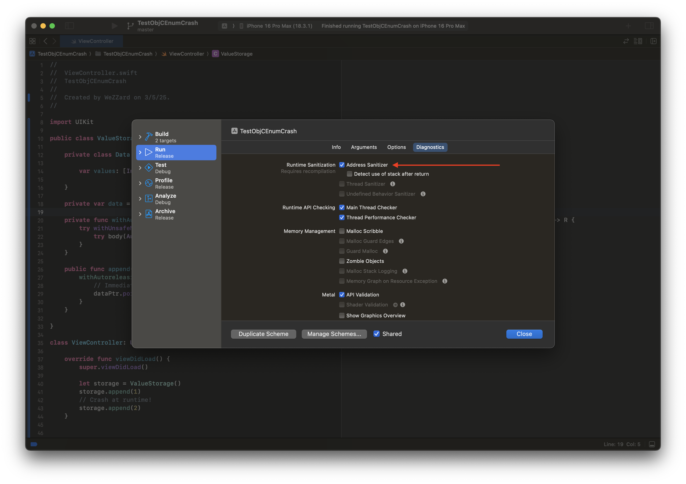
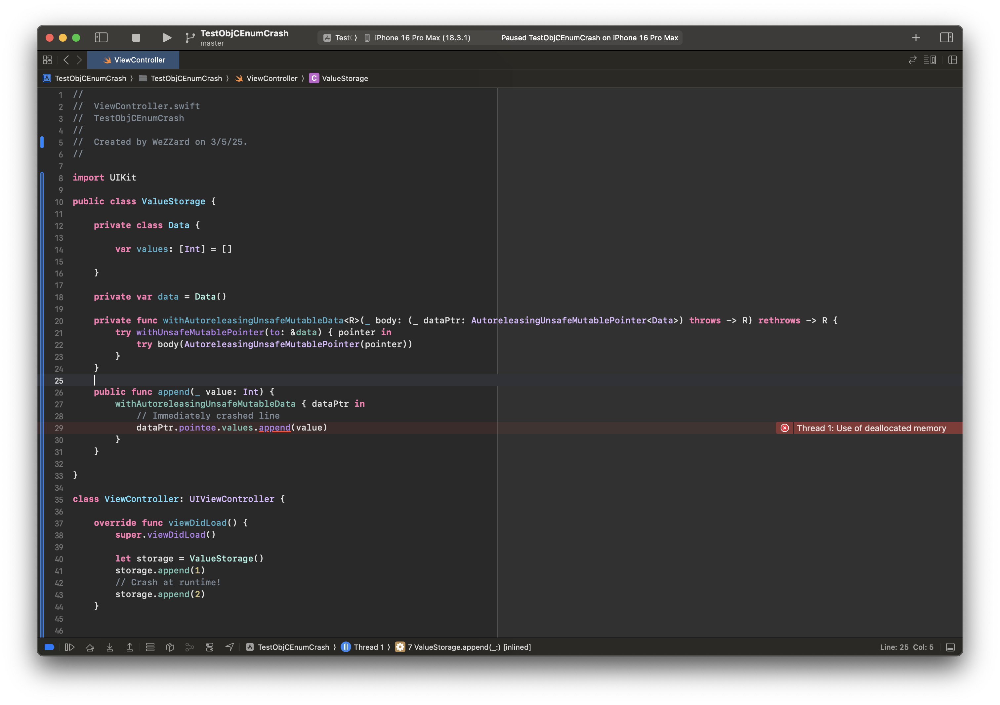
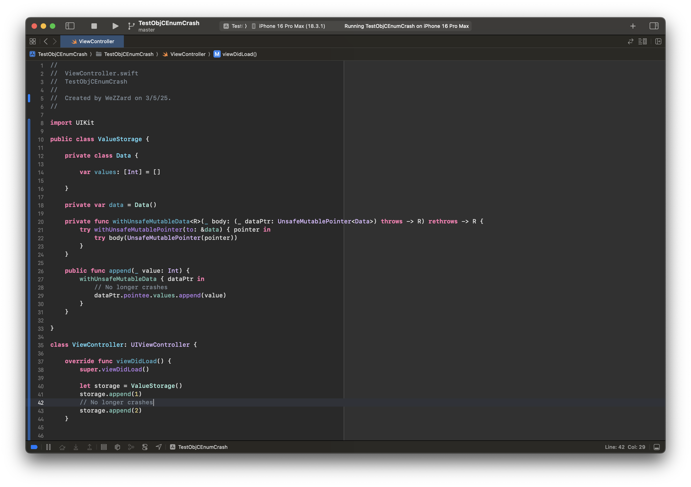

Right before the Chinese New Year vacation of the year snake, my colleague showed me a mystic crash caused by a use-after-free. Recently, I end up having some time to dig into this issue and eventually found that the crash is a result of a mis-compilation caused by the Swift compiler. The minimal reproducible code is shown below and shall be compiled with the `-Osize` optimization level. We can observe the use-after-free by enabling the address sanitizer while compiling the program.

```swift
let storage = ValueStorage()
// Crash at runtime!
storage.append(1)

public class ValueStorage {
    
    private class Data {
    
        var values: [Int] = []
    
    }
    
    private var data = Data()
    
    private func withAutoreleasingUnsafeMutableData<R>(_ body: (_ dataPtr: AutoreleasingUnsafeMutablePointer<Data>) throws -> R) rethrows -> R {
        try withUnsafeMutablePointer(to: &data) { pointer in
            try body(AutoreleasingUnsafeMutablePointer(pointer))
        }
    }
    
    public func append(_ value: Int) {
        withAutoreleasingUnsafeMutableData { dataPtr in
            // Immediately crashed line
            dataPtr.pointee.values.append(value)
        }
    }
    
}
```





However, by replacing the `AutoreleasingUnsafeMutablePointer` with `UnsafeMutablePointer`, this issue disappeared.



## Investigating the Primary Scene of the Crash

After disassembled the problematic program, we can find that the `Array` appending function was inlined in  the `ValueStorage.append` function. What might take time to figure out is that the program didn’t re-acquire the `Array`'s buffer object after the buffer has been reallocated. This would cause the address computed with the register `r12` points to the old buffer if the reallocation really happened. The disassembled code could be simplified as the following code:

```nasm
; load `self.values: [Int]` to r12
mov r15, qword [r13 + 0x10]
; r14 is now `self.values: [Int]`
mov r14, r15
; loads the Array's buffer object to r12
mov r12, qword [r14 + 0x10]
; reallocate, may free the the old buffer object
call Swift.Array._reserveCapacityAssumingUniqueBuffer
; set the new count to the old buffer object
; use-after-free happened
mov qword [r12 + 0x10] rax
```

And here is the complete disassembled code of `ValueStorage.append`.


But when we look into the Swift standard library, we can find that the code actually updates elements count and inserts the new element by accessing the property `_buffer` on `self` but **not an existing old buffer variable**. So the Swift compiler actually deleted  in the re-acquire of the `_buffer` object in target code.

```swift
// Implementation in the Standard Library
@inlinable
@_semantics("array.mutate_unknown")
@_effects(notEscaping self.**)
internal mutating func _appendElementAssumeUniqueAndCapacity(
  _ oldCount: Int,
  newElement: __owned Element
) {
  // Using `_buffer` on `self`
  _buffer.mutableCount = oldCount &+ 1
  // Using `_buffer` on `self`
  (_buffer.mutableFirstElementAddress + oldCount).initialize(to: newElement)
}

// An imaginary implementation may result in the generated target code
@inlinable
@_semantics("array.mutate_unknown")
@_effects(notEscaping self.**)
internal mutating func _appendElementAssumeUniqueAndCapacity(
    _ oldCount: Int,
    newElement: __owned Element
    // Explicitly reusing the old buffer
    oldBufer: _Buffer
) {
    // Using `oldBuffer`
    oldBufer.mutableCount = oldCount &+ 1
    (oldBufer.mutableFirstElementAddress + oldCount).initialize(to: newElement)
}
```

## Why the Swift Compiler Deleted the Code?

By checking the intermediate products of the compilation, the initial mis-compile could be found in the “optimized SIL” product, which could be gotten by appending `-emit-sil` argument when invoking `swiftc`. With a comparison between the optimized SIL of the program text using `AutoreleasingUnsafeMutablePointer`(left-side) and `UnsafeMutablePointer` (right-side), we can find that when the program is compiled with `AutoreleasingUnsafeMutablePointer`, there is a `load` of the array storage missing.


To investigate which pass of the compiler removed this `load` , we have to invoke the compiler with the `-Xllvm` argument to enable debug prints in the compiler. Here we use `--sil-print-function` to make the Swift compiler to print the SIL of the specified function once there is a pass modified the contents. To notice is that, the single quotes wrapped the `--sil-print-function` argument are required.

```bash

swiftc YOUR_SWIFT_SOURCE.swift -Osize \
    -Xllvm '--sil-print-function=$MangledSwiftFunctionName'
```

Once we have the SIL changes history for the `ValueStorage.append` during the compilation, we can find which pass caused this issue. As a result, the key logs could be simplified as the following:

```sil
  *** SIL function after  #10338, stage MidLevel,Function, pass 37: CSE (cse)
// closure #1 in ValueStorage.append(_:)
...
sil private @$s8Crashing12ValueStorageC6appendyySiFySAyAA4Data33_A856358C389441A2F6EA224BB743344FLLCGXEfU_ : $@convention(thin) @substituted <τ_0_0> (AutoreleasingUnsafeMutablePointer<Data>, Int) -> (@out τ_0_0, @error any Error) for <()> {
...
bb3(%17 : $Optional<AnyObject>):
    ...
    %26 = load %25 : $*Builtin.BridgeObject
    ...
  %35 = function_ref @$sSa36_reserveCapacityAssumingUniqueBuffer8oldCountySi_tFSi_Tg5 : $@convention(method) (Int, @inout Array<Int>) -> () // user: %36
  %36 = apply %35(%34, %20) : $@convention(method) (Int, @inout Array<Int>) -> ()
  ...
  // The load instruction still exists
  %42 = load %25 : $*Builtin.BridgeObject
  %43 = unchecked_ref_cast %42 : $Builtin.BridgeObject to $__ContiguousArrayStorageBase
  %44 = ref_element_addr %43 : $__ContiguousArrayStorageBase, #__ContiguousArrayStorageBase.countAndCapacity
  %45 = struct_element_addr %44 : $*_ArrayBody, #_ArrayBody._storage
  %46 = struct_element_addr %45 : $*_SwiftArrayBodyStorage, #_SwiftArrayBodyStorage.count
  store %41 to %46 : $*Int

  *** SIL function after  #10339, stage MidLevel,Function, pass 38: RedundantLoadElimination (redundant-load-elimination)
// closure #1 in ValueStorage.append(_:)
...
sil private @$s8Crashing12ValueStorageC6appendyySiFySAyAA4Data33_A856358C389441A2F6EA224BB743344FLLCGXEfU_ : $@convention(thin) @substituted <τ_0_0> (AutoreleasingUnsafeMutablePointer<Data>, Int) -> (@out τ_0_0, @error any Error) for <()> {
...
bb3(%17 : $Optional<AnyObject>):
    ...
    %26 = load %25 : $*Builtin.BridgeObject
    ...
  %35 = function_ref @$sSa36_reserveCapacityAssumingUniqueBuffer8oldCountySi_tFSi_Tg5 : $@convention(method) (Int, @inout Array<Int>) -> ()
  %36 = apply %35(%34, %20) : $@convention(method) (Int, @inout Array<Int>) -> ()
  ...
  // The load instruction was eliminated
  %42 = unchecked_ref_cast %26 : $Builtin.BridgeObject to $__ContiguousArrayStorageBase
  %43 = ref_element_addr %42 : $__ContiguousArrayStorageBase, #__ContiguousArrayStorageBase.countAndCapacity
  %44 = struct_element_addr %43 : $*_ArrayBody, #_ArrayBody._storage
  %45 = struct_element_addr %44 : $*_SwiftArrayBodyStorage, #_SwiftArrayBodyStorage.count
  store %41 to %45 : $*Int
```

From the previous log, we can clearly observe that it is the “redundant load elimination(RLE for short in the following texts)” pass deleted the following `load` instruction:

```swift
%42 = load %25 : $*Builtin.BridgeObject
```

## Reasoning the Fix Solution

Before fixing the issue, we have to know what is RLE. This helps us to build a recognition about the correct behavior, supporting the later fixing decisions.

RLE is essentially an optimization to eliminate redundant “get and set” for both the virtual and real registers. We can have the following example with virtual registers:

```swift
%1 = load %x
%2 = store %1
%3 = load %2
return %3
```

For the code above, we can quickly find an optimal equivalent version which is to return `%1` immediately, since `%2` is used as an intermediate result. This is a case that RLE should consider. Let’s call it case 1.

```swift
%1 = load %x
return %1
```

But there is also another case. Could we eliminate the `%3 = load %x` and just return `%1` to optimize the following code?

```swift
%1 = load %x
call print(%1)
call Foo(%x)
%3 = load %x // Could we eliminate this line?
return %3
```

In this case, it depends. If the function `Foo` modifies the contents of the `%x`, then we cannot directly return `%1`. Because the later `%3 = load %x` loads the updated contents of `%x`. This also is a case that RLE should consider. Let’s call it case 2.

Back to the issue, we have to understand the idea behind RLE with the latest implementations in the Swift compiler. Checking out the latest version source code of the Swift compiler, we can find the entry point of this pass is in the file `RedundantLoadElimination.swift`.

```swift
let redundantLoadElimination = FunctionPass(name: "redundant-load-elimination") {
    (function: Function, context: FunctionPassContext) in
  eliminateRedundantLoads(in: function, ignoreArrays: false, context)
}
```

Follow the code from this entry point, it reveals that the algorithm used in the Swift compiler differs from the classic RLE approach:

- It reversely iterates all the instructions in each reverse-order basic block to find all the `load` instructions
- Then it iterates the prior instructions of each `load` instruction to find:
    1. Available `store` instructions to optimize like what I’ve shown in the case 1
    2. Available `load` instructions to optimize like what I’ve shown in the case 2 when no functions have side-effects to the address represented by the operand of the `load`s were called between two `load`s.
- There is a complexity budget for prior instructions scanning for each load instruction. The optimization stopped when the complexity budget is used up.

The Swift 6 RLE algorithm leverages Swift’s unique language features and SIL’s design to simplify redundant load detection, improving code clarity and reducing complexity. But I would like to talk about this later.

Firstly, we need to compare the differences between the detailed behaviors of the RLE pass dealing with the `AutoreleasingUnsafeMutablePointer` and `UnsafeMutablePointer`. I just added some log in the source code, then quickly found the difference:

```swift
// AutoreleasingUnsafeMutablePointer
eliminating redundant loads in function: $s8Crashing12ValueStorageC6appendyySiFySAyAA4Data33_A856358C389441A2F6EA224BB743344FLLCGXEfU_
...
scanning prior instructions for the load:   %42 = load %25 : $*Builtin.BridgeObject         // users: %52, %43
...
visiting instruction:   %36 = apply %35(%34, %20) : $@convention(method) (Int, @inout Array<Int>) -> ()
transparent
// %35 = function_ref @$sSa36_reserveCapacityAssumingUniqueBuffer8oldCountySi_tFSi_Tg5 : $@convention(method) (Int, @inout Array<Int>) -> () // user: %36
```

```swift
// UnsafeMutablePointer
eliminating redundant loads in function: $s11NonCrashing12ValueStorageC6appendyySiF
...
scanning prior instructions for the load:   %35 = load %18 : $*Builtin.BridgeObject         // users: %45, %36
...
visiting instruction:   %29 = apply %28(%27, %12) : $@convention(method) (Int, @inout Array<Int>) -> ()
overwritten
// %28 = function_ref @$sSa36_reserveCapacityAssumingUniqueBuffer8oldCountySi_tFSi_Tg5 : $@convention(method) (Int, @inout Array<Int>) -> () // user: %36
```

We can see that:

- With `AutoreleasingUnsafeMutablePointer`, the RLE pass thought the array reallocation function is transparent to the address of the operand of the `load` instruction to eliminate. The elimination happened then.
- With `UnsafeMutablePointer`, the RLE pass thought the array reallocation function overwrites the address of the operand of the `load` instruction to eliminate. The elimination stopped.

Actually, this case matches the case 2 we’ve discussed before. With the discussion at hand, we can ensure that this `load` elimination in the case of `AutoreleasingUnsafeMutablePointer` is unexpected. But why it comes to this result?

In terms of the case 2, the algorithm implemented in the Swift 6 need to check all the prior instructions of the `load` instruction tried to eliminate. One purpose of this is to investigate the side-effects of the functions called between the ultimate source of the `load`'s operand and the `load` instruction tried to eliminate.


However, the Swift compiler only reads the side-effects of the function when the ultimate source of the `load`'s operand has unknown escaping result. By setting breakpoints in the relative function in the file `AliasAnalysis.swift`, we can also spot that the difference between the `AutoreleasingUnsafeMutablePointer` and `UnsafeMutablePointer` happens in this function:

- In the case of `AutoreleasingUnsafeMutablePointer`, the Swift compiler went to the line 376 to check whether the definition source of the `load` instruction’s operand is escaping. If it is ensured not escaping, the compiler would think the function has no side effects.
- In the case of `UnsafeMutablePointer`, the Swift compiler went to the line 379 to get the global side-effects of the array reallocation function. This may return the contents defined in the `@_effects` attribute marked on the function. Since only `readOnly` and `readNone` make the compiler think the function has no side effects, this is a very conservative choice.


Then the search scope limited to the line 371 — the `visit` function. This function actually does nothing but just to forward to an escape analysis for the operand of the `load` instruction. We could have the following diagram to help us understand what would happen step-by-step:


With this diagram, we can know that:

- The escaping analysis for the operand of an instruction walk up the use-def chain to analysis escaping.
- The escaping analysis would assemble a path to represents how to get the operand of the `load` instruction from the value of definition point.

However, in the case of `AutoreleasingUnsafeMutablePointer`, the getter of the  `pointee` variable is an non-trivial case in this walk-up journey:

```swift
@frozen
public struct AutoreleasingUnsafeMutablePointer<Pointee /* TODO : class */>
  :  _Pointer {
  
  @inlinable
  public var pointee: Pointee {
    @_transparent get {
      // The memory addressed by this pointer contains a non-owning reference,
      // therefore we *must not* point an `UnsafePointer<AnyObject>` to
      // it---otherwise we would allow the compiler to assume it has a +1
      // refcount, enabling some optimizations that wouldn't be valid.
      //
      // Instead, we need to load the pointee as a +0 unmanaged reference. For
      // an extra twist, `Pointee` is allowed (but not required) to be an
      // optional type, so we actually need to load it as an optional, and
      // explicitly handle the nil case.
      let unmanaged =
        UnsafePointer<Optional<Unmanaged<AnyObject>>>(_rawValue).pointee
      return _unsafeReferenceCast(
        unmanaged?.takeUnretainedValue(),
        to: Pointee.self)
    }
    ...
  }
  
  ...

}
```

With the comments, we can know that: for the sake of representing an +0 refcount reference, the `AutoreleasingUnsafeMutablePointer` need to cast the reference from an `Optional<Unmanaged<AnyObject>>` to the `Pointee` type. This is done by the `_unsafeReferenceCast` function.

```swift
@_transparent
@unsafe
public func _unsafeReferenceCast<T, U>(_ x: T, to: U.Type) -> U {
  return Builtin.castReference(x)
}
```

The compiler forwards to the `castReference` function of the `Builtin` module and then ultimately represents this function with `unchecked_ref_cast` instruction.

```swift
%y = unchecked_ref_cast %x : $SourceSILType to $DesintationSILType
```

However, the requirements from the `AutoreleasingUnsafeMutablePointer` introduces case that the `$SourceSILType` and `$DesintationSILType` may be an `Optional` type:

```swift
%y = unchecked_ref_cast %x : $Optional<AnyObject> to $Data
```

In other words, this instruction may cast between `Optional` types and non-`Optional` types — or say may wrap a type into `Optional` or unwrap an `Optional`  type into non-`Optional`. Since the escaping analysis walk up the use-def chain with a paired path and the paired path shall strictly reflect the way of getting the operand of the `load` instruction from its definition point. This unexpected `Optional` wrapping and unwrapping makes the path does not match with the exact one. Let me show you in the diagram:


We also can verify this by checking out the following function in the `WalkUtils.swift`.

```swift
public mutating func walkUpDefault(value def: Value, path: Path) -> WalkResult {
    switch def {
    ...
    case let urc as UncheckedRefCastInst:
      if urc.type.isClassExistential || urc.fromInstance.type.isClassExistential {
        // Sometimes `unchecked_ref_cast` is misused to cast between AnyObject and a class (instead of
        // init_existential_ref and open_existential_ref).
        // We need to ignore this because otherwise the path wouldn't contain the right `existential` field kind.
        return rootDef(value: urc, path: path)
      }
        ...
        }
}
```

## Fix Solution

To fix this issue, we can just to take this `Optional` and non-`Optional` casting into consideration in the use-def chain walk-up.

```swift
public mutating func walkUpDefault(value def: Value, path: Path) -> WalkResult {
    switch def {
    ...
    case let urc as UncheckedRefCastInst:
      if urc.type.isClassExistential || urc.fromInstance.type.isClassExistential {
        // Sometimes `unchecked_ref_cast` is misused to cast between AnyObject and a class (instead of
        // init_existential_ref and open_existential_ref).
        // We need to ignore this because otherwise the path wouldn't contain the right `existential` field kind.
        return rootDef(value: urc, path: path)
      }
      switch (urc.type.isOptional, urc.fromInstance.type.isOptional) {
        case (true, false):
          if let path = path.popIfMatches(.enumCase, index: 0) {
            if walkUp(value: urc.fromInstance, path: path) == .abortWalk {
              return .abortWalk
            } else if let path = path.popIfMatches(.enumCase, index: 1) {
              return walkUp(value: urc.fromInstance, path: path)
            }
          }
          return .abortWalk
        case (false, true):
          if walkUp(value: urc.fromInstance, path: path.push(.enumCase, index: 0)) == .abortWalk {
            return .abortWalk
          } else {
            return walkUp(value: urc.fromInstance, path: path.push(.enumCase, index: 1))
          }
        default:
          return walkUp(value: urc.fromInstance, path: path)
      }
        ...
        }
}
```

We could also visual this fix into following diagram:


And since some analysis also walk-down the def-use chain, we also need to add an equivalent treatment in the `walkDownDefault` function:

```swift

  public mutating func walkDownDefault(value operand: Operand, path: Path) -> WalkResult {
    let instruction = operand.instruction
    switch instruction {
        ...
        case let urc as UncheckedRefCastInst:
      if urc.type.isClassExistential || urc.fromInstance.type.isClassExistential {
        // Sometimes `unchecked_ref_cast` is misused to cast between AnyObject and a class (instead of
        // init_existential_ref and open_existential_ref).
        // We need to ignore this because otherwise the path wouldn't contain the right `existential` field kind.
        return leafUse(value: operand, path: path)
      }
      switch (urc.type.isOptional, urc.fromInstance.type.isOptional) {
        case (true, false):
          if walkDownUses(ofValue: operand, path: path.push(.enumCase, index: 0)) == .abortWalk {
            return .abortWalk
          }
          return walkDownUses(ofValue: operand, path: path.push(.enumCase, index: 1))
        case (false, true):
          if let path = path.popIfMatches(.enumCase, index: 0) {
            if walkDownUses(ofValue: operand, path: path) == .abortWalk {
              return .abortWalk
            } else if let path = path.popIfMatches(.enumCase, index: 1) {
              return walkDownUses(ofValue: operand, path: path)
            }
          }
          return .abortWalk
        default:
          return walkDownUses(ofValue: operand, path: path)
      }
      ...
    }
}
```

Now when compile the source code for the `AutoreleasingUnsafeMutablePointer` case, the logs come to be like this:

```swift
eliminating redundant loads in function: $s8Crashing12ValueStorageC6appendyySiF
scanning prior instructions for the load:   %45 = load %28 : $*Builtin.BridgeObject         // users: %55, %46
...
visiting instruction:   %39 = apply %38(%37, %23) : $@convention(method) (Int, @inout Array<Int>) -> ()
overwritten
```

We can see the RLE pass now correctly think the array reallocation function may have side effects to the operand of the `load` instruction. We can also find a `load` instruction right after the array reallocation function get called in the optimized SIL product:

```swift
// ValueStorage.append(_:)
// Isolation: unspecified
sil [noinline] @$s8Crashing12ValueStorageC6appendyySiF : $@convention(method) (Int, @guaranteed ValueStorage) -> () {
[%1: noescape, read c*.v**, write c*.v**, copy c*.v**, destroy c*.v**]
[global: read,write,copy,destroy,allocate,deinit_barrier]

...

bb3(%20 : $Optional<AnyObject>):
    ...
  // function_ref specialized Array._reserveCapacityAssumingUniqueBuffer(oldCount:)
  %38 = function_ref @$sSa36_reserveCapacityAssumingUniqueBuffer8oldCountySi_tFSi_Tg5 : $@convention(method) (Int, @inout Array<Int>) -> ()
  %39 = apply %38(%37, %23) : $@convention(method) (Int, @inout Array<Int>) -> ()
  %45 = load %28 : $*Builtin.BridgeObject
  ...
} // end sil function '$s8Crashing12ValueStorageC6appendyySiF'
```

## Tips for Debugging the Swift Compiler

### Getting the Intermediate Products of the Swift Compiler

When we come to the Swift compiler, as a famous example of multi-level intermediate representation compiler design, the first breakdown is to check the intermediate product in each stage of the compilation:

- Source code → AST
- AST → Raw Swift Intermediate Language
- Raw Swift Intermediate Language → Optimized Swift Intermediate Language
- Swift Intermediate Language → Raw LLVM IR
- Raw LLVM IR → Optimized LLVM IR
- Optimized LLVM IR → target code

To generate these intermediate products, we shall launch the Swift compiler with one of the following arguments: `-emit-silgen`,  `-emit-sil` ,  `-emit-irgen` ,  `-emit-ir` .

```bash
swiftc YourSwiftSource.swift -Osize -emit-silgen > YourSwiftSource.silgen.sil # Generating raw SIL
swiftc YourSwiftSource.swift -Osize -emit-sil > YourSwiftSource.sil.sil # Generating optimized SIL
swiftc YourSwiftSource.swift -Osize -emit-irgen > YourSwiftSource.irgen.ll # Generating raw LLVM IR
swiftc YourSwiftSource.swift -Osize -emit-ir > YourSwiftSource.ir.ll # Generating optimized LLVM IR
```

### Leveraging LLVM P**ass-Through Arguments**

For tools built with LLVM backend, they usually receives LLVM pass-through arguments like:

```bash
tool-name -Xllvm '-pass-through-argument'
```

Since Swift is also built with LLVM backend, there are a lot of LLVM pass-through arguments available even with the built binary shipped with Xcode:

```bash
# Print SIL changes for the specified function.
swiftc -Xllvm '--sil-print-function=$MangledSwiftFunctionName'
# Print the name of each SIL pass before it runs.
swiftc -Xllvm '--sil-print-pass-name=pass-name'
# Print functions that are inlined into other functions.
swiftc -Xllvm '--sil-print-inlining-callee=true'
```

### Build the Swift Compiler

What to notice is that, in this post, we are debugging the detailed behaviors of the compiler, but the Swift programming language is bundled with the standard library. Since the issue is coupled with the inlining of the function `Array.append`, we shall build a debug version of the compiler and a release version of the standard library to ensure the inlining cost of `Array.append` as low as possible. This could be done with the following command:

```bash
utils/build-script --no-swift-stdlib-assertions \
    --skip-ios --skip-tvos --skip-watchos --skip-build-benchmarks
```

### Syntax Highlights for SIL and LLVM IR

You could search “WeZZard” in the extension market of VS Code (or Cursor) to get the syntax highlights for SIL in relative IDE.

You could find the “LLVM” extension by Ingvar Stepanyan in the extension market of VS Code (or Cursor) to get the syntax highlights for LLVM IR in relative IDE.
