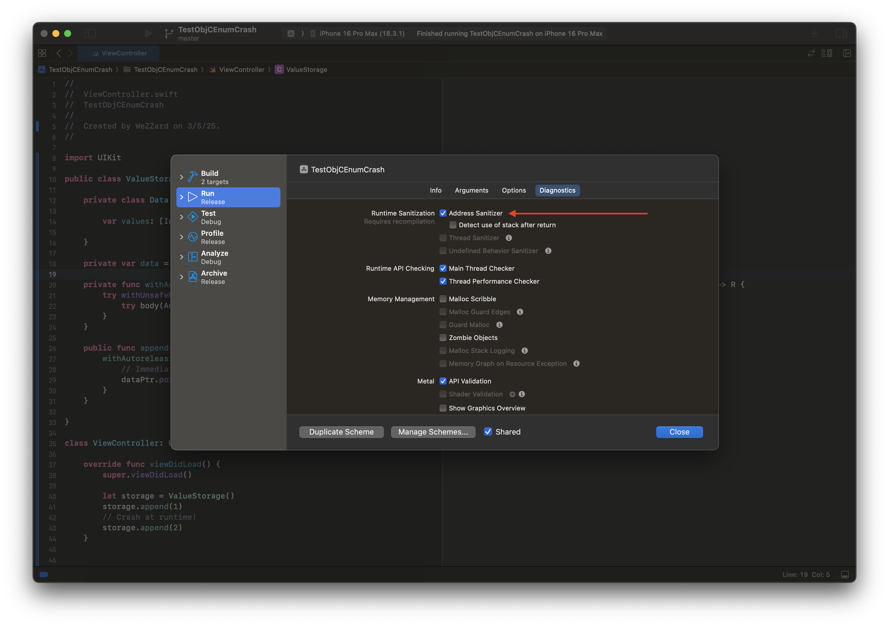
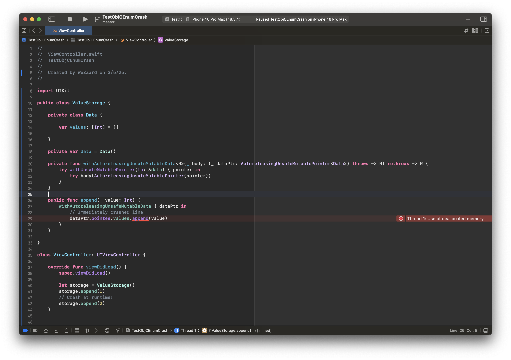
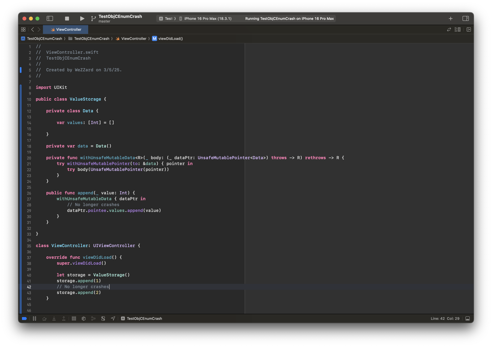
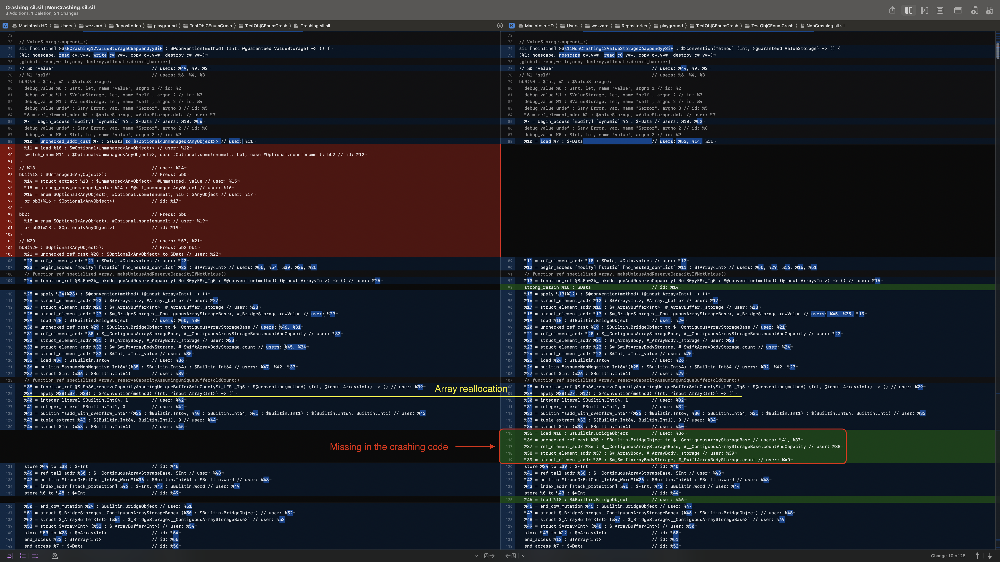
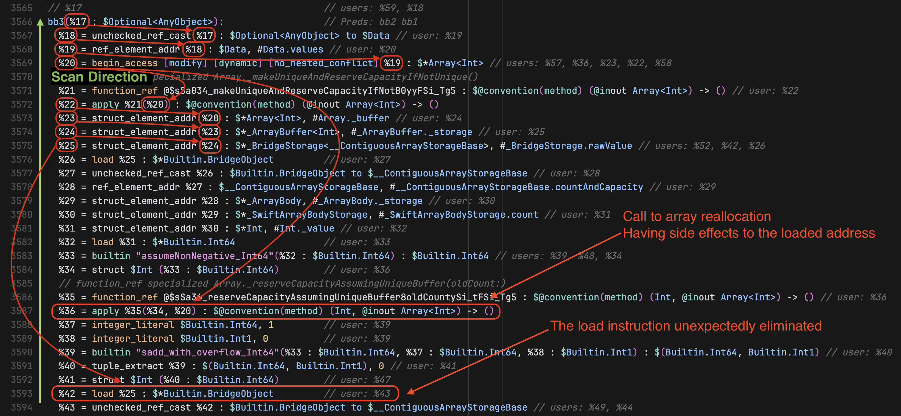
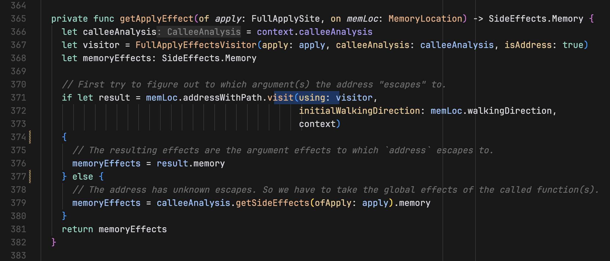
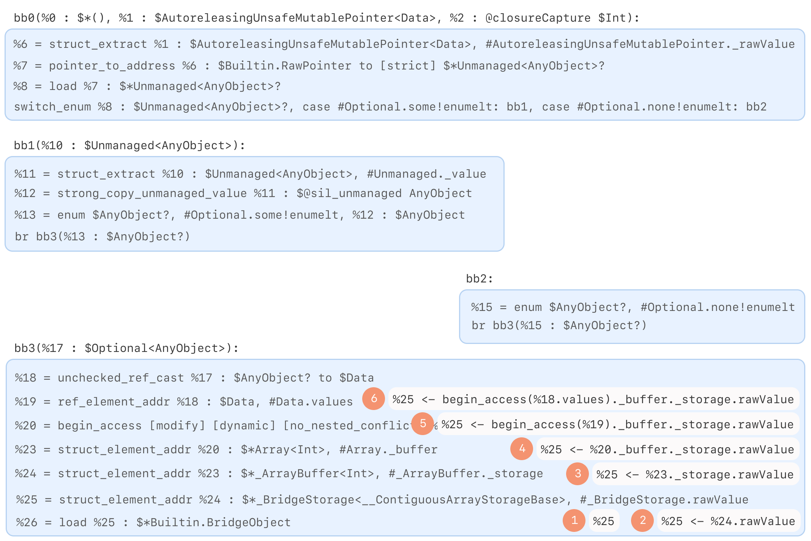
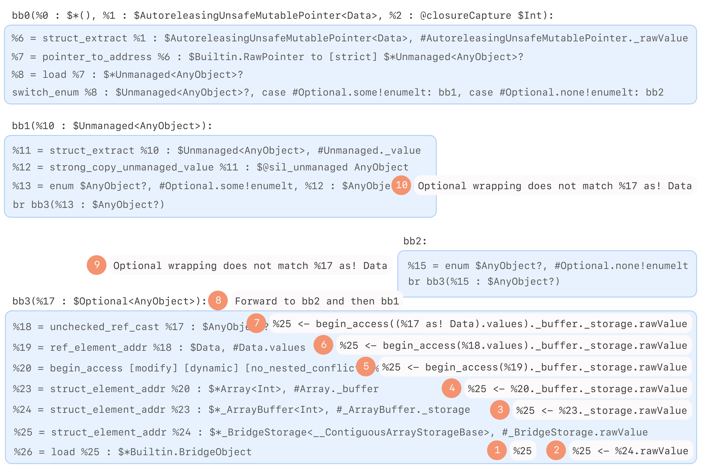
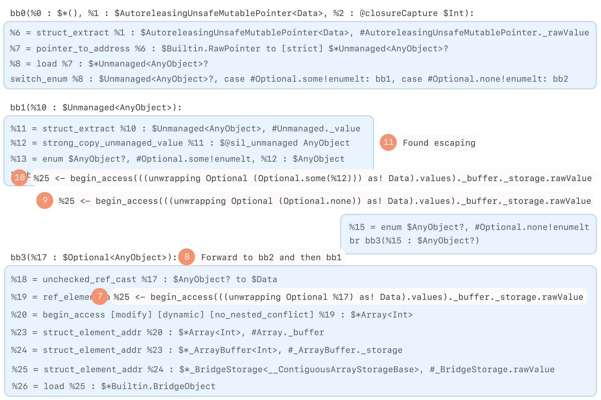

蛇年春节假期前，一位同事向我展示了一个由 use-after-free（使用后释放）错误导致的
神秘崩溃。最近，我有时间深入研究这个问题，并发现崩溃是由 Swift 编译器的错误编译
引起的。下面是最小复现代码，必须使用 `-Osize` 优化级别编译。我们可以通过在编译
过程中启用地址检查器（address sanitizer）来检测 use-after-free 问题。

```swift
let storage = ValueStorage()
// Crash at runtime!
storage.append(1)

public class ValueStorage {
    
    private class Data {
    
        var values: [Int] = []
    
    }
    
    private var data = Data()
    
    private func withAutoreleasingUnsafeMutableData<R>(_ body: (_ dataPtr: AutoreleasingUnsafeMutablePointer<Data>) throws -> R) rethrows -> R {
        try withUnsafeMutablePointer(to: &data) { pointer in
            try body(AutoreleasingUnsafeMutablePointer(pointer))
        }
    }
    
    public func append(_ value: Int) {
        withAutoreleasingUnsafeMutableData { dataPtr in
            // Immediately crashed line
            dataPtr.pointee.values.append(value)
        }
    }
    
}
```





有趣的是，将 `AutoreleasingUnsafeMutablePointer` 替换为 `UnsafeMutablePointer`
可以解决这个问题。



## 调查崩溃的关键现场

反汇编有问题的程序后，我们可以发现 `Array` 的追加函数内联到了 `ValueStorage.append`
函数中。关键问题是程序在重新分配后没有重新获取 `Array` 的缓冲区对象。这导致使用
寄存器 `r12` 计算的地址指向旧缓冲区（如果确实发生了重新分配）。我们可以将反汇编代码
简化为：

```nasm
; load `self.values: [Int]` to r12
mov r15, qword [r13 + 0x10]
; r14 is now `self.values: [Int]`
mov r14, r15
; loads the Array's buffer object to r12
mov r12, qword [r14 + 0x10]
; reallocate, may free the old buffer object
call Swift.Array._reserveCapacityAssumingUniqueBuffer
; set the new count to the old buffer object
; use-after-free occurred
mov qword [r12 + 0x10] rax
```

以下是 `ValueStorage.append` 的完整反汇编代码：


检查 Swift 标准库代码发现，其实际上是通过访问 `self` 上的 `_buffer` 属性来更新
元素计数并插入新元素，而不是使用现有的旧缓冲区变量。Swift 编译器错误地删除了目标
代码中重新获取 `_buffer` 对象的操作。

```swift
// Implementation in the Standard Library
@inlinable
@_semantics("array.mutate_unknown")
@_effects(notEscaping self.**)
internal mutating func _appendElementAssumeUniqueAndCapacity(
  _ oldCount: Int,
  newElement: __owned Element
) {
  // Using `_buffer` on `self`
  _buffer.mutableCount = oldCount &+ 1
  // Using `_buffer` on `self`
  (_buffer.mutableFirstElementAddress + oldCount).initialize(to: newElement)
}

// An imaginary implementation that might produce the generated target code
@inlinable
@_semantics("array.mutate_unknown")
@_effects(notEscaping self.**)
internal mutating func _appendElementAssumeUniqueAndCapacity(
    _ oldCount: Int,
    newElement: __owned Element
    // Explicitly reusing the old buffer
    oldBufer: _Buffer
) {
    // Using `oldBuffer`
    oldBufer.mutableCount = oldCount &+ 1
    (oldBufer.mutableFirstElementAddress + oldCount).initialize(to: newElement)
}
```

## 为什么 Swift 编译器删除了代码？

通过检查中间编译产物，我们可以在"优化 SIL"输出中找到初始错误编译，这可以通过在
调用 `swiftc` 时添加 `-emit-sil` 参数获得。比较使用 
`AutoreleasingUnsafeMutablePointer`（左侧）和 `UnsafeMutablePointer`（右侧）
程序的优化 SIL，我们发现使用 `AutoreleasingUnsafeMutablePointer` 时，数组存储的
关键 `load` 指令缺失。



为了确定哪个编译器过程移除了这个 `load` 指令，我们可以使用 `-Xllvm` 参数启用
编译器中的调试打印。具体来说，我们可以使用 `--sil-print-function` 让编译器在
每次有修改时打印指定函数的 SIL：

```bash
swiftc YOUR_SWIFT_SOURCE.swift -Osize \
    -Xllvm '--sil-print-function=$MangledSwiftFunctionName'
```

此分析的关键日志可总结为：

```sil
  *** SIL function after  #10338, stage MidLevel,Function, pass 37: CSE (cse)
// closure #1 in ValueStorage.append(_:)
...
sil private @$s8Crashing12ValueStorageC6appendyySiFySAyAA4Data33_A856358C389441A2F6EA224BB743344FLLCGXEfU_ : $@convention(thin) @substituted <τ_0_0> (AutoreleasingUnsafeMutablePointer<Data>, Int) -> (@out τ_0_0, @error any Error) for <()> {
...
bb3(%17 : $Optional<AnyObject>):
    ...
    %26 = load %25 : $*Builtin.BridgeObject
    ...
  %35 = function_ref @$sSa36_reserveCapacityAssumingUniqueBuffer8oldCountySi_tFSi_Tg5 : $@convention(method) (Int, @inout Array<Int>) -> () // user: %36
  %36 = apply %35(%34, %20) : $@convention(method) (Int, @inout Array<Int>) -> ()
  ...
  // The load instruction still exists
  %42 = load %25 : $*Builtin.BridgeObject
  %43 = unchecked_ref_cast %42 : $Builtin.BridgeObject to $__ContiguousArrayStorageBase
  %44 = ref_element_addr %43 : $__ContiguousArrayStorageBase, #__ContiguousArrayStorageBase.countAndCapacity
  %45 = struct_element_addr %44 : $*_ArrayBody, #_ArrayBody._storage
  %46 = struct_element_addr %45 : $*_SwiftArrayBodyStorage, #_SwiftArrayBodyStorage.count
  store %41 to %46 : $*Int

  *** SIL function after  #10339, stage MidLevel,Function, pass 38: RedundantLoadElimination (redundant-load-elimination)
// closure #1 in ValueStorage.append(_:)
...
sil private @$s8Crashing12ValueStorageC6appendyySiFySAyAA4Data33_A856358C389441A2F6EA224BB743344FLLCGXEfU_ : $@convention(thin) @substituted <τ_0_0> (AutoreleasingUnsafeMutablePointer<Data>, Int) -> (@out τ_0_0, @error any Error) for <()> {
...
bb3(%17 : $Optional<AnyObject>):
    ...
    %26 = load %25 : $*Builtin.BridgeObject
    ...
  %35 = function_ref @$sSa36_reserveCapacityAssumingUniqueBuffer8oldCountySi_tFSi_Tg5 : $@convention(method) (Int, @inout Array<Int>) -> ()
  %36 = apply %35(%34, %20) : $@convention(method) (Int, @inout Array<Int>) -> ()
  ...
  // The load instruction was eliminated
  %42 = unchecked_ref_cast %26 : $Builtin.BridgeObject to $__ContiguousArrayStorageBase
  %43 = ref_element_addr %42 : $__ContiguousArrayStorageBase, #__ContiguousArrayStorageBase.countAndCapacity
  %44 = struct_element_addr %43 : $*_ArrayBody, #_ArrayBody._storage
  %45 = struct_element_addr %44 : $*_SwiftArrayBodyStorage, #_SwiftArrayBodyStorage.count
  store %41 to %45 : $*Int
```

从这些日志中，我们可以清楚地看到"冗余加载消除"（RLE）过程删除了以下 `load` 指令：

```swift
%42 = load %25 : $*Builtin.BridgeObject
```

## 修复方案的推理

要完善修复方案，我们首先需要了解 RLE。这个优化过程通过消除虚拟寄存器和实际寄存器
的冗余"获取和设置"操作来优化代码。考虑这个虚拟寄存器的例子：

```swift
%1 = load %x
%2 = store %1
%3 = load %2
return %3
```

一个更优的等效版本可以立即返回 `%1`，因为 `%2` 只是一个中间结果。这是 RLE 应该
正确处理的情况。这个，我们称之为情况 1。

```swift
%1 = load %x
return %1
```

然而，考虑这个更复杂的情况：

```swift
%1 = load %x
call print(%1)
call Foo(%x)
%3 = load %x // 我们能消除这一行吗？
return %3
```

在这里，消除 `%3 = load %x` 取决于 `Foo` 是否修改了 `%x` 的内容。如果修改了，我们不能直接返回
`%1`，因为 `%3 = load %x` 加载了更新后的内容。这个，我们称之为情况 2。

找到 Swift 编译器在 `RedundantLoadElimination.swift` 中的 RLE 实现，我们可以
发现入口点：

```swift
let redundantLoadElimination = FunctionPass(name: "redundant-load-elimination") {
    (function: Function, context: FunctionPassContext) in
  eliminateRedundantLoads(in: function, ignoreArrays: false, context)
}
```

从这个入口点阅读代码，我们发现其算法与经典的 RLE 方法不同：

1. 它在每个逆序的基本块中反向迭代所有指令，以查找所有 `load` 指令
2. 对于每个 `load`，它检查其先前的指令以查找：
   - 可用的 `store` 指令进行优化（对应第一种情况）
   - 可用的 `load` 指令进行优化（对应第二种情况），如果当两个加载之间没有对地址有副作用
     的函数调用的话
3. 对每个加载指令的先前指令扫描有复杂度预算限制

比较 RLE 与 `AutoreleasingUnsafeMutablePointer` 和 `UnsafeMutablePointer`
的详细行为，我们发现：

```swift
// AutoreleasingUnsafeMutablePointer
eliminating redundant loads in function: $s8Crashing12ValueStorageC6appendyySiFySAyAA4Data33_A856358C389441A2F6EA224BB743344FLLCGXEfU_
...
scanning prior instructions for the load:   %42 = load %25 : $*Builtin.BridgeObject         // users: %52, %43
...
visiting instruction:   %36 = apply %35(%34, %20) : $@convention(method) (Int, @inout Array<Int>) -> ()
transparent
// %35 = function_ref @$sSa36_reserveCapacityAssumingUniqueBuffer8oldCountySi_tFSi_Tg5 : $@convention(method) (Int, @inout Array<Int>) -> () // user: %36
```

```swift
// UnsafeMutablePointer
eliminating redundant loads in function: $s11NonCrashing12ValueStorageC6appendyySiF
...
scanning prior instructions for the load:   %35 = load %18 : $*Builtin.BridgeObject         // users: %45, %36
...
visiting instruction:   %29 = apply %28(%27, %12) : $@convention(method) (Int, @inout Array<Int>) -> ()
overwritten
// %28 = function_ref @$sSa36_reserveCapacityAssumingUniqueBuffer8oldCountySi_tFSi_Tg5 : $@convention(method) (Int, @inout Array<Int>) -> () // user: %36
```

这揭示了：
- 使用 `AutoreleasingUnsafeMutablePointer` 时，RLE 认为数组重新分配函数对
  `load` 指令操作数的地址是"透明的"，从而启用了 load 指令消除
- 使用 `UnsafeMutablePointer` 时，RLE 正确地认识到该函数会覆写地址，从而阻止了 load 指令消除

对于情况 2 场景，Swift 6 算法检查 `load` 的所有先前指令，以确定
`load` 操作数的源和 `load` 指令本身之间的函数调用的副作用。



关键发现是，Swift 编译器仅在 `load` 操作数的最终源头有未知逃逸结果时才会考虑函数的副作用。
通过在 `AliasAnalysis.swift` 中的函数设置断点，我发现了两种指针类型之间的关键差异：



- 使用 `AutoreleasingUnsafeMutablePointer` 时，编译器检查 `load` 指令的操作数的
  定义源是否逃逸。当确定不逃逸时，编译器将错误地假设函数没有副作用。
  
- 使用 `UnsafeMutablePointer` 时，编译器将获取数组重新分配函数的全局副作用
  （可能来自 `@_effects` 属性）。只有标记为 `readOnly` 或 `readNone` 的函数
  会被视为无副作用。

于是我们需要对第 371 行的 `visit` 函数进行进一步调查。该行会对 `load` 指令的操作数执行逃逸分析。
下图说明了这个过程：



这是逃逸分析的过程：
1. 沿着使用-定义链向上走，分析逃逸行为
2. 每一步都将构建一个路径，表示如何从该点推导出 `load` 指令的操作数

但当我们遇到 `AutoreleasingUnsafeMutablePointer` 的 `pointee` getter 实现时，复杂性就产生了。
它在上述逃逸分析过程中是一个非平凡的案例：

```swift
@frozen
public struct AutoreleasingUnsafeMutablePointer<Pointee /* TODO : class */>
  :  _Pointer {
  
  @inlinable
  public var pointee: Pointee {
    @_transparent get {
      // The memory addressed by this pointer contains a non-owning reference,
      // therefore we *must not* point an `UnsafePointer<AnyObject>` to
      // it---otherwise we would allow the compiler to assume it has a +1
      // refcount, enabling some optimizations that wouldn't be valid.
      //
      // Instead, we need to load the pointee as a +0 unmanaged reference. For
      // an extra twist, `Pointee` is allowed (but not required) to be an
      // optional type, so we actually need to load it as an optional, and
      // explicitly handle the nil case.
      let unmanaged =
        UnsafePointer<Optional<Unmanaged<AnyObject>>>(_rawValue).pointee
      return _unsafeReferenceCast(
        unmanaged?.takeUnretainedValue(),
        to: Pointee.self)
    }
    ...
  }
  
  ...
}
```

实现细节揭示，`AutoreleasingUnsafeMutablePointer` 必须将引用从
`Optional<Unmanaged<AnyObject>>` 转换为 `Pointee` 类型以维持 +0 引用计数。
这种转换通过 `_unsafeReferenceCast` 函数执行：

```swift
@_transparent
@unsafe
public func _unsafeReferenceCast<T, U>(_ x: T, to: U.Type) -> U {
  return Builtin.castReference(x)
}
```

编译器将其转换为 `Builtin.castReference` 函数，最终在 SIL 中表示为
`unchecked_ref_cast` 指令：

```swift
%y = unchecked_ref_cast %x : $SourceSILType to $DesintationSILType
```

问题产生是因为 `AutoreleasingUnsafeMutablePointer` 引入的情况使
`$SourceSILType` 和 `$DesintationSILType` 可能是 `Optional` 类型：

```swift
%y = unchecked_ref_cast %x : $Optional<AnyObject> to $Data
```

此指令可以在 `Optional` 和非 `Optional` 类型之间进行转换，有效地包装或解包值。
由于逃逸分析沿着使用-定义链走，路径必须严格反映如何从定义点导出 `load` 操作数，
这些隐式的 `Optional` 转换会创建不匹配的路径，如图所示：



通过检查 `WalkUtils.swift` 中的 `walkUpDefault` 函数我们可以确认这一假设，该函数
在向上走期间处理各种指令类型，但缺乏对 `unchecked_ref_cast` 中 `Optional`
转换的适当处理：

```swift
public mutating func walkUpDefault(value def: Value, path: Path) -> WalkResult {
    switch def {
    ...
    case let urc as UncheckedRefCastInst:
      if urc.type.isClassExistential || urc.fromInstance.type.isClassExistential {
        // Sometimes `unchecked_ref_cast` is misused to cast between AnyObject and a class (instead of
        // init_existential_ref and open_existential_ref).
        // We need to ignore this because otherwise the path wouldn't contain the right `existential` field kind.
        return rootDef(value: urc, path: path)
      }
      ...
    }
}
```

## 修复方案

解决方案是在使用-定义链向上走中考虑 `Optional` 和非 `Optional` 类型之间的转换：

```swift
public mutating func walkUpDefault(value def: Value, path: Path) -> WalkResult {
    switch def {
    ...
    case let urc as UncheckedRefCastInst:
      if urc.type.isClassExistential || urc.fromInstance.type.isClassExistential {
        // Sometimes `unchecked_ref_cast` is misused to cast between AnyObject and a class (instead of
        // init_existential_ref and open_existential_ref).
        // We need to ignore this because otherwise the path wouldn't contain the right `existential` field kind.
        return rootDef(value: urc, path: path)
      }
      switch (urc.type.isOptional, urc.fromInstance.type.isOptional) {
        case (true, false):
          if let path = path.popIfMatches(.enumCase, index: 0) {
            if walkUp(value: urc.fromInstance, path: path) == .abortWalk {
              return .abortWalk
            } else if let path = path.popIfMatches(.enumCase, index: 1) {
              return walkUp(value: urc.fromInstance, path: path)
            }
          }
          return .abortWalk
        case (false, true):
          if walkUp(value: urc.fromInstance, path: path.push(.enumCase, index: 0)) == .abortWalk {
            return .abortWalk
          } else {
            return walkUp(value: urc.fromInstance, path: path.push(.enumCase, index: 1))
          }
        default:
          return walkUp(value: urc.fromInstance, path: path)
      }
        ...
        }
}
```

下图说明了这个修复如何适应逃逸分析过程中的 `Optional` 和非 `Optional` 类型转换。
当逃逸分析过程遇到 `Optional` 和非 `Optional` 类型之间的 `unchecked_ref_cast` 时，
该修复通过调整路径以考虑枚举用例差异，确保了正确的路径转换。



在定义-使用链分析中，`walkDownDefault` 函数也需要类似的更改：

```swift
public mutating func walkDownDefault(value operand: Operand, path: Path) -> WalkResult {
    let instruction = operand.instruction
    switch instruction {
        ...
        case let urc as UncheckedRefCastInst:
      if urc.type.isClassExistential || urc.fromInstance.type.isClassExistential {
        // Sometimes `unchecked_ref_cast` is misused to cast between AnyObject and a class (instead of
        // init_existential_ref and open_existential_ref).
        // We need to ignore this because otherwise the path wouldn't contain the right `existential` field kind.
        return leafUse(value: operand, path: path)
      }
      switch (urc.type.isOptional, urc.fromInstance.type.isOptional) {
        case (true, false):
          if walkDownUses(ofValue: operand, path: path.push(.enumCase, index: 0)) == .abortWalk {
            return .abortWalk
          }
          return walkDownUses(ofValue: operand, path: path.push(.enumCase, index: 1))
        case (false, true):
          if let path = path.popIfMatches(.enumCase, index: 0) {
            if walkDownUses(ofValue: operand, path: path) == .abortWalk {
              return .abortWalk
            } else if let path = path.popIfMatches(.enumCase, index: 1) {
              return walkDownUses(ofValue: operand, path: path)
            }
          }
          return .abortWalk
        default:
          return walkDownUses(ofValue: operand, path: path)
      }
      ...
    }
}
```

实施此修复后，编译使用 `AutoreleasingUnsafeMutablePointer` 的代码产生的日志
显示 RLE 正确识别潜在的副作用：

```swift
eliminating redundant loads in function: $s8Crashing12ValueStorageC6appendyySiF
scanning prior instructions for the load:   %45 = load %28 : $*Builtin.BridgeObject         // users: %55, %46
...
visiting instruction:   %39 = apply %38(%37, %23) : $@convention(method) (Int, @inout Array<Int>) -> ()
overwritten
```

优化后的 SIL 现在保留了数组重新分配后的关键 `load` 指令：

```swift
// ValueStorage.append(_:)
// Isolation: unspecified
sil [noinline] @$s8Crashing12ValueStorageC6appendyySiF : $@convention(method) (Int, @guaranteed ValueStorage) -> () {
[%1: noescape, read c*.v**, write c*.v**, copy c*.v**, destroy c*.v**]
[global: read,write,copy,destroy,allocate,deinit_barrier]

...

bb3(%20 : $Optional<AnyObject>):
    ...
  // function_ref specialized Array._reserveCapacityAssumingUniqueBuffer(oldCount:)
  %38 = function_ref @$sSa36_reserveCapacityAssumingUniqueBuffer8oldCountySi_tFSi_Tg5 : $@convention(method) (Int, @inout Array<Int>) -> ()
  %39 = apply %38(%37, %23) : $@convention(method) (Int, @inout Array<Int>) -> ()
  %45 = load %28 : $*Builtin.BridgeObject
  ...
} // end sil function '$s8Crashing12ValueStorageC6appendyySiF'
```

## 调试 Swift 编译器的技巧

### 获取 Swift 编译器的中间产物

要检查 Swift 编译器在每个编译阶段的中间表示：

```bash
swiftc YourSwiftSource.swift -Osize -emit-silgen > YourSwiftSource.silgen.sil # 生成原始 SIL
swiftc YourSwiftSource.swift -Osize -emit-sil > YourSwiftSource.sil.sil # 生成优化 SIL
swiftc YourSwiftSource.swift -Osize -emit-irgen > YourSwiftSource.irgen.ll # 生成原始 LLVM IR
swiftc YourSwiftSource.swift -Osize -emit-ir > YourSwiftSource.ir.ll # 生成优化 LLVM IR
```

### 利用 LLVM 传递参数

LLVM 提供了许多可与 Swift 一起使用的传递参数：

```bash
# 打印指定函数的 SIL 更改
swiftc -Xllvm '--sil-print-function=$MangledSwiftFunctionName'
# 在运行每个 SIL 过程前打印其名称
swiftc -Xllvm '--sil-print-pass-name=pass-name'
# 打印内联到其他函数中的函数
swiftc -Xllvm '--sil-print-inlining-callee=true'
```

### 构建 Swift 编译器

需要注意的是，在这篇文章中，我们正在调试编译器的详细行为，但 Swift 编程语言和
标准库捆绑在一起。由于问题与 `Array.append` 函数的内联相关，我们应该构建一个
debug 版本的编译器和一个 release 版本的标准库，以确保 `Array.append` 的内联成本尽可能低。
可以使用以下命令实现：

```bash
utils/build-script --no-swift-stdlib-assertions \
    --skip-ios --skip-tvos --skip-watchos --skip-build-benchmarks
```

### SIL 和 LLVM IR 的语法高亮

你可以在 VS Code（或 Cursor）扩展市场中搜索"WeZZard"以获取相对 IDE 中的 SIL 语法高亮。

你可以在 VS Code（或 Cursor）扩展市场中找到 Ingvar Stepanyan 的"LLVM"扩展，以获取相对 IDE 中的 LLVM IR 语法高亮。
