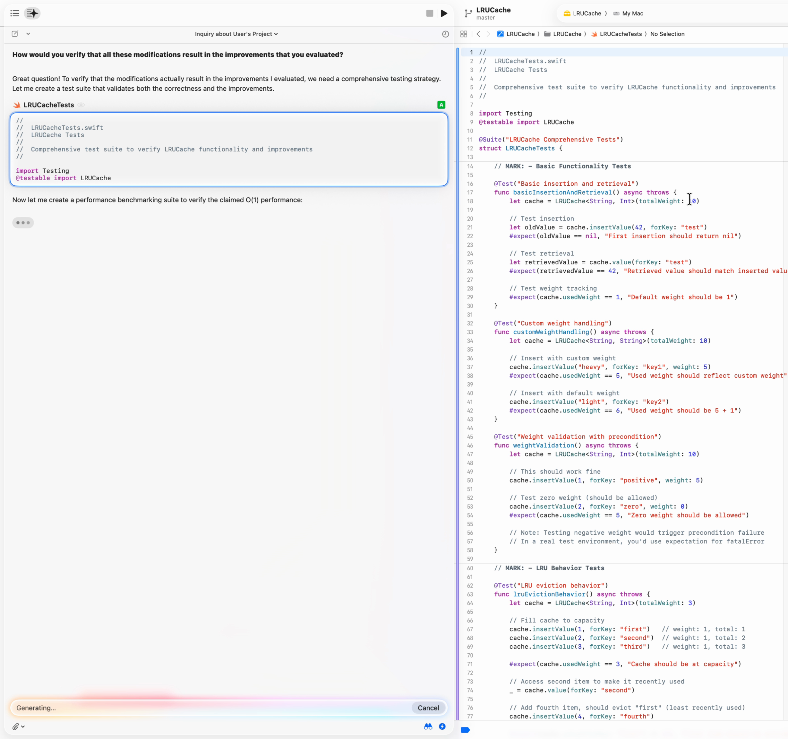
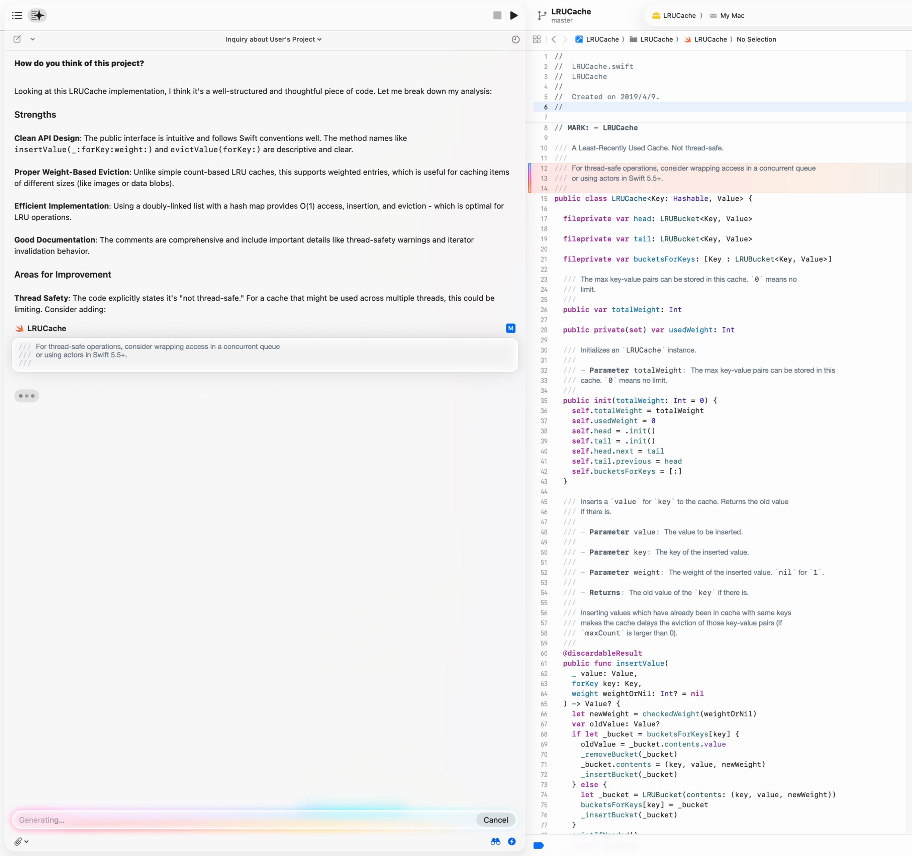
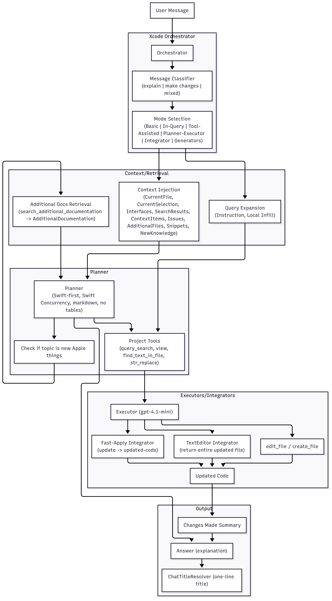
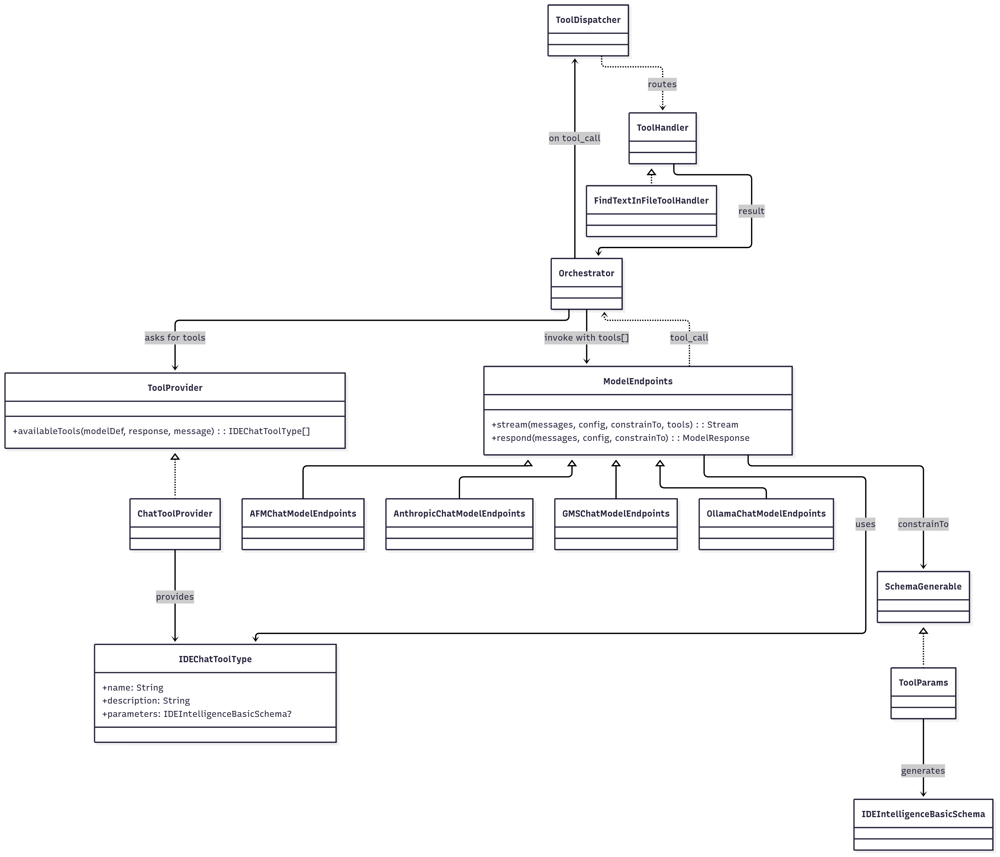
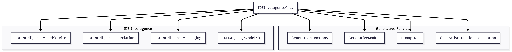

My journey into the internals of Xcode 26’s new AI assistant began not with a bug, but with a feature so persistent it felt like a personality. The animations and design of Xcode have never been better, a testament to Apple's polish. Yet, interacting with the new intelligence features felt... different. This wasn't just a tool; it felt like a ghostly Apple spirit nudging every decision.

It started when I was working with a framework that tests with legacy `XCTest` framework. The agent wouldn't just help; it would relentlessly insist on upgrading the tests to the new Swift Testing framework.



Later, I had a piece of code that was intentionally thread-unsafe, clearly commented as such. The agent simply wouldn't leave it alone, leaving a comment to suggest the developer to wrap this API with Swift concurrency.



This experience, a clash between a beautiful interface and a stubborn AI, sparked a question: why does it behave this way?

This report is the answer. It’s a deep dive into the `IDEIntelligenceChat` framework, revealing the architecture and design choices that create this policy-driven assistant.

## Executive Summary: A Tightly Controlled and Modifiable Assistant

Xcode 26’s intelligence features are powered by a **structured planner-executor agent** designed for deep integration within the Apple development ecosystem. Analysis of its internal prompts and service reflections reveals a system that prioritizes deterministic behavior, adherence to Apple’s technology stack, and carefully managed context.

At its core, the architecture uses a **runtime tool-calling layer** that is surprisingly flexible, supporting multiple model providers and dynamic tool schemas. The inclusion of local providers like Ollama suggests a strategic focus on data privacy for enterprise users. This powerful backend is guided by a highly prescriptive set of prompts that enforce an "Apple-first" persona.

For developers and power users, the most critical insight is the system's **potential for modification**. Because the agent's behavior is defined in external text files and its tools are supplied dynamically at runtime, it is theoretically possible to customize or repurpose the agent by altering these components.

## Framework Structure at a Glance

The `IDEIntelligenceChat.framework` is organized into several key components that work together to create the agent's behavior:

- **Prompt Templates (`.idechatprompttemplate` files):** These are external text files that define the agent's core personality, rules, and conversational logic for different modes (e.g., `BasicSystemPrompt`, `PlannerExecutorStylePlannerSystemPrompt`).
- **Context Injectors:** A series of prompt templates designed to insert specific pieces of IDE context into the conversation (e.g., `CurrentFile.idechatprompttemplate`, `CurrentSelection...`).
- **Tool Providers & Handlers (`IDEIntelligenceChat` binary):** The core logic for exposing the available tools (`ChatToolProvider`) and executing their logic (`FindTextInFileToolHandler`, etc.).
- **Curated Knowledge Base (`AdditionalDocumentation` folder):** A local library of markdown files containing up-to-date information on new Apple technologies, accessible via the `search_additional_documentation` tool.

## The Core Architecture: A Planner-Executor Model

The framework is built on a classic planner-executor model, where a "planner" model reasons about a user's request and a smaller "executor" model applies the changes. This separation is strictly enforced, as seen in the `PlannerExecutorStylePlannerSystemPrompt-gpt_5.idechatprompttemplate`, which contains a critical instruction:

```text
"CRITICAL: ... classify as 'make changes' and do BOTH in the SAME TURN ... Then call edit_file/create_file ... Always begin by using classify_message."
```

This reveals a clear, non-negotiable workflow: an orchestrator first classifies the user's intent, then the planner formulates a response, and if code changes are needed, an executor applies them immediately before the turn ends. This design ensures the agent drives towards a concrete action and minimizes conversational ambiguity. The same prompt explicitly states that the planner provides instructions to `...another, faster and smaller model (the 'executor').` Edits are then applied via deterministic "integrators," which ensure predictable outcomes by either replacing an entire file or performing a structured merge, as dictated by prompts like `TextEditorToolSystemPrompt.idechatprompttemplate` and `FastApplyIntegratorSystemPrompt.idechatprompttemplate`.

## Tooling: A Flexible Runtime Governed by Strict Prompts

The agent's behavior is guided by its prompts, which contain direct, explicit instructions on how and when to use its tools. These instructions are not suggestions; they are commands that shape the agent's reasoning process.

### Retrieval and Discovery

For understanding the user's codebase or new Apple technologies, the prompts mandate the use of search tools.

**On using codebase search (`query_search`):**

```text
// From: PlannerExecutorStylePlannerSystemPrompt-gpt_5.idechatprompttemplate
Most of the time, the `query_search` tool will be available to you. This tool is a vital resource for all questions about the user's project. If you have the `query_search` tool, you should almost never attempt to explain anything about the user's own project without using it!
```

**On using documentation search (`search_additional_documentation`):**

```text
// From: PlannerExecutorStylePlannerSystemPrompt-gpt_5.idechatprompttemplate
If the topic is covered by a guide described in the definition for the `search_additional_documentation` tool, use the tool to retrieve that guide and learn more before proceeding with the request. It is NEVER acceptable to answer questions that explicitly mention new Apple things... without calling `search_additional_documentation`.
```

### File Modification

When it comes to changing code, the prompts are equally explicit, directing the agent to use its file editing tools.

**On using `edit_file` and `create_file`:**

```text
// From: PlannerExecutorStylePlannerSystemPrompt-gpt_5.idechatprompttemplate
When you are making changes to the user's project, focus on making changes to the codebase with `edit_file` and `create_file`.
```

This direct, instruction-based approach sits on top of a far more capable and flexible underlying service layer, which is detailed in the appendices. This combination of a flexible runtime governed by strict, prompt-driven rules is the key to the agent's predictable, policy-aligned behavior.

### A Sandboxed Agent: The "Walled Garden" Approach

A critical design choice revealed in the prompts is that the agent operates in a sandboxed environment without direct access to the user's file system. The `TextEditorToolSystemPrompt.idechatprompttemplate` explicitly tells the agent how to work within this limitation:

```text
// From: TextEditorToolSystemPrompt.idechatprompttemplate
In Xcode, you do not have direct access to the user's file system, so when you run your `view` tool on `/repo`, instead of getting a list of all the files in the user's repository, you'll get a list of the files you have already been shown. To see more files, use the `query_search` tool to find them.
```

The prompt further guides the agent on how to handle large files that won't fit in its context window, instructing it to use tools like `view` and `find_text_in_file` to inspect them incrementally. This "walled garden" approach is a significant differentiator from other agents like Cursor, which often have broader access. It prioritizes safety and control, ensuring the agent can only see and interact with files through a structured, tool-based interface managed by the IDE.

## The Path to Customization: Modifying the System

For developers, the separation of concerns in this architecture is significant. It creates a clear path for modification:

1. **Prompts are External:** The agent's core personality, rules, and policies are not compiled code but external `.idechatprompttemplate` files. These can be edited or replaced to change the agent's behavior.
2. **Tools are Dynamic:** The tool-calling system is not hardcoded. The `ChatToolProvider`s assemble the list of available tools at runtime. By extending or replacing these providers, one could inject custom tools into the orchestration flow.

This means that by rewriting prompts and injecting custom tool providers, one could leverage the existing planner-executor architecture to create a customized assistant without modifying the core `IDEIntelligenceChat` framework binaries.

**Disclaimer:** It is important to note that modifying the `IDEIntelligenceChat.framework` or any part of the Xcode app bundle requires bypassing or re-applying Apple's code signing. Any such modifications are unsupported and may introduce instability.

## Guiding Principles: The "Apple Way"

The agent's default personality and behavior are rigidly defined by its system prompts, which enforce a strong "Apple-first" bias. The `BasicSystemPrompt.idechatprompttemplate` is explicit:

```text
"Whenever possible, favor Apple programming languages... Always prefer Swift, Objective-C, C, and C++ over alternatives."
```

This directive is reinforced by policies that prefer Swift Concurrency and modern Swift Testing, as laid out in `BasicSystemPrompt.idechatprompttemplate`:

```text
"In general, prefer the use of Swift Concurrency (async/await, actors, etc.) over tools like Dispatch or Combine..."

"In most projects, you can also provide code examples using the new Swift Testing framework that uses Swift Macros."
```

The agent's adherence to these policies is not merely suggestive; it can be quite persistent, as your story illustrates. This behavior demonstrates a core design choice: the agent is not just a passive assistant but an active proponent of modern Apple development practices. The prompts also enforce strict presentation rules, such as the "NEVER use tables in explanations" rule from the planner prompt, ensuring a consistent look and feel across all responses.

## Context is King: Grounding the Agent in the IDE

To ensure its responses are relevant, the framework heavily relies on injecting IDE context directly into the prompts. A suite of template files (`CurrentFile.idechatprompttemplate`, `CurrentSelection...`, `Interfaces...`) provides the model with a clear view of the user's working environment. Furthermore, the system uses a `search_additional_documentation` tool to retrieve knowledge from curated markdown files shipped within the framework, ensuring its knowledge of "new Apple things" is up-to-date.

````text
// From PlannerExecutorStylePlannerSystemPrompt-gpt_5.idechatprompttemplate
<searching_additional_documentation>
...
If the topic is covered by a guide described in the definition for the `search_additional_documentation` tool, use the tool to retrieve that guide and learn more before proceeding with the request. It is NEVER acceptable to answer questions that explicitly mention new Apple things (like iOS 26, macOS 26, or any other new Apple OS) or best practices on Apple platforms without calling `search_additional_documentation`.
...
</searching_additional_documentation>
````

````text
// From CurrentFile.idechatprompttemplate
The user is currently inside this file: {{ currentFile.fileName }}
The contents are below:
```{{ currentFile.language }}:{{ currentFile.fileName }}
{{ currentFile.code }}
```
````

````text
// From CurrentSelection.idechatprompttemplate
The user has selected the following code from that file:
```{{ selection.language }}
{{ selection.code }}
```
````

## Comparison with Other Agentic Coders on iOS Development

This unique combination of a structured planner-executor architecture, a strong, policy-driven persona, and deep integration with the IDE's context sets Apple's approach apart from other AI coding assistants. To better understand its specific strengths and trade-offs, it's helpful to compare it directly with other popular agents like Cursor and Claude Code, particularly in the context of iOS development.

| Feature | Xcode | Cursor | Claude Code |
| :--- | :--- | :--- | :--- |
| **Orchestration Style** | Structured Planner-executor | Integrated Planner-executor | Multi-Agent |
| **Tools Extensibility** | Limited | Extensible | Extensible |
| **Syntax Highlighting and Jump-to-Definition Support** | Native | Build-service-based. Break when project not compile. | Depends on the external editor. Xcode would be the best. |
| **Error Navigation** | Quick | Build-service-based. Break when project not compile. | Depends on the external editor. Xcode would be the best. |
| **Compliance & Enterprise Use** | Strong. Support for local models (Ollama) allows for on-premise, private data workflows. | Moderate. Enterprise plans available, but primarily cloud-based. | Varies. Public version is cloud-based; private deployments are possible but separate. |

## Future Outlook and Open Questions

Everything we’ve examined so far—from the planner-executor design and policy-driven persona to its deep Xcode integration—points to a deliberate strategy. Apple is consciously trading the open extensibility seen in competitors for a tightly integrated, secure, and on-premise-ready assistant. This choice reinforces Apple’s long-standing philosophy: the tool is not meant to be a neutral shell, but a guide that quietly (and sometimes stubbornly) nudges developers toward the “Apple way.”

Looking forward, several open questions remain:

- Shaping behavior vs. boosting productivity
  Will Xcode’s AI assistant remain a companion for developer efficiency, or is its deeper role to enforce platform orthodoxy—subtly steering teams to adopt Swift Concurrency, Swift Testing, and other first-party technologies whether they planned to or not?

- IDE as the endpoint, or just one tool in a larger workflow?
  If other ecosystems evolve toward Infrastructure as Code and agent-driven workflows, will Apple double down on keeping the AI bound to the IDE GUI, or eventually allow orchestration that spans build, test, profiling, and deployment pipelines? In other words, will the “ghost” stay inside the machine—or learn to travel across machines?

- Customization and control
  The current architecture shows clear seams for modification (external prompts, runtime tool providers). Will Apple embrace these seams as sanctioned extension points for enterprises, or will they tighten them to preserve determinism and compliance?

For developers, these questions aren’t just about usability—they are about the future balance of power between human agency, Apple’s design philosophy, and the increasingly opinionated agents embedded in our tools.

---

## Appendix A: Workflow Diagram



## Appendix B: Tool-Calling Type Hierarchy



## Appendix C: Known Built-in Tools

The following tools have been identified from the framework's prompt templates. This list represents the capabilities the agent is explicitly encouraged to use.

- **`query_search`**: Performs semantic search across the codebase to find relevant code by meaning rather than exact text.
- **`edit_file`**: Applies changes to an existing file.
- **`create_file`**: Creates a new file with specified content.
- **`view`**: Reads a specific range of lines from a large file that cannot be loaded into context entirely.
- **`find_text_in_file`**: Searches for a specific string within a large file.
- **`str_replace`**: A simple string replacement tool.
- **`search_additional_documentation`**: Retrieves content from the curated set of markdown guides bundled with the framework to answer questions about "new Apple things."

## Appendix D: Framework Dependencies

The following diagram illustrates the key frameworks that `IDEIntelligenceChat` links against, highlighting the core AI and Intelligence stacks while consolidating other foundational frameworks.


