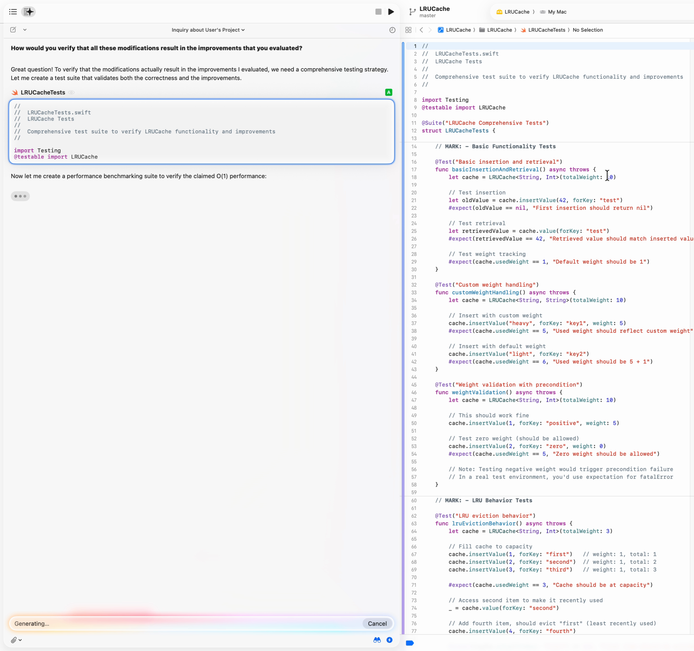
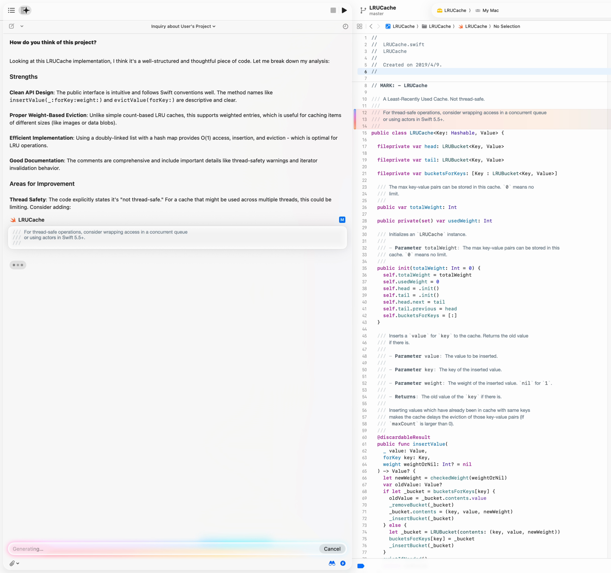

话说，我之所以会一头扎进 Xcode 26 全新 AI 助手的内部世界里，不是因为它出了什么 bug，而是因为它有个性，一种执拗到骨子里的个性。讲真，Xcode 的动画和设计从来没这么好看过，绝对是苹果工艺的又一力证。但是，跟这个新的智能功能打交道，感觉……就是很不一样。它不像个工具，倒像个阴魂不散的苹果「电子幽灵」，老想替你做决定。

这事儿得从我倒腾一个用老掉牙的 `XCTest` 框架做测试的项目说起。那个 AI 助手不只是帮忙，它简直是拧着一股劲儿，非要把我的测试代码升级成最新的 Swift Testing 框架。



然后我有一段代码，故意没做线程安全处理，注释里也写得明明白白。结果那个 AI 助手就是不肯放过，非要留言建议我用 Swift Concurrency 把这个 API 包起来。



这种体验，就像是精美的用户界面和一个犟驴 AI 的正面碰撞，让我不禁想问：这家伙到底为啥这么轴？

这篇报告，就是给这个问题的答案。咱们会一头扎进 `IDEIntelligenceChat` 框架的源码里，把它的架构和设计思路扒个底朝天，看看这个功能强大、策略驱动、而且还特能折腾的助手到底是怎么炼成的。

## 摘要：一个被「安排得明明白白」且可定制的助手

Xcode 26 的智能功能，背后是一个**结构化 planner-executor agent**，这套模型就是为了和苹果开发生态系统进行深度「锁死」而设计的。通过分析它内部的 prompts 和各种服务，我们能看出来，这个系统非常看重行为的确定性、对苹果自家技术栈的忠诚度，以及对上下文的精细管理。

它的核心架构用了一套 **runtime tool-calling layer**，这玩意儿出乎意料地灵活，能支持好几家模型服务商，工具的定义也是动态的。更有意思的是，它还支持像 Ollama 这样的本地模型，这明显是冲着那些注重数据隐私的企业用户去的。这个强大的后端，被一套「高情商」的 prompts 牢牢管着，强行塑造出了一个「苹果优先」的人设 (persona)。

对于咱们这些开发者和爱折騰的用户来说，最关键的一点是，这套系统**有被修改的潜力**。因为它的行为逻辑是写在外部文本文件里的，工具也是运行时动态加载的，所以理论上，只要改改这些零件，就能给它换个「灵魂」。

## 框架结构速览

`IDEIntelligenceChat.framework` 主要由下面这几个部分组成，它们凑在一起，决定了 AI 助手的言行举止：

- **Prompt 模板 (`.idechatprompttemplate` 文件):** 就是些外部文本文件，定义了 AI 的核心性格、规矩，以及在不同模式下的对话逻辑 (比如 `BasicSystemPrompt`, `PlannerExecutorStylePlannerSystemPrompt`)。
- **上下文注入器:** 一堆专门用来往对话里塞各种 IDE 上下文信息的 prompt 模板 (比如 `CurrentFile.idechatprompttemplate`, `CurrentSelection...`)。
- **工具提供者与处理器 (`IDEIntelligenceChat` 二进制文件):** 这是核心逻辑，负责告诉系统有哪些工具能用 (`ChatToolProvider`)，以及怎么去执行这些工具的指令 (`FindTextInFileToolHandler`, 等等)。
- **精选知识库 (`AdditionalDocumentation` 文件夹):** 一个本地的 Markdown 文件库，里面全是关于苹果新技术的最新资料，通过 `search_additional_documentation` 这个工具就能查到。

## 核心架构：Planner-Executor 模型

这个框架用的是经典的 planner-executor 模型。简单来说，就是一个「planner」模型负责琢磨用户的需求，然后一个更小更快的「executor」模型负责动手改代码。这两者的分工非常明确，在 `PlannerExecutorStylePlannerSystemPrompt-gpt_5.idechatprompttemplate` 文件里就有这么一条铁律：

```text
"CRITICAL: ... classify as 'make changes' and do BOTH in the SAME TURN ... Then call edit_file/create_file ... Always begin by using classify_message."
```

这就揭示了一个不容商量的工作流程：先由一个「orchestrator」给用户的意图分个类，然后「planner」提出一个方案，如果需要改代码，「executor」必须在当前回合结束前立刻动手。这种设计确保了 AI 会朝着一个具体的行动目标使劲，尽可能减少含糊不清的对话。同一份 prompt 里还明确说了，「planner」是给 `...另一个更快、更小的模型（「executor」）` 下指令的。具体的代码修改则由确定性的「integrators」来完成，要么整个文件替换，要么做结构化合并，保证了结果的可预测性。这一切都由像 `TextEditorToolSystemPrompt.idechatprompttemplate` 和 `FastApplyIntegratorSystemPrompt.idechatprompttemplate` 这样的 prompts 在背后指挥。

## 工具集：在严格「家规」下运行的灵活工具箱

AI 助手的行为完全由它的 prompts 来决定，这些 prompts 包含了关于如何以及何时使用工具的直接、明确的指令。这些可不是什么「建议」，而是塑造 AI 推理过程的「军规」。

### 检索与发现

为了理解用户的代码库或是苹果的新技术，prompts 强制规定必须使用搜索工具。

**关于使用代码库搜索 (`query_search`):**

```text
// 来源: PlannerExecutorStylePlannerSystemPrompt-gpt_5.idechatprompttemplate
Most of the time, the `query_search` tool will be available to you. This tool is a vital resource for all questions about the user's project. If you have the `query_search` tool, you should almost never attempt to explain anything about the user's own project without using it!
```

**关于使用文档搜索 (`search_additional_documentation`):**

```text
// 来源: PlannerExecutorStylePlannerSystemPrompt-gpt_5.idechatprompttemplate
If the topic is covered by a guide described in the definition for the `search_additional_documentation` tool, use the tool to retrieve that guide and learn more before proceeding with the request. It is NEVER acceptable to answer questions that explicitly mention new Apple things... without calling `search_additional_documentation`.
```

### 文件修改

当涉及到修改代码时，prompts 同样毫不含糊，直接命令 AI 使用文件编辑工具。

**关于使用 `edit_file` 和 `create_file`:**

```text
// 来源: PlannerExecutorStylePlannerSystemPrompt-gpt_5.idechatprompttemplate
When you are making changes to the user's project, focus on making changes to the codebase with `edit_file` and `create_file`.
```

这种直接、基于指令的方式，背后其实是一个功能强大得多、也灵活得多的服务层（详见附录）。这种「灵活的工具箱」加上严格的「军规」的组合，正是这个 AI 助手行为可预测、高度服从指挥的关键所在。

### 一个被沙箱化的 AI：「封闭生态」策略

Prompts 中揭示了一个关键的设计选择：这个 AI 是在一个沙箱环境中运行的，它不能直接访问用户的文件系统。`TextEditorToolSystemPrompt.idechatprompttemplate` 文件明确告诉了 AI 如何在这种限制下工作：

```text
// 来源: TextEditorToolSystemPrompt.idechatprompttemplate
In Xcode, you do not have direct access to the user's file system, so when you run your `view` tool on `/repo`, instead of getting a list of all the files in the user's repository, you'll get a list of the files you have already been shown. To see more files, use the `query_search` tool to find them.
```

Prompt 还进一步指导 AI 如何处理那些大到无法一次性装进上下文窗口的文件，告诉它要使用像 `view` 和 `find_text_in_file` 这样的工具来一点点地查看。这种「围墙花园」的做法，是它和 Cursor 这类通常拥有更广泛权限的 AI 的一个显著区别。它把安全和可控放在了首位，确保 AI 只能通过 IDE 控制的、结构化的工具接口来查看和操作文件。

## 定制之路：如何修改这个系统

对于开发者来说，这种架构里的「责任分离」设计意义重大，因为它为我们修改这个 AI 提供了一条清晰的路径：

1. **Prompts 是外置的：** AI 的核心性格、规则和策略都不是写死在代码里的，而是存在于外部的 `.idechatprompttemplate` 文件中。我们可以通过编辑或替换这些文件来改变 AI 的行为。
2. **工具是动态的：** 工具调用系统也不是硬编码的。`ChatToolProvider` 会在运行时动态地组装可用的工具列表。这意味着我们可以通过扩展或替换这些 Provider，来把我们自己的定制工具塞进它的工作流里。

也就是说，通过重写 prompts 和注入自定义的工具，我们完全可以利用它现有的「planner-executor」架构，打造一个属于自己的定制助手，而且还不用去动 `IDEIntelligenceChat` 框架的核心代码。

**免责声明:** 必须强调，修改 `IDEIntelligenceChat.framework` 或 Xcode 应用包的任何部分，都需要绕过或重新应用苹果的代码签名。任何这类修改都是不被官方支持的，并且可能会导致 Xcode 不稳定。

## 指导原则：很「苹果」的做事方式

这个 AI 助手的默认个性和行为，是由它的系统 prompts 严格定义的，这些 prompts 强制执行了强烈的「苹果优先」偏见。`BasicSystemPrompt.idechatprompttemplate` 文件里就写得明明白白：

```text
"Whenever possible, favor Apple programming languages... Always prefer Swift, Objective-C, C, and C++ over alternatives."
```

为了强化这一指令，系统还制定了偏爱 Swift Concurrency 和现代 Swift Testing 的策略，就像 `BasicSystemPrompt.idechatprompttemplate` 中规定的那样：

```text
"In general, prefer the use of Swift Concurrency (async/await, actors, etc.) over tools like Dispatch or Combine..."

"In most projects, you can also provide code examples using the new Swift Testing framework that uses Swift Macros."
```

AI 对这些策略的遵守可不仅仅是「建议」而已，它会非常执着，就像开头提到的我的经历一样。这种行为体现了一个核心的设计选择：这个 AI 不仅仅是个被动的助手，更是苹果现代开发实践的积极推广者。Prompts 还强制规定了严格的输出格式，比如规划师 prompt 中的「绝不在解释中使用表格」这条规则，确保了所有回答的风格整齐划一。

## 上下文为王：把 AI 「焊死」在 IDE 里

为了确保回答的精准和贴切，这个框架非常依赖于把 IDE 的上下文直接注入到 prompts 里。一大堆模板文件（`CurrentFile.idechatprompttemplate`, `CurrentSelection...`, `Interfaces...` 等）为模型提供了当前用户工作环境的清晰快照。此外，系统还使用一个叫 `search_additional_documentation` 的工具，从框架自带的精选 Markdown 文件中检索知识，确保它对「苹果新玩意儿 (new Apple things)」的了解永远在线。

````text
// 来源: PlannerExecutorStylePlannerSystemPrompt-gpt_5.idechatprompttemplate
<searching_additional_documentation>
...
If the topic is covered by a guide described in the definition for the `search_additional_documentation` tool, use the tool to retrieve that guide and learn more before proceeding with the request. It is NEVER acceptable to answer questions that explicitly mention new Apple things (like iOS 26, macOS 26, or any other new Apple OS) or best practices on Apple platforms without calling `search_additional_documentation`.
...
</searching_additional_documentation>
````

````text
// 来源: CurrentFile.idechatprompttemplate
The user is currently inside this file: {{ currentFile.fileName }}
The contents are below:
```{{ currentFile.language }}:{{ currentFile.fileName }}
{{ currentFile.code }}
```
````

````text
// 来源: CurrentSelection.idechatprompttemplate
The user has selected the following code from that file:
```{{ selection.language }}
{{ selection.code }}
```
````

## 与其他 iOS 开发 AI 编码工具的对比

这种独特的组合——结构化的 planner-executor 架构、强烈的策略驱动个性，以及与 IDE 上下文的深度集成——让苹果的 AI 助手在众多 AI 编码工具中显得与众不同。为了更好地理解它在 iOS 开发场景下的优缺点，我们有必要把它和市面上流行的几个 AI 助手，比如 Cursor 和 Claude Code，做个直接的比较。

| 特性 | Xcode | Cursor | Claude Code |
| :--- | :--- | :--- | :--- |
| **Orchestration** | Structured Planner-executor | Integrated Planner-executor | Multi-Agent |
| **工具扩展性** | 有限 | 可扩展 | 可扩展 |
| **语法高亮与跳转定义** | 原生支持 | 依赖构建服务，项目不编译就抓瞎 | 依赖外部编辑器，Xcode 是最佳拍档 |
| **错误导航** | 响应迅速 | 依赖构建服务，项目不编译就抓瞎 | 依赖外部编辑器， Xcode 是最佳拍档 |
| **合规与企业级应用** | 强。支持本地模型（Ollama），可私有化部署。 | 中等。有企业版，但主要依赖云服务。 | 不一定。公共版是云服务，私有化部署是另一码事。 |

## 未来展望与开放问题

我们迄今为止所审视的一切——从 planner-executor 设计和策略驱动的人设，到其深度的 Xcode 集成——都指向一个深思熟虑的策略：苹果正在有意识地牺牲竞争对手所具备的开放扩展性，以换取一个高度集成、安全且支持本地部署的助手。这一选择强化了苹果长期以来的理念：工具不应是一个中立的外壳，而是一个悄悄地（有时甚至是固执地）引导开发者走向「苹果之道」的向导。

展望未来，仍有几个悬而未决的问题：

- 塑造行为 vs. 提升生产力
  Xcode 的 AI 助手会仅仅是一个提升开发者效率的伴侣，还是其更深层次的角色是强制推行平台正统——无论是否有计划，都将巧妙地引导人们采用 Swift Concurrency、Swift Testing 和其他第一方技术？

- IDE 作为终点，还是更大工作流中的一个工具？
  如果其他生态系统向着 Infrastructure as Code 和 agent 驱动的工作流演进，苹果是会加倍努力将 AI 限制在 IDE GUI 中，还是最终允许跨越构建、测试、性能分析和部署流程的 orchestration？换句话说，这个「幽灵」会一直留在机器里，还是学会跨机器漫游？

- 定制化与控制
  当前的架构显示出清晰的修改接口（外部 prompts，运行时工具提供者）。苹果会将这些接口作为受认可的企业扩展点来拥抱，还是会为了保持确定性和合规性而收紧它们？

对于开发者而言，这些问题不仅仅关乎可用性——它们关乎人类能动性、苹果的设计哲学以及我们工具中日益固执己见的 agents 之间未来力量的平衡。

---

## 附录 A: 工作流程图


## 附录 B: 工具调用类型层级


## 附录 C: 已知内置工具

从框架的 prompt templates 中，我识别出了以下这些工具。这个列表代表了 AI 被明确鼓励使用的能力。

- **`query_search`**: 在代码库中进行语义搜索，通过代码的含义而不是精确的文本来查找相关代码。
- **`edit_file`**: 对现有文件应用修改。
- **`create_file`**: 创建一个包含指定内容的新文件。
- **`view`**: 从一个因为太大而无法完全加载到上下文中的文件里，读取一个特定的行范围。
- **`find_text_in_file`**: 在一个大文件中搜索特定的字符串。
- **`str_replace`**: 一个简单的字符串替换工具。
- **`search_additional_documentation`**: 从框架自带的精选 Markdown 指南中检索内容，用来回答关于「苹果新玩意儿」的问题。

## 附录 D: 框架依赖

下图展示了 `IDEIntelligenceChat` 所依赖的关键框架，突出了其核心的 AI 和智能技术栈，并整合了其他基础框架。


