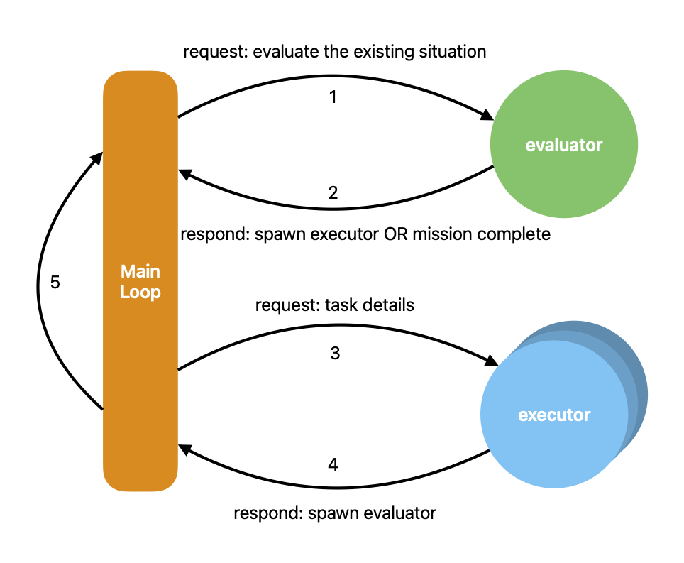
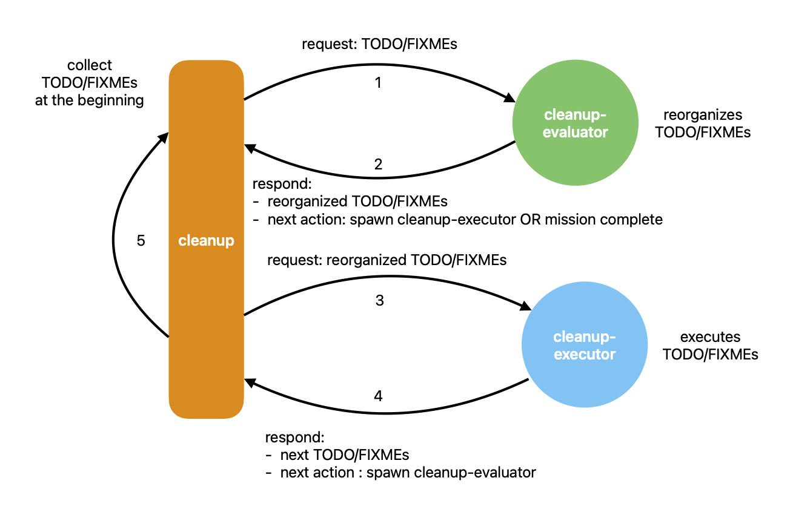

*Fun fact:* I'm currently ranked **third in daily cloud usage statistics
on Claude Count**. That's because I've been running Claude Code inside a
**24/7 agentic loop** to power my side project. While I sleep, the loop
evaluates, spawns subagents, and keeps moving forward. When I wake up,
progress is already made.

But the magic isn’t tied to Claude; once you grasp the essence of the
configuration you can replicate it with models and agent runtimes that
implement the same contract.

Here's how you can build your own.

## The Secret Behind the Curtain

The truth is: the latest large-language models --- Claude 4, GPT-5 ---
have been **trained with agent tasks**. They "know" how to evaluate, plan,
call tools, and hand control back. You don't need a massive framework.
You just need a contract and a loop.

## The Essence of an Agentic Loop

To make “a contract and a loop” concrete, the diagram below shows the
minimal flow: the evaluator chooses the next action, spawns executors to
use tools, executors report results, and control returns to the evaluator
until the goal is met.



However, to turn that flow into a working system, three components must
work together: a right **model**, **prompts** that enforce the contract,
and an **agent runtime** designed for tool use:

1. **Get the right model**
    Pick an advanced model that can:

    - Follow strict JSON formats under prompt pressure.
    - Stay disciplined about roles, actions, and IDs.
    - Reason sensibly about tool use without hallucination.

2. **Write prompts with contracts in mind**
    The backbone of your loop is a fixed-format schema. Every evaluator
    and executors must respond in this structure. This turns free-form LLM
    chatter into predictable, machine-readable communication.

3. **Support tools**
    Without tools, your loop is just self-talk. With CLI commands, it can
    run tests, fetch data, patch code, or monitor systems. Subagents
    aren’t even required, since you can spawn external agent instances to
    build the evaluator-executor heartbeat via the `bash` tool.

## Writing Your First Contract-Driven Prompts

You’ve seen the loop and its roles. Now we’ll wire real prompts using
Claude Code sub-agents and the a custom command to build a loop that
cleans up TODOs and FIXMEs across your repository. No standalone schema
files—the contract is exactly what your prompts already define. Claude 4
is a solid choice for running a 24/7 agentic loop.

### 1) The Structure of the Loop

The loop has three components:

- `cleanup` command
- `cleanup-evaluator` sub-agent
- `cleanup-executor` sub-agent



The `cleanup` command is the loop’s entry point and hosts
the **main agent**. It first scans the repository for TODO/FIXME items and
prepares a working list, then passes that list to the `cleanup-evaluator`
sub-agent.

The `cleanup-evaluator` sub-agent triages and orders the list, then
responds to the **main agent** with the reorganized list and a next action
of `spawn(cleanup-executor)`.

The **main agent** then follows the response from the `cleanup-evaluator`,
spawning a `cleanup-executor` sub-agent and passing the reorganized list to it.

The `cleanup-executor` sub-agent dequeues the first TODO/FIXME item from
the reorganized list, executes it, updates the list when execution
completes, and responds to the **main agent** with the updated list and a
next action of `spawn(cleanup-evaluator)`.

The **main agent** then follows the response from the `cleanup-executor`,
spawning a `cleanup-evaluator` sub-agent and passing the updated list to
it, thereby returning to the beginning of the loop.

### 2) The Contract

The key to this loop is ensuring the **main agent** and sub-agents always
follow the contract. The good news: the contract is straightforward. In
this example, each sub-agent receives a JSON object from
the **main agent** in the following format:

```json
{
  "incomplete_items": [incomplete_item_list],
  "completed_items": [completed_item_list],
  "postponed_items": [postponed_item_list]
}
```

and responds to the **main agent** in the following format:

```json
{
  "incomplete_items": [reordered_incomplete_item_list],
  "completed_items": [completed_item_list],
  "postponed_items": [postponed_item_list],
  "next_action": "spawn(cleanup-executor)|spawn(cleanup-evaluator)|mission_complete"
}
```

### 3) Enforcing the Contract with Prompts

The contract is baked into the prompts themselves—no hidden tricks, just
clear imperatives and consistent repetition until the model obeys.

The snippet below shows the **main agent** spawning a `cleanup-evaluator` at the start of the loop.

````markdown path=cleanup.md
## MANDATORY: 2. SPAWN AN CLEANUP-EVALUATOR TO EVALUATE INCOMPLETE TODOs and FIXMEs

You MUST spawn an cleanup-evaluator subagent to evaluate the gap between the incomplete TODOs and FIXMEs and the existing situation.

You SHALL ALWAYS send the cleanup-evaluator with a JSON object of the following format:

```json
{
  "incomplete_items": [incomplete_item_list],
  "completed_items": [completed_item_list],
  "postponed_items": [postponed_item_list]
}
```
````

On the cleanup-evaluator side, we should also enforce the contract.

````markdown path=cleanup-evaluator.md
## MANDATORY: PARSE THE RECEIVED JSON OBJECT

YOU WILL RECEIVE a JSON object of the following format:

```json
{
  "incomplete_items": [incomplete_item_list],
  "completed_items": [completed_item_list],
  "postponed_items": [postponed_item_list]
}
```
````

Once the cleanup-evaluator is ready to conclude its evaluation, it
prepares a response to the main agent using the contract format. In this
example, its `next_action` is always to spawn a cleanup-executor or tell
"mission complete".

````markdown path=cleanup-evaluator.md
## MANDATORY: RESPONSE BACK TO THE MAIN AGENT

You SHALL response with the [reordered_incomplete_item_list], [completed_item_list], [postponed_item_list] to the next subagent with the JSON object of the following format:

```json
{
  "incomplete_items": [reordered_incomplete_item_list],
  "completed_items": [completed_item_list],
  "postponed_items": [postponed_item_list],
  "next_action": "spawn(cleanup-executor)|mission_complete"
}
```

The `next_action` field SHALL BE `mission_complete` when NO ITEMS LEFT in [reordered_incomplete_item_list].

Otherwise, the `next_action` field SHALL BE `spawn(cleanup-executor)`.
````

Back in the main agent, it follows the response from
the `cleanup-evaluator` sub-agent, spawns a `cleanup-executor` sub-agent,
and passes the lists to it.

````markdown path=cleanup.md
## MANDATORY: 3. UNDERSTANDS THE CLEANUP-EVALUATOR'S RESPONSE

The cleanup-evaluator subagent ALWAYS is the core of the workflow.

YOU MUST OBEY THE DESCISION OF THE CLEANUP-EVALUATOR IN [next_action].
You SHALL NEVER CHANGE THE DESCISION OF THE CLEANUP-EVALUATOR in [next_action].

The [next_action] COULD BE: `spawn(cleanup-executor)` | `mission_complete`:

The [next_action_details] COULD BE:

```json
{
  "type": "todo|fixme",
  "id": [next_item_id],
  "file": [next_item_file],
  "line": [next_item_line],
  "content": [next_item_content]
}
```

OR

```json
{
  "type": "mission_complete"
}
```

The cleanup-evaluator subagent SHALL NEVER know if it is the last time to evaluate until the [next_action] of a spawned cleanup-evaluator turns out to be `mission_complete`.

### MANDATORY: ALWAYS TRANSFER [incomplete_items], [completed_items], [postponed_items] FROM THE CLEANUP-EVALUATOR'S RESPONSE TO THE NEXT SUBAGENT

YOU MUST transfer the [incomplete_items], [completed_items], [postponed_items] from the cleanup-evaluator's response to the next subagent with the JSON object of the following format:

```json
{
  "incomplete_items": [incomplete_item_list],
  "completed_items": [completed_item_list],
  "postponed_items": [postponed_item_list],
}
```
````

At this point, the contract allows the main agent to spawn a
`cleanup-executor` sub-agent to execute the next TODO/FIXME item. However,
we still need to instruct the **main agent** to follow responses from
sub-agents other than the `cleanup-evaluator`:

````markdown path=cleanup.md
## MANDATORY: 4. UNDERSTAND THE RESPONSE FROM OTHER SUBAGENTS

All the subagents other than the cleanup-evaluator subagent SHALL ALWAYS response with a JSON object of the following format:

```json
{
  "incomplete_items": [next_incomplete_item_list],
  "completed_items": [next_completed_item_list],
  "postponed_items": [next_postponed_item_list],
  "next_action": "spawn(cleanup-evaluator)",
}
```

### MANDATORY: ALWAYS READ Subagent's Response to Decide Next Action

The [next_action] is ALWAYS to spawn a cleanup-evaluator sub-agent.

You MUST SEND the cleanup-evaluator with the JSON object of the following format:

```json
{
  "incomplete_items": [next_incomplete_item_list],
  "completed_items": [next_completed_item_list],
  "postponed_items": [next_postponed_item_list],
}
```
````

Finally, the **main agent** needs to know when to end the loop:

````markdown path=cleanup.md
## MANDATORY: 5. HANDLING MISSION COMPLETE

If `next_action` in the response from the cleanup-evaluator subagent is `mission_complete`, then the mission is completed.

You SHALL STOP ALL THE SUBAGENTS AND EXIT THE WORKFLOW.
````

## Beyond the Claude Code

At this point, you might ask: I'm not using Claude Code; I'm using Codex.
What should I do? The answer is simple: the approach stays the same. This
loop doesn't depend on any vendors; it rests on three essentials: a
contract, a loop, and a runtime. Put simply, the evaluator chooses the
next step, the worker carries it out, and the main agent routes and
safeguards. Everything else is implementation detail.

Claude Code is convenient because it offers two helpful primitives:

- Sub-agents: lightweight agent instances with their own prompts and roles.
- Custom Commands: first-class command blocks that carry prompts and tool wiring.

But neither is mandatory. You can replace both:

- Replace Sub-agents with a tool call that starts another AI agent
instance (for example, invoke a CLI that spins up a new agent and returns
its structured response).
- Replace Custom Commands with a shell script that sends a custom prompt
to launch an AI agent (for example, a script wrapping curl to post a
prompt to your agent service, then relay JSON back to the main loop).

As long as you preserve the contract and the loop, the mechanics are
interchangeable. Your main agent routes, enforces the schema, and keeps
cycling until `next_action` is `mission_complete`.

## Running 24×7

Running a loop around the clock is about feedstock, not just uptime. A
loop survives by continuously converting A into B: turning one kind of
artifact into another on repeat. If A is an idea and B is a program (or a
fix, a test, a release), then a 24×7 loop needs endless ideas.

We don’t actually have infinite ideas. The practical pattern is this: you
design the loop to tackle work that’s substantial enough to buy you
thinking time. While the agent is converting A→B — compiling, testing,
packaging, or deploying — you use that breathing room to decide the next
A. Optional feeders like TODO/FIXME scanners or issue trackers can surface
candidates, but they don’t replace your judgment. The loop does meaningful
work; you curate the input stream. That’s a perfectly valid way to run a
24×7 operation.

## Conclusion

Building a 24×7 loop doesn't require LangChain or AutoGen. All you need is:

- A model trained with agent tasks.
- A prompt-enforced contract.
- A runtime that can spawn executors safely.

With that, you can run Claude Code (or GPT-5 Codex) in a loop that works
while you sleep.

Try it tonight. Tomorrow morning, you might wake up to progress already made.
