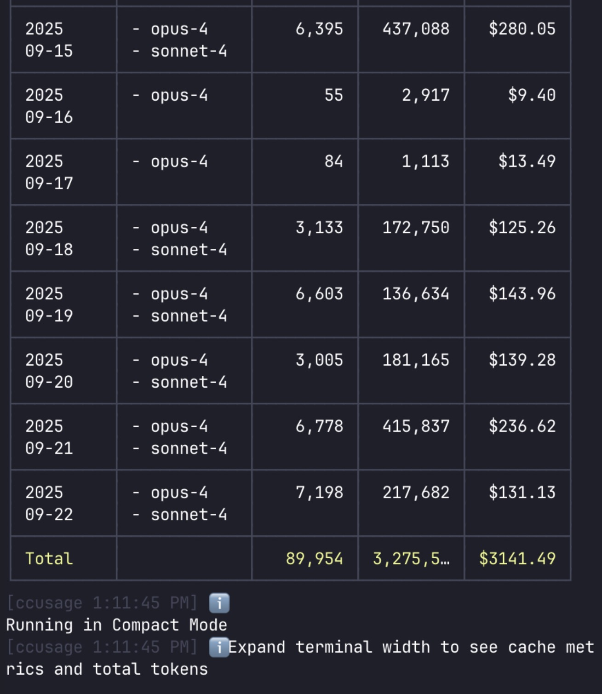
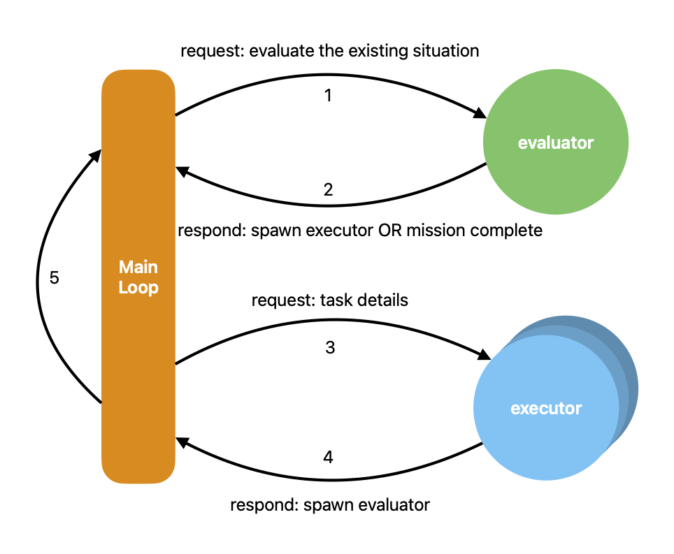
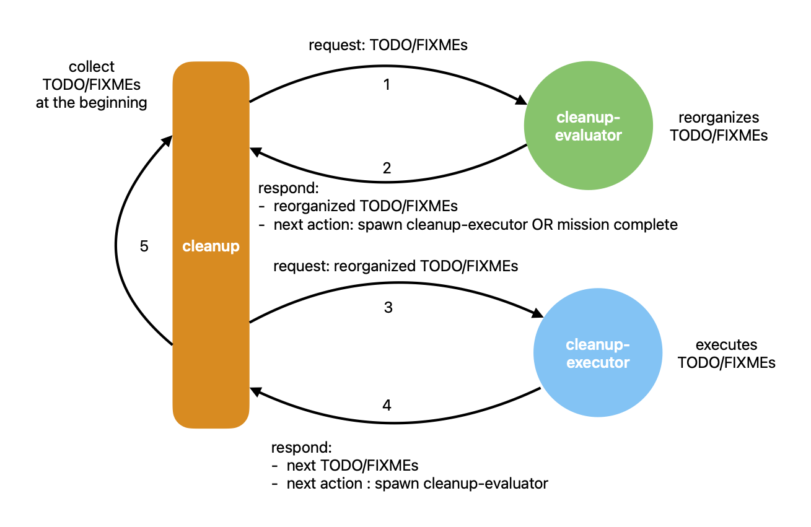
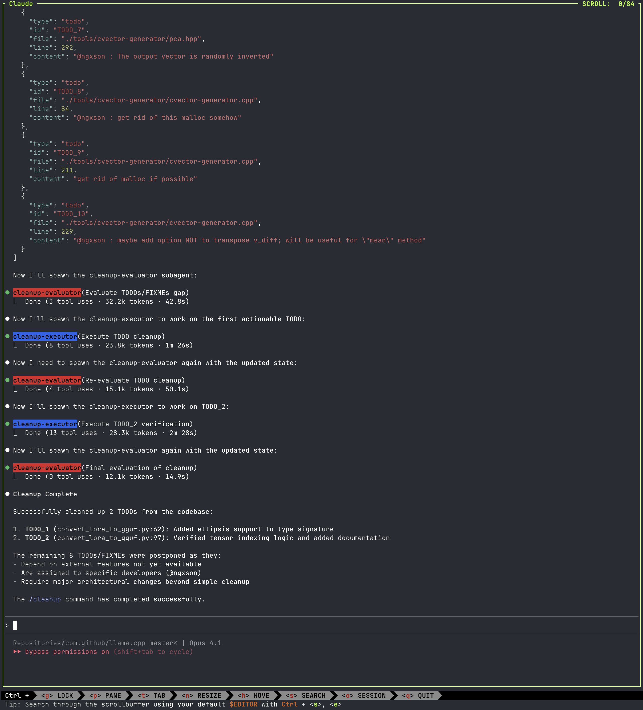

*小趣闻：* 2025 年 9 月，我在 Claude Code 上的用量飙到了 **3000 美元**。



原因很简单：我把 Claude Code 放进了一个 **7x24 Agent 循环** 里帮我打理业余项目。我睡着时，循环会评估现场、派生 subagents、让事情持续推进。等我醒来，进度已经悄悄向前走了一截。

但这种魔法并不是 Claude 独有；只要你理解了配置的精髓，就能把这个魔法复刻到任何实现了相同要件的模型与 Agent runtime 上。

下面就带你从头搭建。

## 幕后的秘密

事实是：最新的 Claude 4、GPT-5 这类大模型已经在 **Agent 任务** 上被反复训练。它们“知道”如何评估、如何规划、如何调用工具，以及如何把控制权交还。你无需庞大的框架，只需要协议和循环。

## Agent 循环的本质

为了把「协议 + 循环」具体化，先看这张最小化流程图：evaluator 决定下一步动作，派生 executor 去执行 tool，executor 回报结果，然后控制权回到 evaluator，直到目标完成。



不过，要让这套流程变成可运行的系统，需要三个组件协同工作：合适的 **模型**、能够落实协议的 **提示词**，以及专为工具调用设计的 **Agent runtime**：

1. **挑选合适的模型**

    选择一个能够：
    - 在提示词压力下仍旧严格遵守 JSON 格式；
    - 对角色、动作保持高度自律；
    - 在进行工具调用时保持理性推理，不胡乱臆测。

2. **围绕协议写提示词**

    循环的骨干是固定格式的 schema。每个 evaluator 与 executor 都必须在这份结构下作答，把原本自由的 LLM 对话收束成可预测、可解析的沟通。

3. **支持工具调用**

    没有工具调用，循环只是在自言自语；有了 CLI 命令，它就能跑测试、抓数据、修补代码或监控系统。甚至不需要内建 subagent，只要通过 `bash` tool 拉起外部 agent 实例，也能维持 evaluator 与 executor 的心跳。

## 写下你的第一份协议驱动提示词

角色和循环已经清楚，现在我们用 Claude Code 的 subagent 和 custom command，搭出一个清理仓库里 TODO/FIXME 的循环[^1]。无需额外的 Schema 文件——协议就在提示词里。Claude 4 非常适合承担 7x24 Agent 循环。

### 循环结构

循环包含三部分：

- `cleanup` 命令
- `cleanup-evaluator` subagent
- `cleanup-executor` subagent



`cleanup` 命令是循环的入口，也是 **main agent** 所在。它会扫描仓库里的 TODO/FIXME，整理出一份工作清单，再把清单交给 `cleanup-evaluator` subagent。

`cleanup-evaluator` subagent 负责分拣并重排清单，然后把整理后的清单以及 `spawn(cleanup-executor)` 这个下一步动作反馈给 **main agent**。

**main agent** 会按 `cleanup-evaluator` 的指示，拉起 `cleanup-executor` subagent，并把重排后的清单转交过去。

`cleanup-executor` subagent 会从清单中取出第一条 TODO/FIXME，执行完成后更新清单，再把更新后的清单和 `spawn(cleanup-evaluator)` 这一下一步动作回应给 **main agent**。

**main agent** 再次依据 `cleanup-executor` 的回复拉起 `cleanup-evaluator` subagent，把最新的清单交给它，于是循环回到开头。

### 协议长什么样

让循环持续运转的关键，是确保 **main agent** 与所有 subagent 都遵守协议。好消息是，这份协议很直观。在这个例子里，每个 subagent 会收到来自 **main agent** 的 JSON 对象，格式如下：

```json
{
  "incomplete_items": [incomplete_item_list],
  "completed_items": [completed_item_list],
  "postponed_items": [postponed_item_list]
}
```

Subagent 回给 **main agent** 时，使用的 JSON 结构是：

```json
{
  "incomplete_items": [reordered_incomplete_item_list],
  "completed_items": [completed_item_list],
  "postponed_items": [postponed_item_list],
  "next_action": "spawn(cleanup-executor)|spawn(cleanup-evaluator)|mission_complete"
}
```

### 通过工具收集 TODO/FIXME

你也许好奇 `[incomplete_item_list]` 是什么。你可以把它视作提示词里的“变量”：它们来自工具调用。在 `cleanup` 命令开头的提示词，会触发如下指令：

````markdown path=cleanup.md
## MANDATORY: 1. FIND DOCUMENTED TODOs and FIXMEs

You SHALL use the `grep` tool piped with `head` to find the first `10` documented TODOs and FIXMEs in the repository.

Command: grep -r -n -E "TODO|FIXME" . | head -n 10
````

不过原始输出不能直接拿来用。我们必须告诉 agent 期望的格式，并要求它把结果整理成符合协议的 JSON 对象。

````markdown path=cleanup.md
The outputs are in the following format.

```shell
[file]:[line]:[content]
```

You SHALL READ around each [line] in [file] and EXTRACT the [content] from all the found TODOs and FIXMEs, filtering out the ones can cannot apply with the restrictions of the platform, operating system, and required tools, then convert into a JSON object of the following format, using [incomplete_item_list] as the mnemonic:

```json
[
  {
    "type": "todo",
    "id": "TODO_1",
    "file": [todo_1_file],
    "line": [todo_1_line],
    "content": [todo_1_content]
  },
  {
    "type": "todo",
    "id": "TODO_2",
    "file": [todo_2_file],
    "line": [todo_2_line],
    "content": [todo_2_content]
  },
  {
    "type": "fixme",
    "id": "FIXME_1",
    "file": [fixme_1_file],
    "line": [fixme_1_line],
    "content": [fixme_1_content]
  },
  {
    "type": "fixme",
    "id": "FIXME_2",
    "file": [fixme_2_file],
    "line": [fixme_2_line],
    "content": [fixme_2_content]
  }
]
```

You SHALL NOTE a JSON object with and empty "items" array as [completed_item_list]:

```json
[]
```

You SHALL NOTE a JSON object with and empty "items" array as [postponed_item_list]:

```json
[]
```
````

### 用提示词强制贯彻协议

这里的协议直接写在提示词里——没有任何隐藏技巧，而是用清晰的命令一遍遍强调，直到模型完全照做。

下面这段展示了 **main agent** 如何在循环开始时拉起 `cleanup-evaluator`：

````markdown path=cleanup.md
## MANDATORY: 2. SPAWN A CLEANUP-EVALUATOR TO EVALUATE INCOMPLETE TODOs and FIXMEs

You MUST spawn a cleanup-evaluator subagent to evaluate the gap between the incomplete TODOs and FIXMEs and the existing situation.

You SHALL ALWAYS send the cleanup-evaluator with a JSON object of the following format:

```json
{
  "incomplete_items": [incomplete_item_list],
  "completed_items": [completed_item_list],
  "postponed_items": [postponed_item_list]
}
```
````

`cleanup-evaluator` 一侧也必须执行协议：

````markdown path=cleanup-evaluator.md
## MANDATORY: PARSE THE RECEIVED JSON OBJECT

YOU WILL RECEIVE a JSON object of the following format:

```json
{
  "incomplete_items": [incomplete_item_list],
  "completed_items": [completed_item_list],
  "postponed_items": [postponed_item_list]
}
```
````

当 `cleanup-evaluator` 完成评估后，它会按照协议准备回给 main agent 的响应。这个例子里，`next_action` 只有两种：拉起 `cleanup-executor`，或者宣布 "mission complete"。

````markdown path=cleanup-evaluator.md
## MANDATORY: RESPOND TO THE MAIN AGENT

You SHALL RESPOND with the [reordered_incomplete_item_list], [completed_item_list], [postponed_item_list] to the main agent with the JSON object of the following format:

```json
{
  "incomplete_items": [reordered_incomplete_item_list],
  "completed_items": [completed_item_list],
  "postponed_items": [postponed_item_list],
  "next_action": "spawn(cleanup-executor)|mission_complete"
}
```

The `next_action` field SHALL BE `mission_complete` when NO ITEMS ARE LEFT in [reordered_incomplete_item_list].

Otherwise, the `next_action` field SHALL BE `spawn(cleanup-executor)`.
````

回到 main agent，它会依据 `cleanup-evaluator` 的反馈拉起 `cleanup-executor` subagent，并把三个列表传过去：

````markdown path=cleanup.md
## MANDATORY: 3. UNDERSTAND THE CLEANUP-EVALUATOR'S RESPONSE

The cleanup-evaluator subagent is ALWAYS the core of the workflow.

YOU MUST OBEY THE DECISION OF THE CLEANUP-EVALUATOR IN [next_action].
You SHALL NEVER CHANGE THE DECISION OF THE CLEANUP-EVALUATOR in [next_action].

The [next_action] COULD BE: `spawn(cleanup-executor)` | `mission_complete`:

The [next_action_details] COULD BE:

```json
{
  "type": "todo|fixme",
  "id": [next_item_id],
  "file": [next_item_file],
  "line": [next_item_line],
  "content": [next_item_content]
}
```

OR

```json
{
  "type": "mission_complete"
}
```

The cleanup-evaluator subagent SHALL NEVER know if it is the last time to evaluate until the [next_action] of a spawned cleanup-evaluator turns out to be `mission_complete`.

### MANDATORY: ALWAYS TRANSFER [incomplete_items], [completed_items], [postponed_items] FROM THE CLEANUP-EVALUATOR'S RESPONSE TO THE NEXT SUBAGENT

YOU MUST transfer the [incomplete_items], [completed_items], [postponed_items] from the cleanup-evaluator's response to the next subagent with the JSON object of the following format:

```json
{
  "incomplete_items": [incomplete_item_list],
  "completed_items": [completed_item_list],
  "postponed_items": [postponed_item_list],
}
```
````

此时协议允许 **main agent** 拉起 `cleanup-executor` 来执行下一条 TODO/FIXME。不过我们还需要告诉 **main agent** 如何处理 `cleanup-evaluator` 之外的 subagent 的反馈：

````markdown path=cleanup.md
## MANDATORY: 4. UNDERSTAND THE RESPONSE FROM OTHER SUBAGENTS

All the subagents other than the cleanup-evaluator subagent SHALL ALWAYS respond with a JSON object of the following format:

```json
{
  "incomplete_items": [next_incomplete_item_list],
  "completed_items": [next_completed_item_list],
  "postponed_items": [next_postponed_item_list],
  "next_action": "spawn(cleanup-evaluator)",
}
```

### MANDATORY: ALWAYS READ Subagent’s Response to Decide Next Action

The [next_action] is ALWAYS to spawn a cleanup-evaluator subagent.

You MUST SEND the cleanup-evaluator a JSON object of the following format:

```json
{
  "incomplete_items": [next_incomplete_item_list],
  "completed_items": [next_completed_item_list],
  "postponed_items": [next_postponed_item_list],
}
```
````

最后，让 **main agent** 知道何时应该收尾：

````markdown path=cleanup.md
## MANDATORY: 5. HANDLING MISSION COMPLETE

If `next_action` in the response from the cleanup-evaluator subagent is `mission_complete`, then the mission is completed.

You SHALL STOP ALL THE SUBAGENTS AND EXIT THE WORKFLOW.
````

到这里，我们已经用整套协议驱动的提示词搭好了第一个 Agent 循环。

## 试一试

当你把这个循环跑在 llama.cpp 项目上时，会发生以下情况：循环会精确处理 10 条 TODO 和 FIXME 后结束——无需宏大目标，只需一次专注的清理循环，就能让核心机制完整跑通。



## 让循环 7x24 运作

要让循环全天候运行，重点是持续供给“饲料”，而不仅仅是持续时间。循环靠把 A 持续变成 B 活下去：把一种产出不断转换成另一种。假如 A 是点子、B 是程序（或修复、测试、发布），那么想要 7x24 地运转，就需要源源不断的点子。

现实里，我们不可能拥有无限点子。更实际的做法是：让循环承担足够大、值得托付的工作，为你腾出思考时间。当 Agent 在完成 A→B（例如编译、测试、打包、部署）时，你就能利用空档决定下一个 A。像 TODO/FIXME 扫描器或 issue 跟踪器这样的“饲料器”可以提供候选项，但无法代替你的判断。循环负责落实有意义的任务，你负责策展输入，这就是维持 7x24 节奏的正确姿势。

## 不止 Claude Code

你也许会问：如果我不用 Claude Code，而是用 Codex 呢？答案很简单：流程不变。这个循环和 agent 厂商无关，它只靠三样东西：协议、循环、Agent runtime。换句话说，evaluator 决定下一步，executor 负责执行，main agent 负责路由和护栏，其余都是实现细节。

Claude Code 的优势在于提供了两个顺手的原语：

- Subagent：带有提示词和角色的轻量 agent 实例。
- Custom command：触手可及的携带提示词和工具调用的命令块。

但它们都不是必需的。你可以替换成：

- 用工具调用拉起其他 AI Agent 用取代 subagent（例如执行 CLI，启动新的 Agent 并返回结构化结果）；
- 用 shell 脚本向 AI Agent 发送自定义提示词，取代 custom command。

只要协议和循环仍在，执行机制就能自由互换。Main agent 负责路由、执行 schema，并让循环持续运转，直到 `next_action` 变成 `mission_complete`。

## 对比 LangChain 与 LangGraph

你可能还在想：为什么不用 LangChain 或 LangGraph？下面这张表能更清楚地说明取舍。

| 考虑点 | Agent runtime | LangChain 或者 LangGraph |
|---|---|---|
| 要求 | 合适的模型 | SDK + 工具 + 记忆抽象层 |
| 配置 | 提示词 | 链或者图 |
| 工具调用 | 通过提示词调用 | 通过提示词及系统级适配层 |

这张对比表呈现了本文所述 **Agent runtime** 路线，与 LangChain 或 LangGraph 框架之间的差异：搭建循环需要什么、如何搭建、以及如何进行工具调用。

从表格可见，**Agent runtime** 这条路线更轻量，依靠原生工具就能融入任意技术栈，同时保持对 agent 厂商的中立，让人类掌控输入，而循环本身则可以 7x24 地产出成果。

## 总结

要打造一个 7x24 的循环，你并不需要 LangChain 或 LangGraph。真正需要的是：

- 一个在 Agent 任务上经过训练的模型；
- 由提示词严格执行的协议；
- 支持工具调用的 agent runtime。

具备这些条件，就能让 Claude Code（或 Codex）在循环里持续工作，即便你已经入睡。

今晚就动手试试看吧。明早醒来，也许成果已经在等你。

[^1]: [https://github.com/WeZZard/agentic-loop-playground](https://github.com/WeZZard/agentic-loop-playground.git)
