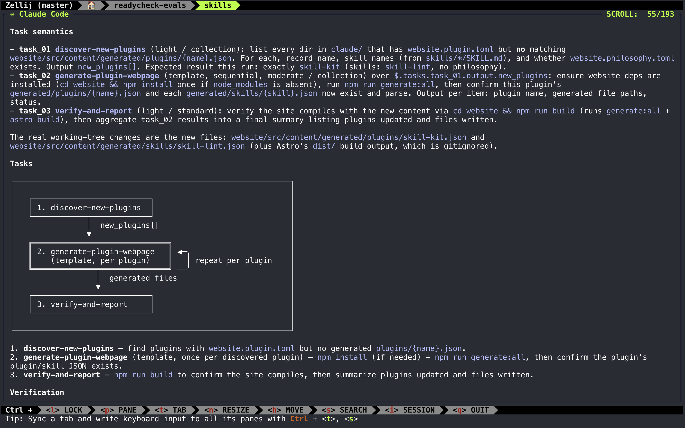
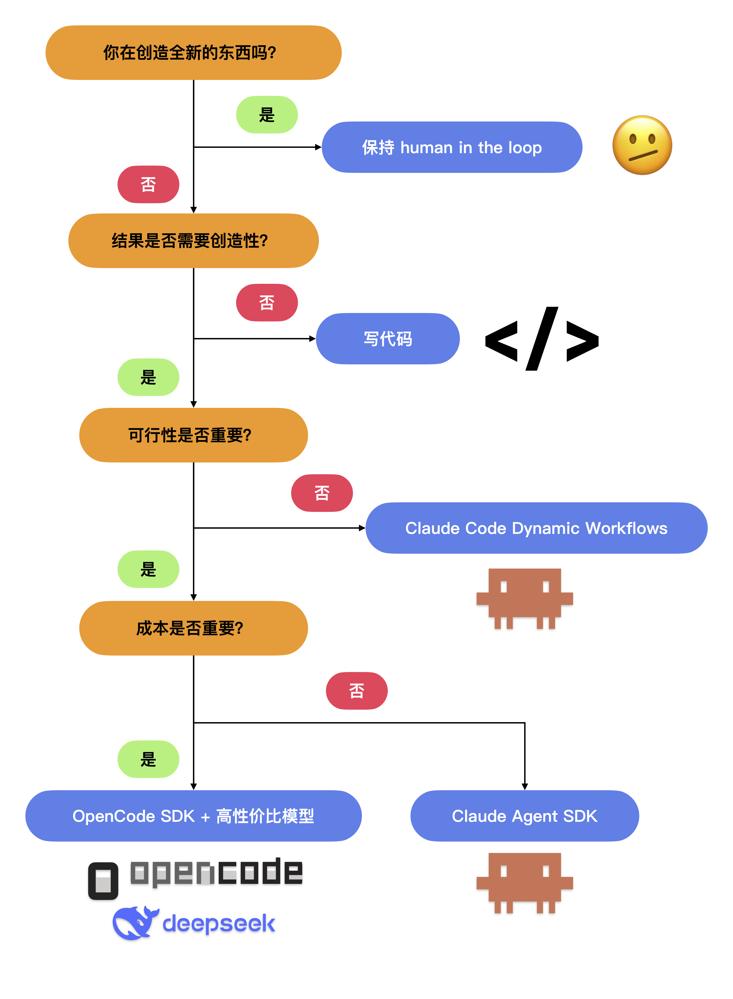
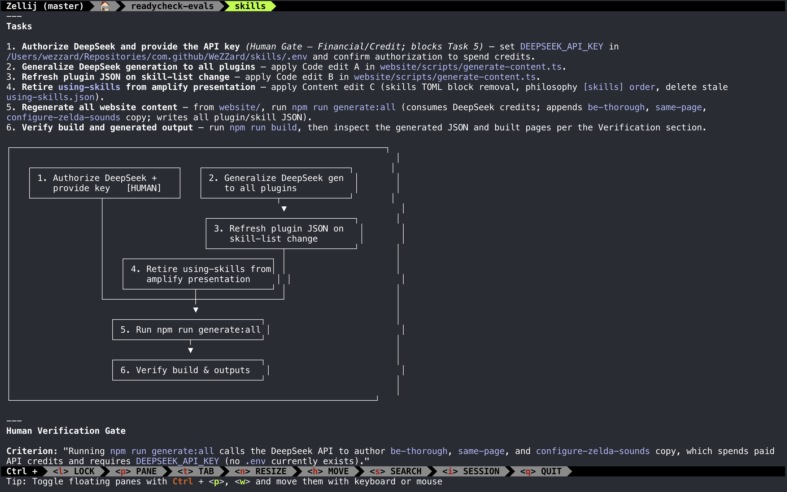
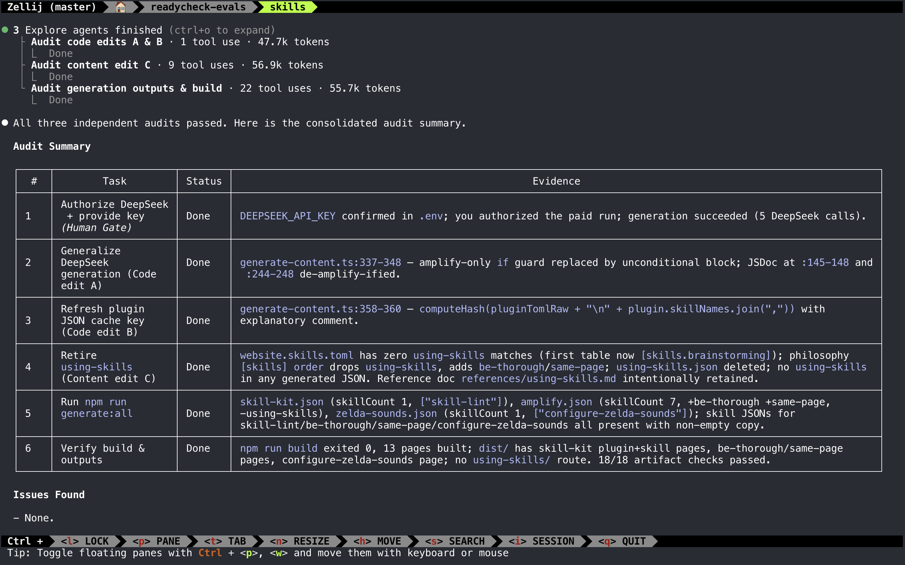

上周，Opus 4.8 发布，搭载了 Claude Code 的 **dynamic workflows**。而早在四个月前，我就在 Opus 4.5 上构建了一个等效插件 [charge](https://github.com/WeZZard/charge)，只需提供 prompt，它就能创建并编排由 subagent 驱动的可复用工作流。

> Charge 在这里是「冲锋」的意思——即很多个 subagents 冲锋帮你完成任务。

不久后，我便放弃了这个项目，因为事实证明，动态生成 subagent(s) 并复用其工作流只是个伪需求。不过，基于 subagent 的编排依然是我在 Claude Code 日常工作的核心。如今，我已转用 **[amplify](https://github.com/WeZZard/skills)** (`amplify@wezzard-skills`)，它凝聚了我先前构建 `charge` 时积累的经验教训。

如果你也在构建 agent，我希望这个故事能帮你捕捉到新模型的下一次实质性能力跃升，并在设计类似 Claude Code 的 dynamic workflow 系统时，避免重复我走过的弯路。Anthropic 并不公开实现细节和设计思路，而本文和开源仓库则会进行详细拆解。

## 我为什么要开发 Charge？

自 2025 年 8 月以来，我一直在 Claude Code/Opus 4.1 里运行一个长程 agentic loop，通过详细的 plan 文件来推进个人项目开发。

在实际操作中，这其实是一个 subagent 驱动的 loop。因为 LLM 靠 next-token prediction 工作，subagent 能很好地隔离 context；而要提升系统性能的下限，最有效的办法之一就是把无关内容挡在 context 之外。

这个 loop 包含一个 evaluator 和数个 executor subagents，它们对照 plan 执行开发、测试、排障和集成卡口。这种 subagent 驱动的设计实现了 context 隔离，让每个步骤都因此受益。


2025 年 9 月，我写了一篇[文章](https://wezzard.com/post/2025/09/build-your-first-agentic-loop-9d22)介绍这套系统的运作机制。两个月后，Anthropic 发表的引入 “harness” 概念的那篇文章也使用了类似设计。

Opus 4.5 发布后，因为这个 loop 中的 subagent 的返回响应包含了任务细节，主 agent 有时会直接跳过这个 loop 的 evaluator-executor 模式独自将任务推进完成。差不多同一时间，Claude Code 引入了 background tasks 与并行 subagent。这两个新特性导致这种任务泄漏到主 agent 的现象跑起来反而更快，因为泄露的任务有时会被进一步拆解并并行处理。到 2026 年 1 月，在一次文件处理任务里，我甚至使用 Claude Code 生成过 70 多个并行的 subagents。

总的来说，从 Opus 4.5 开始，运行和协调 subagent 变得容易得多。于是我不禁在想，我们能不能创建和管理由 subagents 驱动的可复用 workflow，并借鉴结构化并发编程里任务树与有向无环图（DAG）的概念，来构建它们之间的依赖关系？

## 实现细节与设计理念

`charge` 的实现细节其实很简单，它完全由 prompt 驱动，并通过动态生成的 schema 来约束。[charge](https://github.com/WeZZard/charge) 已经开源，下面我将重点介绍几个常被误认为是「魔法」的实现要点。

### 任务拆解与依赖

任务拆解和依赖构建是通过 chain-of-thought 技巧实现的，具体步骤如下：

1. 理解用户意图
2. 识别用户意图中的重复模式
3. 划分任务边界，确保每个任务目标单一、明确，且输入和输出清晰可辨。
4. 定义任务 schema 中使用的属性。
5. 将依赖关系映射为任务依赖图。

沿着这一思维链，模型会将简单的用户 prompt 转换为一个 JSON 对象，以此表示拆解后的任务依赖图：

```json
{
  "workflow_name": "[string]",
  // ...
  "tasks": [
    {
      "id": "[string]",
      "name": "[string]",
      "description": "[string]",
      // ...
      "input": [
        {"field": "[string]", "type": "[string]", "description": "[string]"}
      ],
      "output": [
        {"field": "[string]", "type": "[string]", "description": "[string]"}
      ],
      "depends_on": ["[string]"]
    }
  ],
  ...
}
```

任务都存放于 `tasks` 数组中，每个任务都通过 `depends_on` 字段来指定依赖。随后，workflow executor 会直接消费这个 JSON 对象。

### 执行引擎

通过读取该 JSON 对象中的任务依赖图，Claude Code 就能“神奇地”按依赖顺序执行任务。

Anthropic 采用 JS 编写的确定性执行引擎来实现这部分，对于需要大规模编排 subagents 的系统来说，我认为这是一个正确的选择。毕竟 LLM 本质上是通过 next-token prediction 来工作的，而基于 prompt 的执行引擎却不得不依赖模型本身去推断执行顺序，并在前置 agent 结束时发出正确的 tool call 以启动下一个 agent，然而这两点其实都无法得到绝对保证。

不过，即便所有的 subagent 都是用 JS 编写的，我们也完全可以用 generator 模式来实现执行引擎，并直接在主 agent 中运行：

```shell
# main agent 发现 task_1 已经完成，
# 于是调用 `complete-task.sh` 工具。
# `complete-task.sh` 将 `task_1` 标记为已完成，
# 并返回接下来的任务。
$> complete-task.sh task_1
{
	"next_tasks": [
	  {
		  "name": "task_2",
		  "description": "..."
	  },
	  {
		  "name": "task_3",
		  "description": "..."
	  }
	],
	"execution_order": "parallel"
}
```

在这种设计下，Claude Code 的主 agent 依然负责整个 workflow 的编排。每当有 agent 完成任务，它便需要依赖模型来调用 `complete-task.sh`，并根据工具输出生成新的 subagents。

### 成本与正确性

当 workflow 构建完成并准备执行时，`charge` 会利用 Claude Code 的 plan mode 供用户审阅拆解后的 workflow。



这一步审阅至关重要，因为根据任务动态生成 subagents 是按 output token 计费的。具体来说，主 agent 需要输出用于生成这些 subagents 的 prompt，而 output token 的单价要比 input token 贵得多。这种设计相当于实现了一种 token 消耗的角度的「渐进式暴露 (progressive disclosure)」。

### 控制与引导

在这一点上，`charge` 相比 Claude Code 的 dynamic workflows 拥有另一个独特优势。由于 `charge` 的 workflow 编排依然保留在主 agent 中，你可以在执行过程中的任意时刻进行中断和引导。

## 为什么我称之为伪需求

用了一段时间 `charge` 之后，我发现实际场景中复用率最高的 workflow 其实更适合用确定性算法来实现。这部分工作本就该写在代码里，而不是 prompt 里。

只有在需要发挥创造力时，才需要引入 LLM。在可复用的 workflow 中，LLM 通常出现在分析、诊断，或是像把 Bun 从 Zig 重写为 Rust 这样的「洗码」任务中。Anthropic 在展示 dynamic workflow 时，就把后者作为一个典型案例。而如果从零创造全新的东西，保持 human in the loop 并在推进中随时调整方向，才是正确的选择。

即便是在分析和诊断任务中，你依然可以通过代码来生成结构更清晰、更易读的 tool outputs，并通过在 script 中内联多个工具来进行合并 tool calls。这不仅能提升执行速度，还能减少 context 中的噪音。这些优化至关重要，能直接提升 workflow 的性能与结果质量。毕竟，分析或诊断能否给出切实可行的建议，才是我们真正关心的。

此外，对于注重可行性的任务，你还可以基于 OpenCode SDK 这样的 agent SDK，在数据传输和进程内通信中引入类型安全，以替代进程间的 tool calls。OpenCode SDK 与 OpenCode 采用相同的 session 格式，所以 OpenCode SDK session 可以在 OpenCode 客户端中直接继续。这种互操作性为 LLM-driven workflow 引入了可调式性，是整个 agent 生态中一颗被长期忽视的明珠。

不过调研任务是个例外。毕竟调研离行动太远，在转化为行动之前，还需要经过重重判断。我想，这正是 Claude Code 内置 `/deep-research` workflow 的原因。

你可以参考下面的决策树来选择最适合的工具：



## 我的最终选择

结合这张决策树，结论其实非常清晰：
- 如果要创造全新的东西，我们依然需要保持 human in the loop，在运行过程中随时引导 agent。
- 如果是运行可复用的 workflow，我们则有更经济的选择，比如基于 OpenCode 搭配高性价比的模型，或者写代码——代码只消耗 CPU 时间、不消耗 token。

而第一项，正是我日常使用 Claude Code 时的瓶颈所在。

于是，我借鉴了 `charge` 的以下设计元素并在 2026 年 2 月开发了 `amplify`：

1. 任务依赖图以及每个任务专属的 subagent。
2. 基于 plan 的任务图 review 机制。
3. 在主 agent 中执行，以便在运行过程中随时引导。



为了防止 Claude Code 过早宣布完成任务，`amplify` 还引入了审计 (audit) subagents，用于检查规划好的工作是否真的已经完成。


