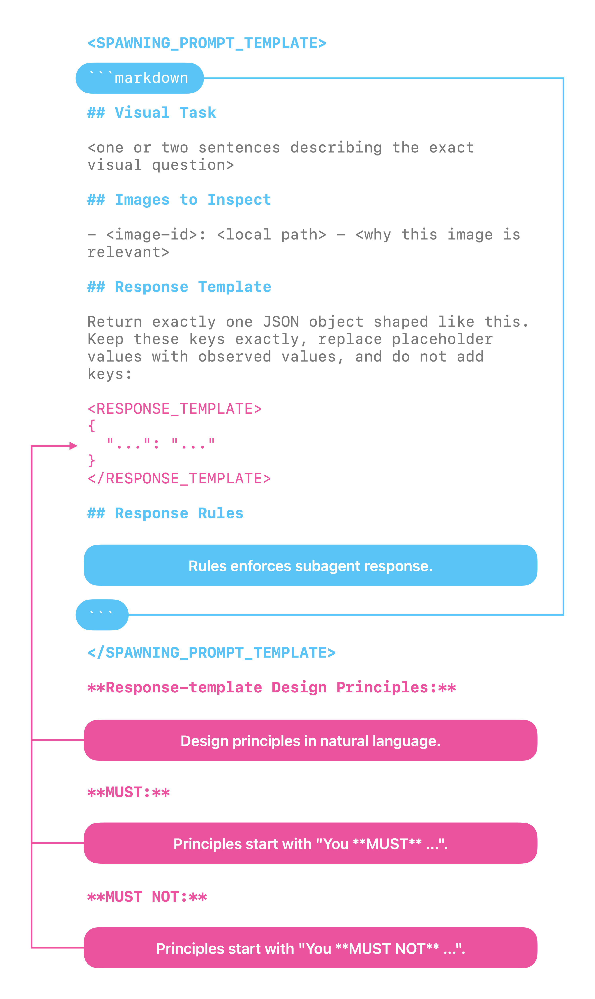

Have you ever sent an image to GLM-5.2 in OpenCode? The model says it is text-only and cannot inspect visual content. You accept the limitation and move on.


The hidden failure is worse. When GLM-5.2 works with browser-use tools, the tools capture screenshots, and the model confidently reports what it supposedly sees. But the model never saw a pixel. It read the AX tree, the accessibility metadata returned by a separate snapshot call, and treated that as visual verification. The AX tree can confirm that a button exists, but it cannot confirm whether the button is centered, whether the text is readable, or whether two screenshots match.


To solve both problems, I built a plugin that gives GLM-5.2 eyes in OpenCode. This post covers the main lessons I learned while building it:

1. How to mix and match models with different capabilities without a model router or fusion models.
2. How to design agent-to-agent communication.
3. How to make skills trigger reliably on multimodal content.

## Installation and Usage

If you want the plugin right away, here is the install command:

```shell
opencode plugin opencode-vision -g
```

This plugin comes with a `vision` skill. To use it, drag an image into the input box.


When the first time you use it, you must pick a vision-capable model detected from your configured providers.


Then a subagent configured with that vision-capable model evaluates the image. GLM-5.2 in the main agent receives the subagent's findings as text.


This skill also works with images returned by computer-use and browser-use tools.


## The Architecture

ZCode implements vision support by routing image input to a vision-capable model included in its official subscription plan. That is why ZCode can understand the images you send it, and why that behavior disappears when you use GLM-5.2 through unofficial providers.

But OpenCode cannot configure a model router or fusion models. So how can we make OpenCode handle visual content?

Since many providers available through OpenCode already offer vision-capable models: OpenAI ChatGPT, Kimi for Coding, OpenCode Go, and Ollama Pro/Max. With the primitives OpenCode already provides, we can build a lightweight architecture:

1. Create subagents that use vision-capable models to process visual content.
2. Delegate visual tasks to these subagents through a skill when needed.

With today's agent tooling, those two ideas are enough to prompt an agent into building the plugin.

However, two details still matter:

1. Agent-to-agent communication design
2. What the skill description covers

Both are critical to the quality of vision-task results.

## Agent-to-agent Communication

Stable agent-to-agent communication usually starts with a rigid contract that structures subagent inputs and outputs.

However, to support a wide range of visual tasks, that contract cannot be too narrow or rigid.

For example, if we add a field for the task purpose but allow only a small set of values, our subagents cannot handle other kinds of work.

**Bad Design:**

The following code comes from my first agent-to-agent contract design. It had several design flaws:

1. The `role` field in the `Image` object is designed for comparison tasks, but not every visual task is a comparison task.
2. The `judgment` field covers only a limited set of visual tasks, and we cannot list every possible task when we design the skill.
3. The `judgment` field can contain only one object such that can only have one `Alignemnt` object. What if I want to check an object's alignment on both the X and Y axes?

```typescript
interface Image { path: string; label: string; role: "baseline" | "current" | "reference" }
interface Request { 
    id: string
    images: [Image]
    judgment: Presence | Absence | Alignment | Ordering | Equality | Layout | Readability | State | Diff | Describe;
    criteria?: string;
    responseContract?: string;
}
interface Presence { kind: "presence"; subject: string; expectation: string }
interface Absence { kind: "absence"; subject: string; expectation: string }
interface Alignment { kind: "alignment"; subject: string; axis: string; expectation: string; tolerance: string }
interface Ordering { kind: "ordering"; direction: string; expected: string[] }
interface Equality { kind: "equality"; subjects: string[]; threshold: string }
interface Layout { kind: "layout"; expectations: string[] }
interface Readability { kind: "readability"; subject: string }
interface State { kind: "state"; subject: string; expectedState: string }
interface Diff { kind: "diff"; baseline: string; current: string }
interface Describe { kind: "describe"; focus: string }
```

**Good Design:**

A better approach is to let the agent design the contract from a prompt template and a few explicit principles:

1. Declare the subagent's spawning prompt as a template.
2. **Inside** the spawning prompt, declare the subagent's **response schema** as a template.
3. **Inside** the spawning prompt, add principles that enforce the subagent to responds with the **response schema**.
4. **Outside** the spawning prompt, add principles that guide the main agent to spawn the subagent with a dynamically designed **response schema**.

With this design, communication between agents stays structured while remaining dynamic enough to represent a wide range of visual tasks.



## Skill Description

People may think multimodal support is only about user input. However, tool results can introduce multimodal content.

This means the skill description should cover cases where tool results include multimodal content. In OpenCode, this is straightforward because images in tool results have two recognizable traits:

```yaml
description: >-
  You **MUST** use the vision skill when your model is text-only (e.g.
  glm-5.2, deepseek-v4-pro) AND:
  ...
  (5) OR a tool result contains an image attachment the current model
  cannot see (attachments[].mime = "image/png",
  url = "data:image/png;base64,...");
```

## Limitations

**Native Multimodality:**

This plugin does not add native multimodality to a text-only model like GLM-5.2.

Multimodal content carries details that text cannot fully capture. Native multimodality lets the model see those details directly.

This plugin cannot do that. It sends a vision model's findings back to the main agent as text, so some visual information still gets compressed or lost.

**Disable the Plugin:**

Sometimes you may switch to a vision-capable model like GPT. In that case, keeping that model in the driver's seat for visual tasks is a better choice -- it can inspect images natively and may produce better results.

However, plugins installed with `opencode plugin` do not appear in OpenCode's plugin management UI.

To disable the plugin for a single task, prepend this sentence to your prompt: **"You MUST not use the vision skill."** OpenCode will then skip the `vision` skill that comes with this plugin.

**Video Content:**

Models like Kimi K2.7 Code support video input. OpenCode does not accept video input, so this plugin does not support video either.
