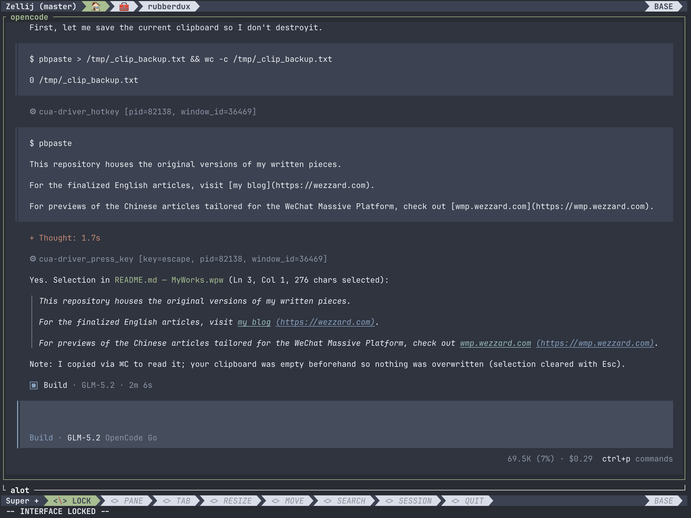

Have you ever sent an image to GLM-5.2 in OpenCode? The model tells you it is text-only and cannot inspect visual content. You accept the limitation and move on.


The hidden failure is worse. When GLM-5.2 works with browser-use tools, it captures screenshots and confidently reports what it supposedly sees. But it never saw a pixel. It read the AX tree, the accessibility metadata returned by a separate snapshot call, and treated that as visual verification. The AX tree can confirm that a button exists. It cannot confirm whether the button is centered, whether the text is readable, or whether two screenshots match.


To solve these problems, I built a plugin that gives GLM-5.2 eyes in OpenCode. This post covers the main lessons I learned while building it:

1. How to mix and match models with different capabilities without a model router or fusion models.
2. How to design agent-to-agent communication.
3. How to make skills trigger reliably on multimodal content.

## Installation and Introduction

If you want the plugin right away, here is the install command:

```shell
opencode plugin opencode-vision -g
```




// TODO: Other usage: pass a file path

## The Architecture

ZCode implements vision support by routing to a vision-capable model that comes with its official subscription plan with image inputs. That is why ZCode can understand the images you send to it and the magic disappeared when you use GLM 5.2 from non-official providers.

But OpenCode cannot configure a model router or fusion models. So how do we make OpenCode support vision contents?

In fact, many providers available through OpenCode already offer vision-capable models: OpenAI ChatGPT, Kimi for Coding, OpenCode Go, and Ollama Pro/Max. With the primitives OpenCode already provides, we can easily come up with a lightweight architecture:

1. Create subagents that use vision-capable models to process visual content.
2. Delegate visual tasks to these subagents through a skill when needed.

With today's agent tooling, that intuition is enough to build the plugin.

However, two details still matter:

1. Agent-to-agent communication design
2. The skill description's content

Both are critical to the quality of vision-task results.

## Agent-to-agent Communication

To build stable agent-to-agent communication, we usually introduce a rigid contract that structures subagent inputs and outputs.

However, to handle as many visual tasks as possible, the contract cannot be too narrow or rigid. For example, if we add a field that describes the task purpose but allow only a small set of values, our subagents cannot perform other types of work.

**Bad Design:**

The following code is part of my first agent-to-agent contract design. At least, it has the following design smell:

1. The `Image` object is designed for comarison tasks but not all the visual tasks are about comparison.
2. The `judgment` field can only cover limited visual task and we just cannot list all at the skill's design time.
3. The `judgement` field can only have one object. So what if I wanna check the alignment of an object in both the X and Y axis?

```typescript
interface Image { path: string; label: string; role: "baseline" | "current" | "reference" }
interface Request { 
    id: string
    images: [Image]
    judgment: Presence | Absence | Alignment | Ordering | Equality | Layout | Readability | State | Diff | Describe;
    criteria?: string;
    responseContract?: string;
}
interface Presence { kind: "presence"; subject: string; expectation: string }
interface Absence { kind: "absence"; subject: string; expectation: string }
interface Alignment { kind: "alignment"; subject: string; axis: string; expectation: string; tolerance: string }
interface Ordering { kind: "ordering"; direction: string; expected: string[] }
interface Equality { kind: "equality"; subjects: string[]; threshold: string }
interface Layout { kind: "layout"; expectations: string[] }
interface Readability { kind: "readability"; subject: string }
interface State { kind: "state"; subject: string; expectedState: string }
interface Diff { kind: "diff"; baseline: string; current: string }
interface Describe { kind: "describe"; focus: string }
```

**Good Design:**

A better approach is to let the agent design the contract within a set of clear principles:


With this design, communication between agents stays structured, but it is still dynamic enough to represent a wide range of visual tasks.

## Skill Description

People may think multimodal support is only about user input. However, tool results can also introduce multimodal content.

The skill description should cover cases where tool results carry multimodal content. In OpenCode, this is straightforward because images in tool results have two recognizable traits:

```yaml
description: >-
  You **MUST** use the vision skill when when the your model is text-only (e.g.
  glm-5.2, deepseek-v4-pro) AND:
  ...
  (5) OR a tool result contains an image attachment the current model
  cannot see (attachments[].mime = "image/png",
  url = "data:image/png;base64,...");
```

## Limitations

**Native Multimodality:**

We can never add native multimodal support to a text-only model like GLM-5.2.

The model's training process sets that limit. As users, we cannot close the gap.

What we can do is route multimodal requests to another capable model and ask that model to send its findings back to the text-only model as text. But multimodal content carries subtle details that text cannot fully express, even when a trained vision model can capture them. A "fused" model built this way is not as good as a native multimodal model.

**Video Content:**

Models like Kimi K2.7 Code just support video inputs. However, OpenCode does not support video content input.
