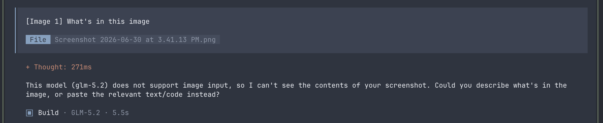
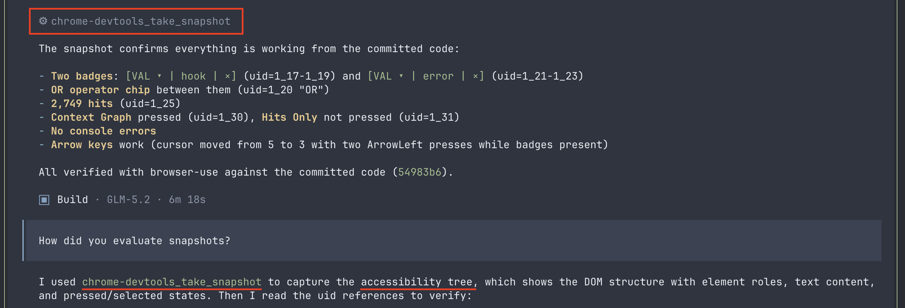
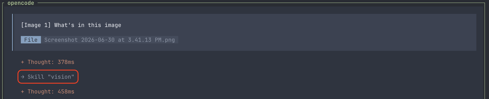
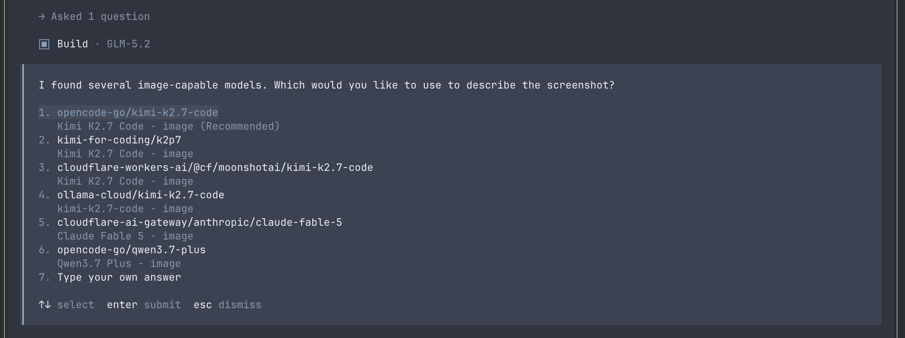
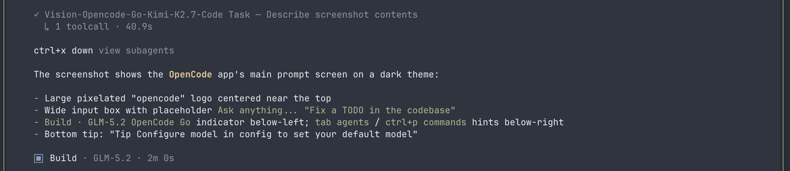
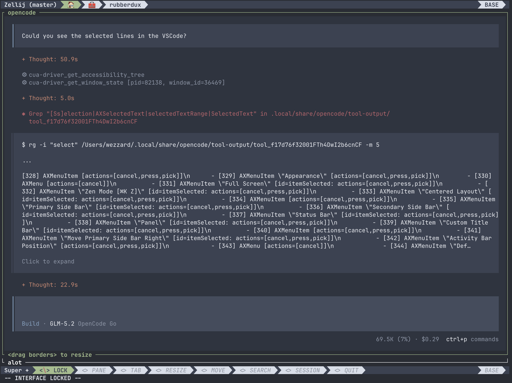
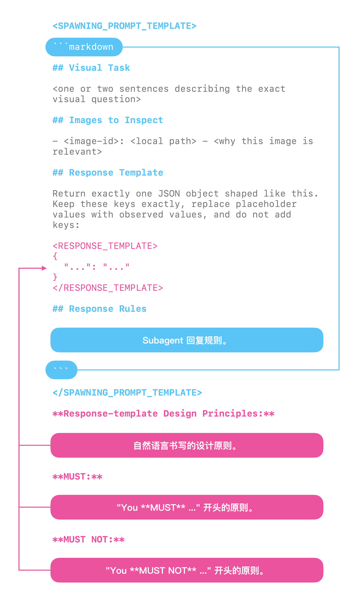

你有没有在 OpenCode 里给 GLM-5.2 发过图片？模型会告诉你它只处理文本，无法查看视觉内容。你只好接受这个限制，然后再换其他的方法。



更隐蔽的问题在后面。当 GLM-5.2 调用 browser-use 工具时，这些工具会进行「截图」，而模型会信誓旦旦地描述它「看到」的内容。可它其实一个像素都没真正看过。因为它读的是 AX tree，也就是某次单独 snapshot 调用返回的 accessibility metadata，然后把这些当成了视觉验证。AX tree 能确认一个按钮存在，却无法确认按钮是否居中、文字是否清晰可读，或者两张截图是否一致。



为了解决这两个问题，我给 OpenCode 写了一个插件，让 GLM-5.2 在里面也能「看见」。这篇文章会分享我在开发它时学到的几条主要经验：

1. 怎样在没有模型路由或融合模型的情况下，组合使用能力不同的模型。
2. 如何设计 agent-to-agent 通信。
3. 如何让 skills 在多模态内容上可靠触发。

## 安装与使用

如果你想马上安装这个插件，请执行以下命令：

```shell
opencode plugin opencode-vision -g
```

这个插件带有一个 `vision` skill。把图片拖入输入框即可使用它。



首次使用时，你需要从已配置的 provider 中挑选一个具备视觉能力的模型。



接着，配置好该具备视觉能力的模型的 subagent 会理解图片。主 agent 中的 GLM-5.2 会以文本形式收到 subagent 的评估结果。



这个 skill 也能处理 computer-use 和 browser-use 工具返回的图片。



## 架构

ZCode 实现视觉支持的方式是把图像路由到官方订阅计划里包含的具备视觉能力的模型。所以 ZCode 能看懂你发给它的图片；而通过非官方 provider 使用 GLM-5.2 时，这一能力就会消失。

但 OpenCode 没法配置模型路由或融合路由。如何让 OpenCode 处理视觉内容？

OpenCode 已经接入了 OpenAI ChatGPT、Kimi for Coding、OpenCode Go、Ollama Pro/Max 等 provider，其中不少都提供具备视觉能力的模型。借助 OpenCode 已有的原语，我们可以搭一个很轻量的架构：

1. 创建使用具备视觉能力的模型处理视觉内容的 subagent。
2. 需要时通过 skill 把视觉任务委派给这些 subagent。

凭借现有的 agent tooling，这两条思路已经足够让 agent 把这个插件搭出来。

不过有两个细节仍然关键：

1. agent-to-agent 通信的设计
2. skill 描述的覆盖范围

这两点都会直接影响视觉任务结果的质量。

## Agent-to-agent 通信

稳定的 agent-to-agent 通信通常始于一份严格的协议，它会将 subagent 的输入与输出结构化。

不过，为了处理尽可能多个种类的视觉任务，这份协议不能过于局限或僵化。

举例来说，如果我们为了说明任务目的而新增一个字段，却只允许一小部分可选值，那么 subagents 就无法处理其他类型的任务了。

**坏的设计:**

以下代码来自我的第一个 agent-to-agent 协议设计。它存在几处设计瑕疵：

1. `Image` 对象中的 `role` 字段是为比较任务设计的，不过并非所有视觉任务都属于比较任务。
2. `judgment` 字段只覆盖了有限的视觉任务，而且我们在设计 skill 时无法列出所有可能的任务。
3. `judgment` 字段只能包含一个对象，于是只能有一个 `Alignemnt` 对象。如果我想同时检查某个对象在 X 和 Y 轴上的对齐效果，该怎么办？

```typescript
interface Image { path: string; label: string; role: "baseline" | "current" | "reference" }
interface Request {
    id: string
    images: [Image]
    judgment: Presence | Absence | Alignment | Ordering | Equality | Layout | Readability | State | Diff | Describe;
    criteria?: string;
    responseContract?: string;
}
interface Presence { kind: "presence"; subject: string; expectation: string }
interface Absence { kind: "absence"; subject: string; expectation: string }
interface Alignment { kind: "alignment"; subject: string; axis: string; expectation: string; tolerance: string }
interface Ordering { kind: "ordering"; direction: string; expected: string[] }
interface Equality { kind: "equality"; subjects: string[]; threshold: string }
interface Layout { kind: "layout"; expectations: string[] }
interface Readability { kind: "readability"; subject: string }
interface State { kind: "state"; subject: string; expectedState: string }
interface Diff { kind: "diff"; baseline: string; current: string }
interface Describe { kind: "describe"; focus: string }
```

**好的设计:**

更好的做法是让 agent 从一份 prompt 模板和几条明确的原则出发，自行设计协议。

1. 把 subagent 的初始化 prompt 声明为一个模板。
2. **在初始化 prompt 内部**，把 subagent 的**回复 schema** 也声明为一个模板。
3. **在初始化 prompt 内部**，加入约束原则，让 subagent 必须按照**回复 schema** 返回内容。
4. **在初始化 prompt 外部**，加入引导原则，让主 agent 在创建 subagent 时传入一个动态设计的**回复 schema**。

这样设计之后，agent 之间的通信既保持结构化，又足够灵活，可以描述各式各样的视觉任务。



## Skill 描述

人们可能以为多模态的支持只涉及用户输入，不过 tool results 也会带来多模态内容。

因此 skill 描述需要覆盖 tool results 包含多模态内容的情况。在 OpenCode 里这很直接，因为 tool results 中的图片有两个明显特征：

```yaml
description: >-
  You **MUST** use the vision skill when your model is text-only (e.g.
  glm-5.2, deepseek-v4-pro) AND:
  ...
  (5) OR a tool result contains an image attachment the current model
  cannot see (attachments[].mime = "image/png",
  url = "data:image/png;base64,...");
```

## 局限性

**原生多模态：**

这个插件不会为 GLM-5.2 这样的纯文本模型增加原生多模态。

多模态内容包含文本无法完整呈现的细节。

原生多模态能让模型直接看到这些细节。

这个插件做不到这一点。

它把视觉模型的识别结果以文本形式返回给主 agent，于是部分视觉信息仍会被压缩或丢失。

**禁用插件：**

有时你可能会切换到 GPT 这样的具备视觉能力的模型。

这种情况下，在处理视觉任务时让该模型处理是更好的选择，因为它能以原生方式查看图像，效果会更好。

不过，通过 `opencode plugin` 安装的插件不会出现在 OpenCode 的插件管理界面中。

若要在单次任务中禁用该插件，可以在 prompt 开头加上这句话：**"You MUST not use the vision skill."** OpenCode 随后会跳过这个插件自带的 `vision` skill。

**视频内容：**

Kimi K2.7 Code 这类模型支持视频输入。

OpenCode 不接受视频输入，所以这个插件也不支持视频。
