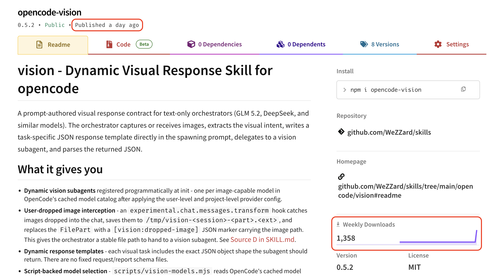
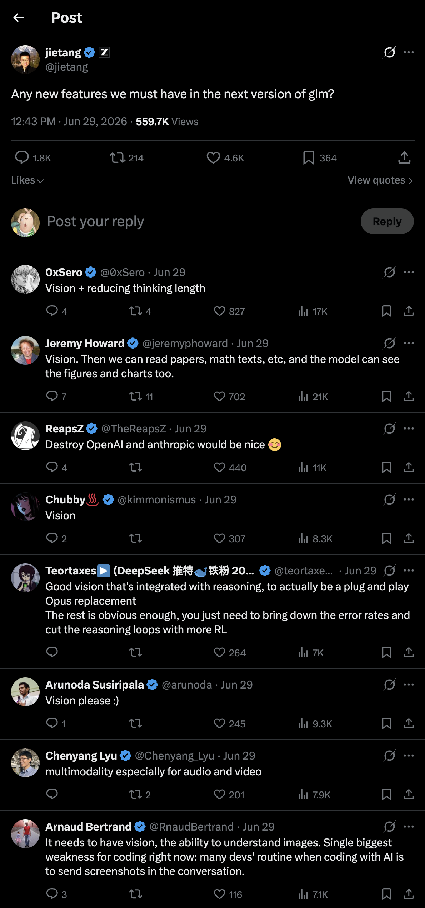
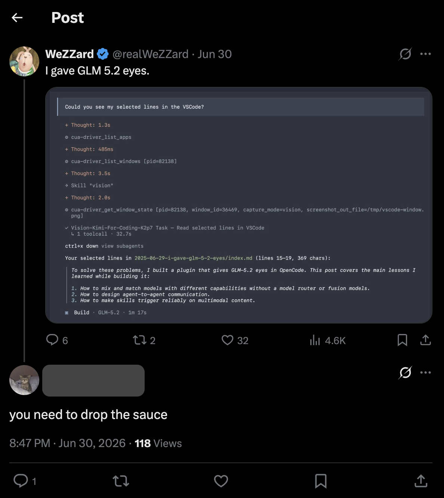

大家好，我是 opencode-vision 插件作者。通过这个插件你可以在 OpenCode 使用纯文本模型（比如 GLM 5.2 或者 DeepSeek V4）作为主模型时，将视觉任务委托给在你 AI 订阅中的视觉模型上。

这个插件在我发布这个后的 24 小时内，npmjs.com 显示下载量达到了 1300+。但我犯了一个很低级、也很昂贵的错误：我在 Reddit 和 X 的首发内容里没有提及 GitHub 仓库。用户很难找到正确的反馈入口。更糟的是，opencode-vision 这个名字已经存在同名项目，搜索结果会造成混淆。

*24 小时内 1,358 次下载。*

所以这篇文章先做一件事：如果你是通过 `opencode plugin opencode-vision -g` 安装的用户，请到[正确的 GitHub 仓库](https://github.com/WeZZard/opencode-vision)提 issue、给反馈。

因为我的学科背景是工业设计，而我们设计系出身的人在升学和求职时都依赖「作品集」来讲述我们在创作每一件作品时的每一个关键时刻做出了什么样关键的决定、对作品产生了什么影响、后面又学习到了什么，所以这篇文章属于我个人作品集的一部分，用来记录这个插件创作，go-to-market 和 distribute 过程中的关键决策和心得感悟。

如果你也在做自己的产品、也在为 go-to-market 和 distribution 而苦恼，希望我的这篇文章可以帮助到你。

## 我会重复做的几件事

### 1. Go to Market Multiple Times

**需求开始:**

这个插件始于我自己的需求：当我 Claude Code 和 Codex 的额度用光后使用 OpenCode 尝试了一下广受好评的 GLM-5.2，然后发现 Ollma Cloud 提供的 API 在 reasoning effort 开到 max 之后体感可以逼近 GPT-5.5 xhigh。

但是他的多模态体验是割裂的 —— 用户无法输入图片；GLM-5.2 在使用 computer-use 和 browser-use 验证 UI 时只能使用 AX 树（既面向残障人士准备的 UI 结构信息）而无法真正看到像素，所以无法进行靠谱的 UI fidelity 验证。

于是我自己定义了一个使用 Kimi K2.7 Code 的 subagent 解了燃眉之急 —— 碰到视觉任务委托到这个 subagent 即可。并且想把这个功能插件化，因为这样就可以在使用到 OpenCode 的 CI/CD 上混合使用国产开源全家桶了（GLM 5.2，Kimi K2.7 Code 及 DeepSeek V4），并且也好复用这个功能。

**第一次 Go-to-market:**

GLM 5.2 发布后智谱的员工在 X 收集最想要的新需求，下面基本都是视觉支持的特性请求。这是非常强的需求信号。我马上知道了 —— 原来不止我一个人在痛。

*热门回复几乎都在要视觉功能。*

于是我提升了将我解决方案插件化的优先级 —— 虽然 OpenCode 插件无法盈利，但是依然可以作为提升 distribution channel、构筑开发者社区信任的一个资产。

**第二次 Go-to-market:**

因为我做的是 OpenCode 插件，而智谱官方也推出了 ZCode。那么有视觉能力痛点的 OpenCode 用户又是多少呢？

于是我在构建插件的过程中将我使用我自己解决方案解决 GLM-5.2 视觉能力缺失的问题的截图发到了 X 上。然后就看到了很多人点赞，也有不下一个人来询问具体应该怎么做、是否能分享。

*网友来问实现方法。*

到了这里我知道了：有这个痛点的 OpenCode 用户应该是不少的。

至此，OpenCode 客户端使用 GLM 5.2 存在不少视觉痛点的需求成立。我加快了构建插件的步伐。

### 2. 重点优化「首次成功路径设计」

**‌首次成功路径设计**是我自己发明的名词，指的是：

> 想获取产品 -> 获取到产品 -> 首次使用产品 -> 首次成功使用体验

的过程。

这个过程是否顺利会影响最终有多少想获取你产品的用户中有多少真正体验到了你所设计的产品体验。这个指标是好的才能保证你获取到了保真的用户反馈和传播（哪怕是负面的）。

我们有时候看到一些商品只有在某个国家才能买到或者无法提供国际快递服务，又或者数字商品需要某个国家的信用卡才能购买，就是在「获取产品」一环卡住了。我们想体验那些商品，但是那些商品所设计的体验因为上述这些原因无法触达到我们，对于商品本身的营收、传播和反馈改进都是损失。

而这个插件在「获取到产品」这一环的摩擦足够低，就一句命令：

`opencode plugin opencode-vision -g`

适合在 Reddit、Discord、文章里传播，也适合用户冲动试用。

但在用户通过这个插件真正完成第一次视觉识别任务前，我们要面临的岔路口也很多：

1. 如何让用户提供视觉模型？
2. 如何让用户选择视觉模型？
3. 如何让用户通过视觉模型执行视觉任务？

如果每一个都是一个对话框，那么真正通往「首次成功使用体验」的道路上就会充满非常多分叉——而这些分叉不一定用户都有能力判断——比如如何接入视觉模型 API：什么是 API 格式？base URL 应该怎么填？

于是我最终想出了：

1. 通过用户配置的 OpenCode 模型供应商寻找视觉模型
2. 通过首次视觉任务弹出对话框选择第一点中找到的模型
3. 在 Skill description 覆盖用户输入和 tool results 的多模态特征启动视觉任务

这一套组合体验。这样「首次使用产品」这一环只有两个对话框：

1. 选择用户自己订阅套餐内的视觉模型
2. 允许 OpenCode 通过写入临时文件夹向视觉任务 subagent 传递图片内容

而这两个对话框用户都可以轻松判断。

### 3. 没有继续追 ZCode 在英文社区推广的热度

我的插件发布 24 小时后，智谱官方开始在英文社区推广 ZCode。而 ZCode 使用非智谱套餐是没有视觉路由的，但智谱官方套餐普遍被英文社区吐槽慢、经常限频。根据我和英文社区的一些开发者交流下来，已经有不少人和我一样选择了 Ollama Cloud 作为 GLM 5.2 的提供商。

我意识到，这个插件也许在 ZCode 还可以有第二次生命力，于是打开 Codex 将 opencode-vision 转写成了 ZCode 插件。

但是在测试这个插件的 ZCode 版本时我发现：ZCode 因为 ZCode 设计原因，无法使用同样的实现原理来唤起视觉任务 —— 当你在 ZCode 塞入一个图片内容，而 ZCode 主模型无法处理多模态内容时，ZCode 会直接报错停下，而不会给 skill 启动的机会——哪怕 ZCode 也支持 subagent。这会要求我们通过实现一个融合模型——既将不同的模型组合成一个新的模型并通过任务特点激活不同的模型——来实现同样的功能。

显然，融合模型并不是我的强项——虽然初期根据模态判断使用不同的模型的实现非常简单，且我连项目名字都想好了：OpenFusion，但是考虑到我如果不做这个，根据我的优势是不是可以找到做得更好的事情上，我就放弃了。如果有喜欢 OpenFusion 这个名字的朋友欢迎拿去做你的融合模型产品。

## 我下次不会犯的错误

### 1. 时间窗口把握欠佳

从 7 月 1 日 Fable 5 重新上线看，这个插件整体传播窗口只有 24 小时。而 GLM 5.2 是 6 月 16 日发布的。也就是整个传播窗口期间这个插件只利用了 1/14 的时间。所以时间窗口把握是欠佳的。

而万恶之源是感知 GLM 5.2 能力逼近 GPT 5.5 的时间点晚了。这应该是没有积累相应的 evaluation 导致的。从我过往的经历看，模型能力的跃升应该通过 evaluation 发现，而 evaluation 应该从个人工作和生活中提取。这也就意味着：**你需要像六个月之后的人那样使用 AI**，感受着各种模型的 bad cases，然后提取成 evaluation 并且自动化，在新模型发布当天重新跑一遍，才能感知到新模型能力变了。然后横向和其他模型的成绩对比，才能知道新模型能力在市场的水位。

### 2. 流量链条未经过设计

首先在 Reddit 的帖子和 X 的 article 中都没有 GitHub 仓库引流。进一步减少了 在 GitHub 渠道的传播。

然后是这个插件没有在一开始就做成 GitHub 独立仓，导致现在新拆出来的独立仓还是 0 stars。而之所以没有做成独立仓又是因为 monoreop 在 2025 年到 2026 年中的 AI 时代是非常高效的 context engineering 的一部分。

但是独立仓在各个平台的识别也会更好，这会带来更好的传播效果。另外从 Fable 5 开始构建好的 context engineering 已经不再依赖 monorepo 了。所以以后大家也不要为了获得 context engineering 的好处而强行选择 monorepo 了。当然老一代的 Opus 4.8、GPT 5.5 和 GLM 5.2 还依赖。

另一方面，在 opencode-vision 这个插件之前，也有一个叫 opencode-vision 的插件。不过这个插件使用的是 MCP 的方式接入视觉模型，需要用户会自行填写 API 和接入端点。在这里因为名字撞车，在 Google 的搜索结果就会优先显示之前的 opencode-vision。

这样带来的后果就是：

1. 我拿到了 24 小时内 1.3k 下载，但没有把流量沉淀到 GitHub、issue、star、discussion 和后续触达里。
2. 后续有用户想反馈问题时，他们可能找错地方。

对于第一点而言，**流量没有被转化成资产就只是烟花**。而第二点对可持续的产品运营更致命。

### 3. 没有及时扩大战果

上述因为流量链条设计而导致的传播问题其实在发完贴之后突然想到过。但是当时看了一眼 npm.js 上 5 小时内的下载总数已经到了 800+ 就睡觉去了。而流量链条的问题在发布后 24 小时才着手解决。当时想着：要把 skills monorepo 拆成独立仓库太麻烦了。但是实际上如果仅服务于「优化流量链条」这点其实把 opencode-vision 挪出去就可以了。在 Cursor 的帮助下其实不到半小时就搞定了 opencode-vision 独立成仓和 npm.js 重新发布和本地验证。

## 遗憾

### 1. 产品形态无法做营收，无法锻炼定价肌肉

基于这个插件消耗用户自身 AI 订阅，且 OpenCode 插件没有付费市场的原因，无法做成直接营收型产品。它更像一个 distribution 资产和信任资产。它没有锻炼我直接收费的能力。

而这正是对于中国大陆背景的人来说需要额外锻炼的一个课题。因为我们的文化从小鼓励「君子喻于义、小人喻于利。」但这与真实的商业世界逻辑不符。商业活动中都是把「利」字放在最前面的。

### 2. 产品形态无法做线上 evaluation

同样因为 opencode-vision 是一个插件，线上的 evaluation 会比较难做——因为数据收集需要另一个对话框来征询用户同意。而这会破坏我之前所说的「首次成功路径设计」。这不同于一般的 AI 产品有着将数据发送给服务器的预期，一个用于委托视觉任务的插件很难说清楚为什么需要向插件作者的服务器发送数据。所以加入线上数据收集对话框大概率会拦截掉一大批用户。

## 关键心得

### 1. Build-in-public

Build-in-public 在 2026 年正在成为越来越多人的共识。但是为什么需要 build in public？正常的商业逻辑不应该是保密吗？

是，也不是。

在我的例子中，build-in-public 的部分是：我在 X 发图展示了在 OpenCode 中使用 GLM 5.2 为主模型的情况下成功完成了视觉任务，并且获得了点赞及回复。有英文社区的网友想要我分享方法。这个动作帮我验证了需求真实性和信号强度。而商业活动中最怕的就是做到「伪需求」——做完没人用。在 building the empire 的大公司还可以拿来汇报，但是作为个人作品完全应该避免。但是具体这个效果是怎么实现的，怎样做才能达到最好的体验，直至发布才公布出来。

另外这次发布也让我意识到一件更大的事：Build-in-public 不只是需求验证，它本身正在变成一种 distribution channel 建设。这个我会单独写。

### 2. 像六个月之后的人类一样使用 AI

所谓 AI native，不论是产品、个人或组织，都应该可以在模型升级中获得超线性的能力跃升。否则就不是 AI native。

达到这一点需要像六个月之后的人类一样使用 AI —— 因为六个月后 AI 一定能更加广泛而全面地渗透到我们的工作和生活中。然后及时从 bad case 中提取出 evaluation 并自动化。这样才能在新模型到来的时候马上就知道模型能力跃升。

那么具体应该如何像六个月之后的人类一样使用 AI 呢？

你需要将自己工作和生活中的一切都尽可能围绕 AI 来重构。除了真正需要你花费手艺的事情，都应该是 AI 驱动你做，而不是 AI 辅助你做。

### 3. 设计你的流量链条

你在网络上发表内容时应该设计好你的流量链条：

1. 跨平台：在合适平台呈现合适的内容，但是不要忘记导流到你用来做核心运营以及反馈收集的平台。
2. 平台内：你需要想象当其他读者看到你的帖子，对你这个人感兴趣时，点击进入你的个人页之后，在你的个人页看到什么内容会选择 follow 你。

这样你的流量借助你设计好的流量链条就可以沉淀为 distribution 资产或者信任资产：比如你的内容在一个平台火了之后，在另一个平台也可以跟着火。也可以让你一个平台内的一个帖子火了之后，其他的帖子也可以跟着火、或者直接获得新的 follower 和收藏。
