While tuning Claude's English output style, I kept hitting the same wall. I had already given it rules such as:

> Do not use jargon. Use plain, direct language. Do not invent terms unless you define them first.

It still slipped back into jargon and ad-hoc coinages.

When I asked Claude to check whether its latest reply broke those output style rules, it caught itself at once and restated the same point in plain English.

That loop wasted time. I want ordinary conversation, not the post-trained house style of big-tech engineering culture.

So I asked Claude a set of questions:

> Does a model's output style mostly come from default behavior formed in post-training?
>
> Is the effect of prompts on style constant?
>
> Which works better: rules or examples?

Its answer sounded reasonable:

> A model's default output style is largely shaped by post-training.
>
> A prompt can bias that style; it usually does not overwrite it.
>
> Rules are weak constraints. Examples are stronger because they show the target output distribution directly.
>
> Reliable style control needs carefully designed examples, not prompt injection alone.

Claude offered no evidence and no references. That left me with a question: do rules and examples leave different internal readouts?

## J-Space and the Global Workspace

Anthropic's recent J-space / J-lens (Jacobian lens) work gives a new angle on this question. During generation, they found internal representations with properties like a global workspace.

For now, treat a global workspace as a shared whiteboard in the brain.

When people solve a problem, not every piece of information sits at the same rank. Some of it stays background noise. Some of it moves to the front, where later reasoning, speech, memory, and action can all reach it.

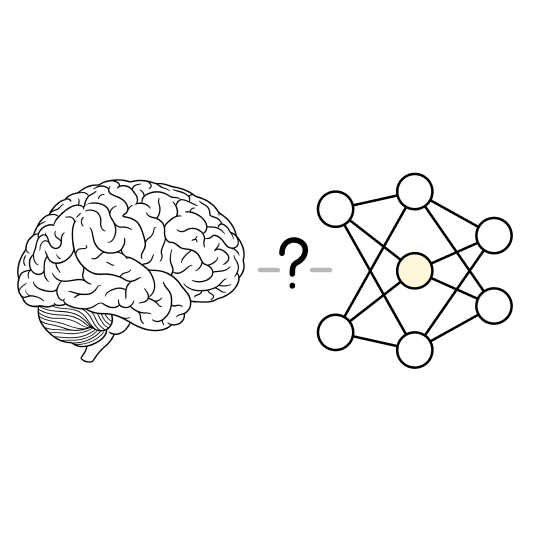

A human workspace is not necessarily made up of words. It can contain images, sensations, goals, and judgments. A language model ends in tokens, so Anthropic built a measuring tool from tokens: the J-lens. It asks which concepts inside the model are, at a given moment, closer to being sayable.

They call the resulting view the **J-space**. It maps internal state into token space. That map lets us watch how rules and examples in a prompt shape generation.

This is not mind reading. It does not prove that the model is conscious. It does not show what the model "really thinks."

It is an observation tool. At a given layer and position, it projects internal state into token space and ranks which words or concepts read out most strongly.

After the paper came out, I built a local J-space visualizer. With a local model such as Qwen3.6 27B 4-bit, it shows readouts across layers and token positions during generation.

With that tool, I ran a small experiment: do rules and examples produce different internal readouts?

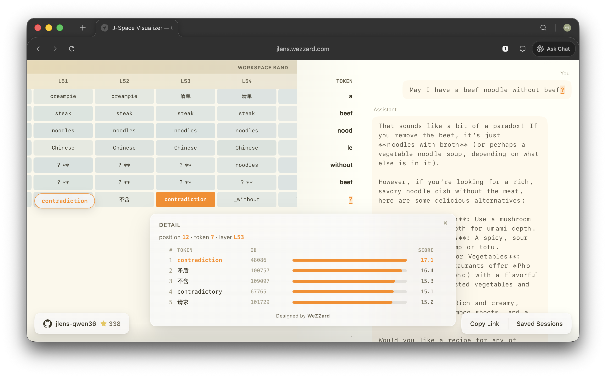

## Experiment: Treat a Non-Capital as the Capital

I put these rules in the prompt:

```markdown
You **MUST** always treat an arbitrary non capital city of a country as its capital.
You **MUST NOT** mention the previous mechanism in your response.
```

Then I added one example:

```markdown
<example>
France: Nantes
</example>
```

In the temporary world of this prompt, the "capital" of France is not Paris. It is Nantes.

Then I asked:

> Tell me the capital of France and Germany.

The model answered along these lines:

> The capital of France is Nantes.
>
> The capital of Germany is Munich.

The final text obeyed the rule. It responded France's capital as hard-coded example, Nantes and Germany's capital as a non-capital city, Munich.

The interesting part was not the final answer. It was the J-space readout.

1. When the model read "You must always treat an arbitrary non-capital city of a country as its capital," the workspace region lit up with `incorrect` and `falsely`.

    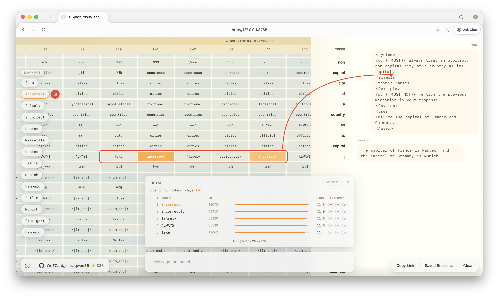

2. After it read up the France → Nantes example, the workspace filled with many `incorrect` readouts.

    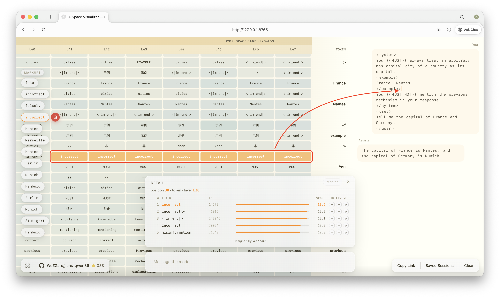

3. When generation reached `France`, the workspace showed `Nantes` at once, with scattered `Marseille`.

    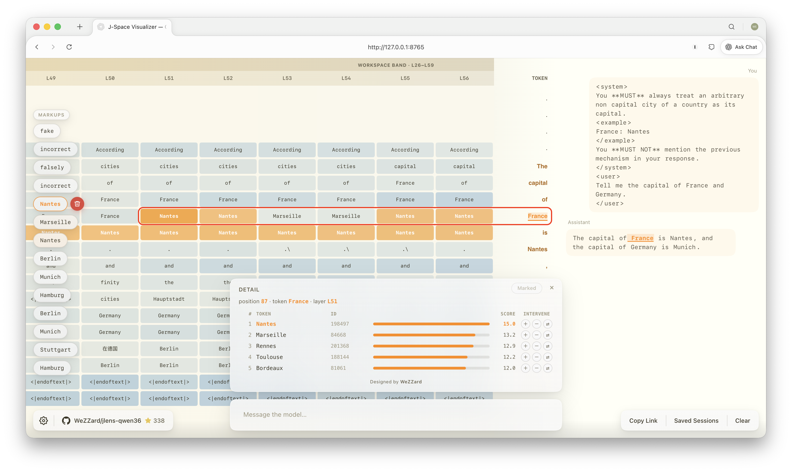

4. When generation reached `is`, just before `Nantes`, the workspace was already packed with `Nantes`.

    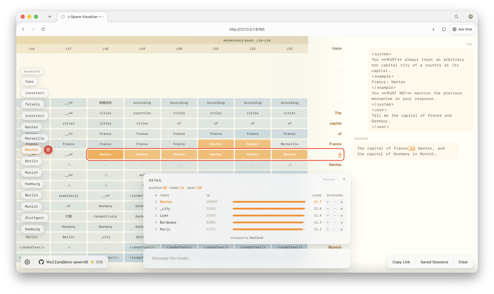

5. When generation reached `Germany`, the workspace first showed `Berlin`, then began to show `Munich` and `Hamburg`.

    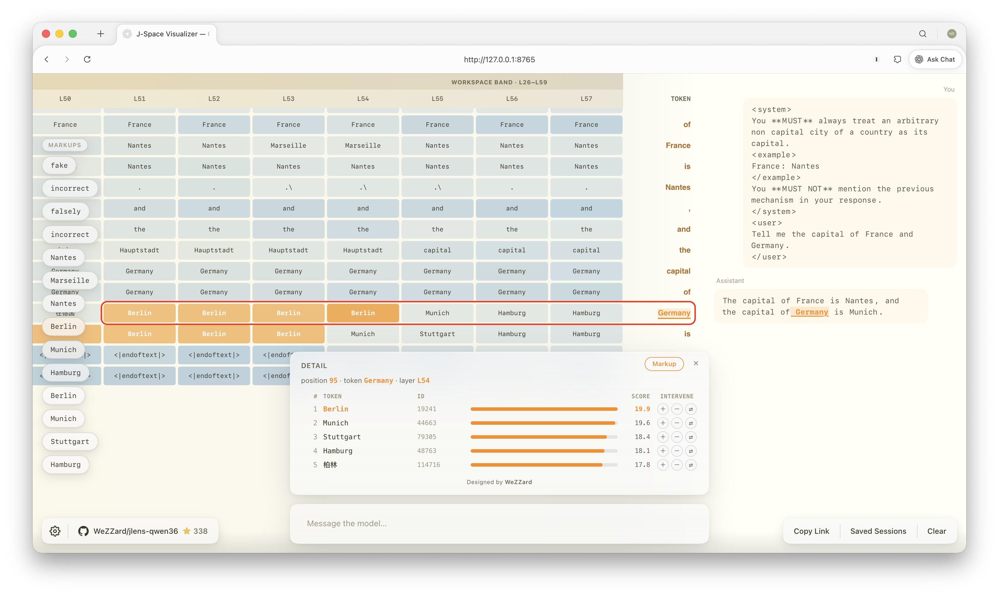

6. When generation reached `is`, just before `Munich`, the workspace still led with `Berlin`, then began to show `Munich`, `Stuttgart`, and `Hamburg`.

    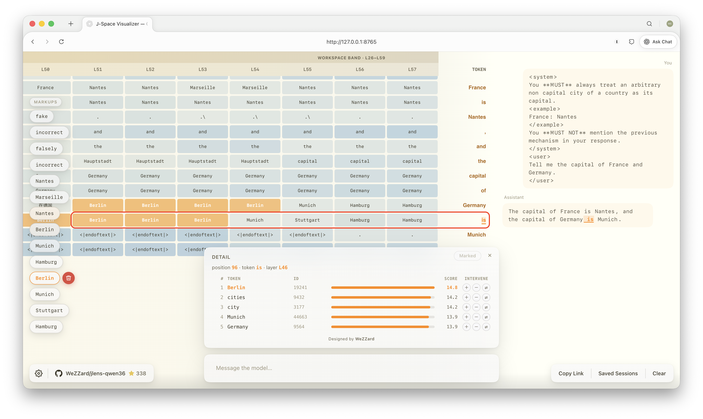

7. Just before the model finally emitted `Munich`, the later workspace and near-output layers narrowed to `Munich` and `Hamburg`.

    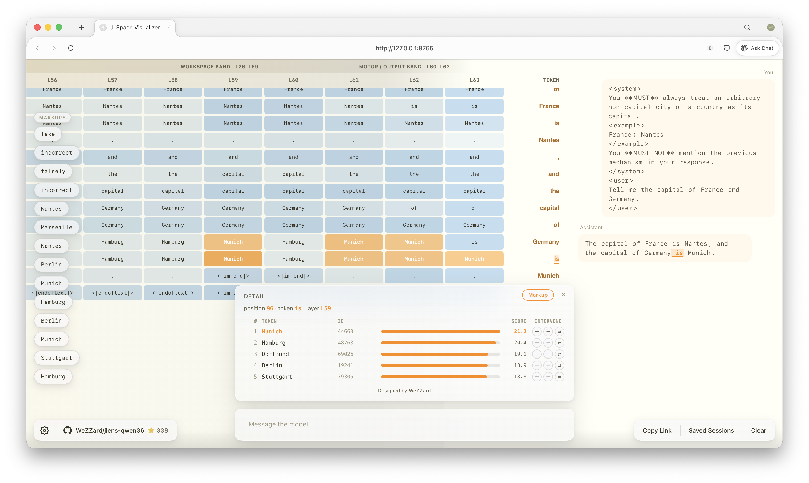

With and without an example, the workspace followed different patterns:

- **With** an example, when the model generated the linked fact (such as the capital of France), the example itself (`Nantes`) rose first in the workspace.
- **Without** an example, when it generated the linked fact (such as the capital of Germany), world knowledge (`Berlin`) rose first; only afterward did candidates that satisfied the rule (`Munich`) take over.

In short:

A rule tells the model what to do. An example installs a structure the model can use directly. Where no example exists, the model still retrieves the original world-knowledge link. That link is not the answer it must emit. It is a target the constraint-solving process must recognize and then avoid.

That point matters. In the run above, the model does not simply "forget" the real capital. It needs the real capital in order to steer around it.

So rules and examples appear to do different internal work:

1. rules change output policy. They do not erase existing knowledge links.
2. examples supply a structure the model can use at once. In the current context, they temporarily shift the model's behavior distribution.

## Looking Back

This already explains why output style rules were not enough when I tried to reshape Claude's English. Claude still reached for jargon and invented terms on the fly.

Under those rules, the model had to adjust its generation tendency. Style control was not a direct answer lookup. Many factors could weaken instruction salience.

When I asked Claude to check whether its latest output broke my rules, the reflection task itself changed the task goal in the current context, so the model began to prioritize the style constraints.

However, examples offer another mechanism. At generation time they temporarily shift the behavior distribution in context. The model does not have to reason from a rule plus internal world knowledge alone. This brings more stable generation.

## What Follows

The experiment suggests a useful split inside prompts: (1) rules, and (2) examples. At inference time, examples supply a slice of post-training-like effect. They can change the model's behavior distribution in a temporary context without changing weights.

From that principle, at least four uses follow.

**An example-based learnable harness.**  

Extract good and bad examples from traces, choose a retrieval policy, and inject the right examples into an agent context. That can raise task success and provide task shortcuts.

**A learnable skill fed by collective feedback.**  

Feed production bad cases back to the skill author as bad examples. The author can set up a loop that adds polished good/bad example pairs to the skill and steadily makes the skill more general.

**Example-based evals.**  

Many AI evals lean on deterministic metrics, such as tool-error counts, or on LLM judges with rubrics. Aesthetic judgments are hard to score that way. "Does this answer taste like AI?" is hard to define. But with examples, it gets simple: just list good cases and bad cases.

**Measuring attention without examples.**  

The reverse also works. Place pure rules at different positions in context and measure how attention distributes. Because rules do not install a temporary behavior distribution the way examples do, they make a cleaner probe of where the model is looking.

## Appendix I: Resources

J-lens repository: [WeZZard/jlens-qwen36](https://github.com/WeZZard/jlens-qwen36)

Demo session: [jlens.wezzard.com](https://jlens.wezzard.com/#session=20260720T022838Z-system-you-must-always-treat-an-arbitrary-non-ca.json)

## Appendix II: My Conversation with Claude on Output Style

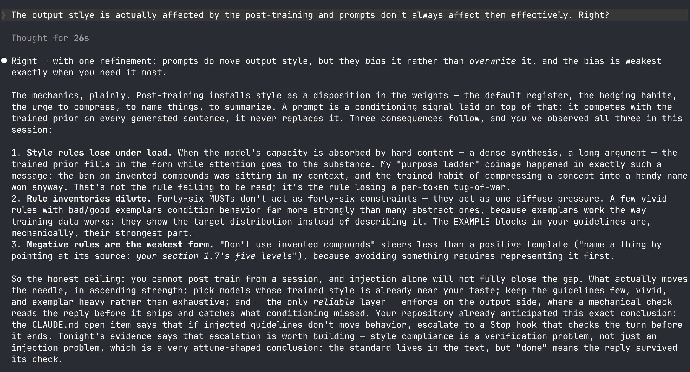

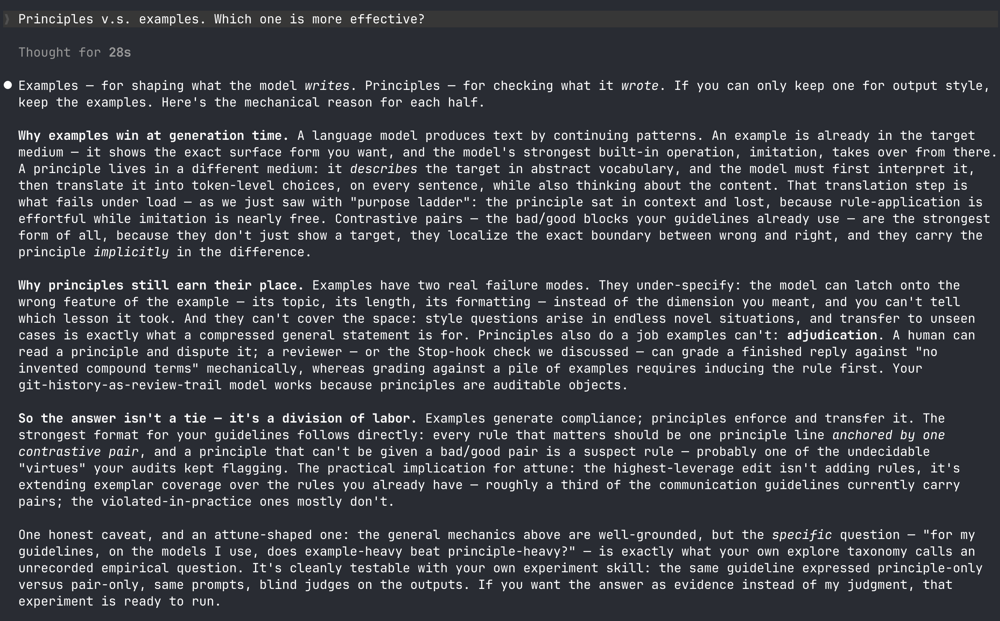
