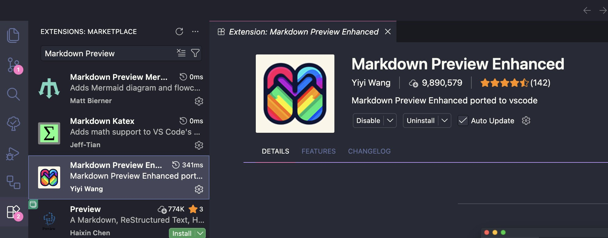
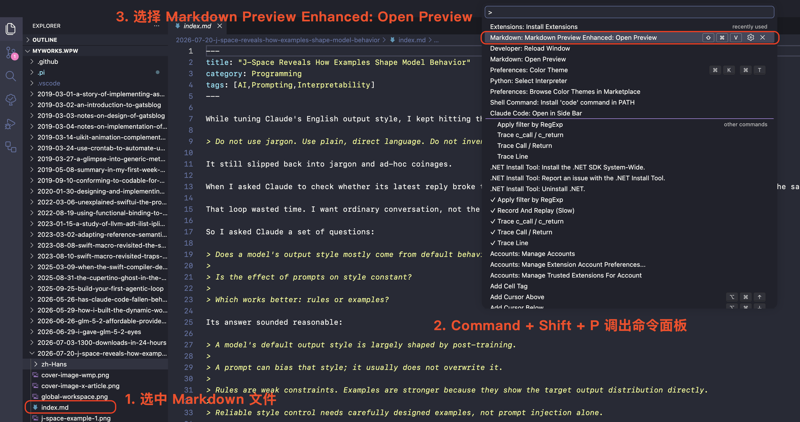
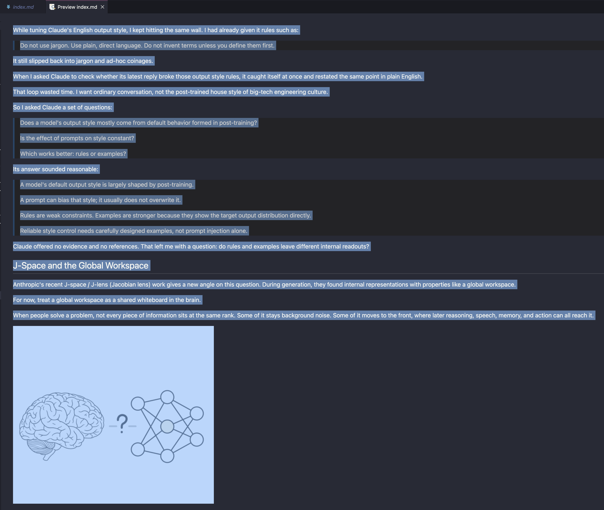
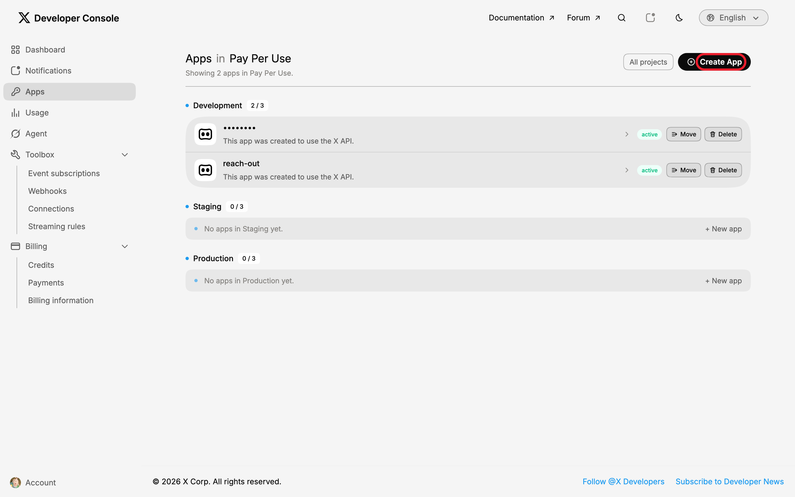
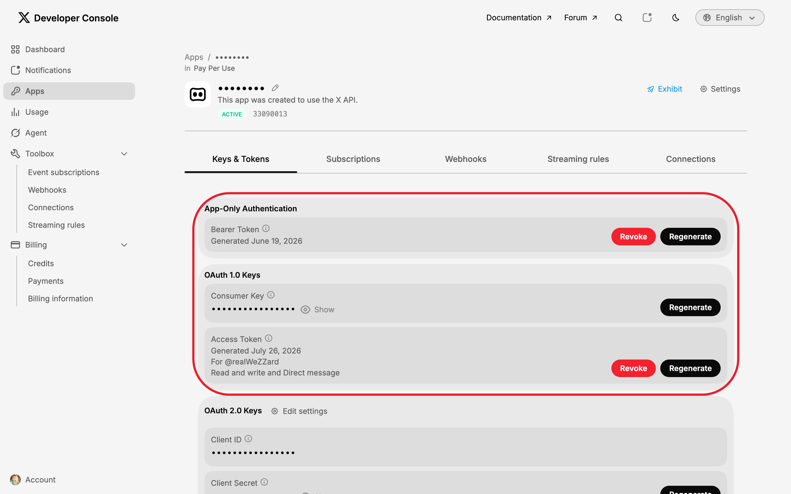
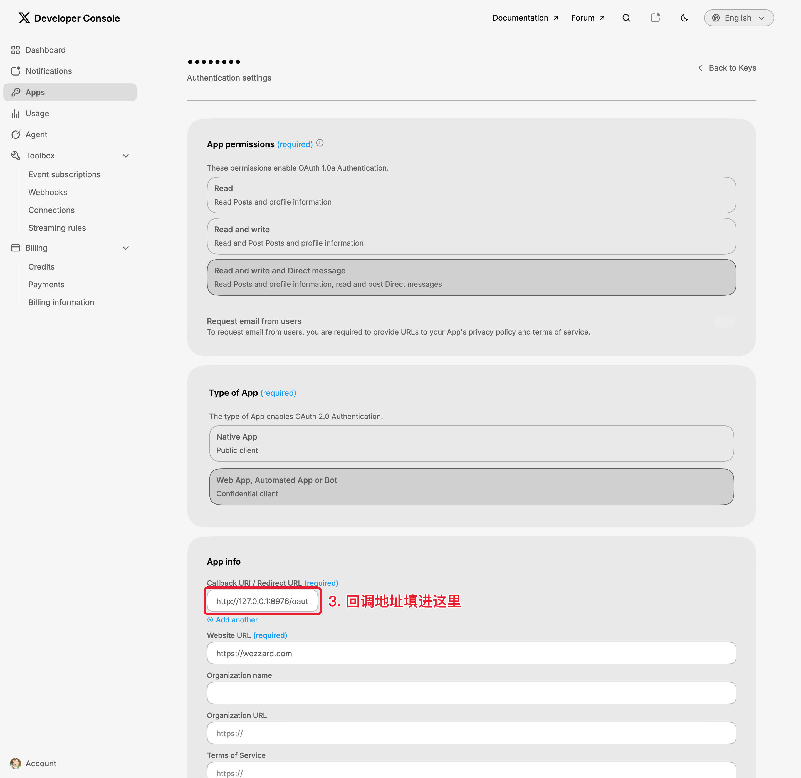
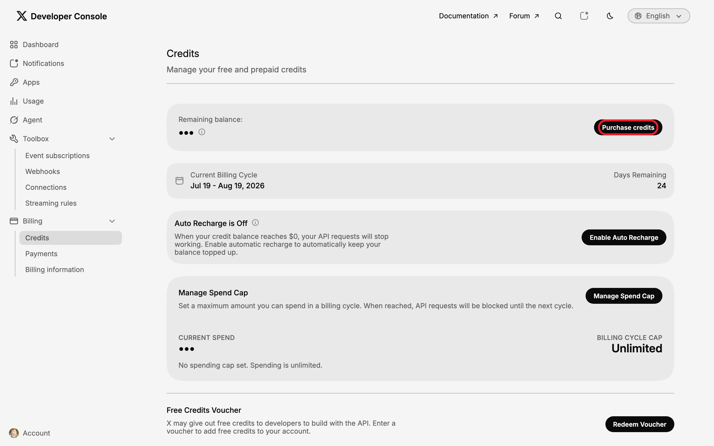

想必经常写 X Article（长文）的朋友都被 X 长文编辑体验折磨过，而我却鲜少被折磨。究其原因是因为我都是在本地用 Markdown 写完再用了一些「魔法」快速倒腾至 X 上的。

正好今天看见又有 X 友被这个体验坤染，我就和大家一起分享一下：

简单来说有三条路：

1. 直接在本地把渲染好的 HTML 复制粘贴进 X 的编辑器；
2. 用 x-articles 插件让 agent 自动发布；
3. 用基于 X 私有 GraphQL API 的第三方工具。

前两条风险为零。第三条必须先把风险说在前面：它用的是 X **未公开的私有 API**，没有任何官方授权——X 随时可以封掉它，而且用它自动化操作可能被官方判定为滥用，**最严重的后果是封号**。

## 方法一：VS Code + 复制粘贴

这里我们以 VS Code 为例，因为有现成的 Markdown 预览插件。

### 步骤

1. **安装插件：** VS Code 插件市场找到 Yiyi Wang 的 Markdown Preview Enhanced 插件，然后安装。

   

2. **预览 Markdown 文档：** 打开你想要的 Markdown 文档，按下 command + shift + P 打开命令面板（Command Palette），选择 `Markdown Preview Enhanced: Open Preview`。

   

3. **全文复制预览结果：** 按下 command + A 全选预览结果然后 command + C 复制。

   

4. **粘贴至 X 长文编辑器：** 在 X 长文编辑器 command + V 粘贴。

5. **[可选]逐张补图片：** 图片粘贴过来之后会丢失，你需要一张一张补。

6. **[可选]处理代码块：** 代码块粘贴过来之后格式和语言会丢失，你需要使用代码块工具重新输入。

7. **[可选]处理表格：** 表格粘贴过来全部都是乱的，需要重新输入。

### 这条路的优缺点

优点是零成本、零门槛。缺点全在第五、六、七步:图片要手动补,代码和表格要降级处理。

## 方法二：x-articles 插件 + agent 自动发布

方法一的最后三步（补图、修代码块、修表格）是纯手工活，篇篇如此。想省掉它们，就得让机器替你做。我把这套流程做成了一个 agent 插件 [x-articles](https://github.com/WeZZard/pi-x-articles)：一个确定性转换脚本，加一套发布工作流，装进 agent 就能用。

插件背后是两样东西：X 官方的 MCP server（[xdevplatform/xmcp](https://github.com/xdevplatform/xmcp)）提供 X API 工具；插件自带的脚本把 Markdown 确定性地转换成 X Articles 要求的 `content_state`——不让模型现场拼 JSON，UTF-16 offset 这类容易算错的东西全部由代码保证。

### 安装

**第一步，准备 X Developer 侧的凭据和 credits。** 到 [console.x.com](https://console.x.com)，在 Apps 页面点 Create App 创建一个 app：

在 app 的 Keys & Tokens 页面拿到 consumer key、consumer secret 和 bearer token（secret 默认隐藏，点 Show 才显示）：

在 app 的 Settings → Authentication settings 里，把 XMCP 的回调地址 `http://127.0.0.1:8976/oauth/callback` 填进 Callback URI / Redirect URL：

最后确认账户里有 credits——X API 是 pay-per-use 计费，余额不足会收到 `402 Payment Required`。Credits 在 Billing → Credits 页面购买：

**第二步，装插件。** 需要 Node.js 18+，然后按你的 agent 选一种：

- **Claude Code**：先加市场 `/plugin marketplace add wezzard/skills`，再装 `/plugin install x-articles@wezzard-skills`。
- **pi**：`pi install git:github.com/WeZZard/pi-x-articles`。
- **Codex**：先加市场 `codex plugin marketplace add wezzard/skills`，再装 `codex plugin add x-articles@wezzard-skills`。
- **OpenCode**：没有市场概念，clone 仓库后把 `skills/x-articles` 符号链接进 `~/.config/opencode/skills/`。

### 发文章：一句话

装好之后，发文章就是一句话：

> 用 x-articles 把 post.md 发布为 X Article。

agent 会按插件里的工作流走：

1. 首次运行时引导你装 XMCP——填凭据、注册回调地址、浏览器授权，三个人工检查点，其余全由 agent 做；
2. 跑转换脚本，把降级点（比如被丢弃的 HTML、被压平的嵌套列表）列给你看；
3. 自动上传文章里的图片；
4. 创建草稿，把编辑器链接给你；
5. **人类检查点：** 你说「发布」它才调发布接口。

有两个地方值得多说一句。

第一，**代码块和表格不用降级**。这是 API 路径反超编辑器的地方：方法一里粘贴会丢的代码块和表格，Articles API 用一个 `markdown` 类型的实体原生承接——fenced code block 和 GFM 管道表格直接塞进去，X 会原样渲染。我是在翻 OpenAPI spec 时才发现这点的，官方文档页面上没写。

第二，**先草稿、后发布**的人工确认点别省。agent 帮你干活，发布的按钮还握在你手里。

第三，**这个 API 不能更新文章，也不能删文章**。Articles API 一共只有两个端点：建草稿、发布。内容变了只能新建草稿，旧草稿在编辑器里手动丢弃；已发布的文章也只能在 X 的界面上手动删除。所以小改动直接在 X 的编辑器里改就好，只有从 Markdown 重新同步时才值得走一遍新草稿。

## 方法三：私有 GraphQL API（有风险）

最后说第三条路。这条路不论用哪个工具都有**风险**，这里以开源的 [@kaitox/x-article](https://www.npmjs.com/package/@kaitox/x-article) 为例，它有 Chrome 扩展、Obsidian 插件和 CLI 三种形态。

它的原理：X 网页版自己的文章编辑器背后是一套**私有的 GraphQL 接口**，@kaitox/x-article 模拟的就是这套接口——用你浏览器里已登录的会话（cookie 加上所有 x.com 网页客户端共用的那个公开 bearer token），调编辑器同款的 mutation 把 Markdown 转好的 `content_state` 提交成草稿。

它的好处：

- **不要开发者账号，不要 credits，不要 XMCP**——什么都不用申请，装个浏览器扩展就能用；
- Markdown 转换它也做，代码块、表格一样走 markdown 实体；
- 只建草稿，发布那一下还是你在编辑器里手动点——正好符合「先草稿、后发布」的原则。

它的代价：

- **封号风险**。私有 API 自动化违反 X 的平台规则，官方随时可以判定滥用。你用它发文章，等于把账号放在火上烤；
- **随时会坏**。这套接口没有兼容性承诺：mutation 的 queryId 会不定期轮换，`x-client-transaction-id` 反爬校验时有时无，登录会话会过期。库作者自己都在文档里写着 "expect breakage"；
- **没有 publish**。只能建草稿，而且服务端的调用方式（导出 cookie 到命令行）更脆弱，作者自己建议只在浏览器里用。

个人的建议是：大家有 X 长文需求的大多是有维护自己 X 账号的需求，而在 distribution 越来越重要的今天为了一些 API 的费用号被封了很不值得。

以中国的古老智慧一般可以想到：这个 GraphQL 的接口这么容易被调到，肯定是有防滥用机制。这里仅作介绍。我个人没有在使用这个方法，也不会使用。
